# Universal User Experience System - Implementation Tasks

**Feature**: 时空酒馆统一用户体验系统
**Status**: Ready for Implementation
**Generated**: 2025-10-01
**Total Tasks**: 86
**Estimated Effort**: 860 hours (21.5 person-weeks)
**Timeline**: 12 weeks

---

## Task Execution Guide

### Parallel Execution
Tasks marked with **[P]** can be executed in parallel. Use multiple Task agents or team members:

```bash
# Example: Run 3 backend services in parallel
Task Agent 1: Implement T007 (FeatureGateService)
Task Agent 2: Implement T008 (RoleViewService)
Task Agent 3: Implement T009 (OnboardingService)
```

### Sequential Execution
Tasks without [P] must be completed in order due to file or logic dependencies.

### Task Status
- ⏳ **Pending**: Not started
- 🔄 **In Progress**: Currently being worked on
- ✅ **Complete**: Finished and verified
- ⚠️ **Blocked**: Waiting on dependencies

---

## Phase 1: Setup & Prerequisites (6 hours)

### T001: Project Environment Verification [P]
**Status**: ⏳ Pending
**Estimated Effort**: 2 hours
**Dependencies**: None
**Can Run in Parallel**: Yes [P]

**Description**:
Verify the development environment and ensure all prerequisites are met for Universal UX System implementation.

**Tasks**:
- [ ] Verify Node.js version (≥18.x)
- [ ] Verify npm/pnpm installation
- [ ] Install project dependencies (`npm install`)
- [ ] Verify Prisma client generation
- [ ] Verify database connection (SQLite dev / PostgreSQL prod)
- [ ] Run existing tests to ensure baseline (`npm test`)

**Files to Check**:
- `/Users/lu/Documents/jiuguanbaba/jiuguanbaba/cankao/tavernai-plus/package.json`
- `/Users/lu/Documents/jiuguanbaba/jiuguanbaba/cankao/tavernai-plus/apps/api/prisma/schema.prisma`

**Acceptance Criteria**:
- All dependencies installed successfully
- Existing tests pass (API endpoint tests, integration tests)
- Database connection verified
- Prisma client generated without errors

---

### T002: Configure Linting and Type Checking [P]
**Status**: ⏳ Pending
**Estimated Effort**: 2 hours
**Dependencies**: T001
**Can Run in Parallel**: Yes [P]

**Description**:
Ensure code quality tools are configured and all existing TypeScript errors are resolved.

**Tasks**:
- [ ] Run `npm run lint` - fix any issues
- [ ] Run `npm run type-check` - resolve TypeScript errors
- [ ] Configure ESLint rules for new feature code
- [ ] Verify Prettier configuration
- [ ] Set up pre-commit hooks if not present

**Files to Check/Modify**:
- `/Users/lu/Documents/jiuguanbaba/jiuguanbaba/cankao/tavernai-plus/.eslintrc.js`
- `/Users/lu/Documents/jiuguanbaba/jiuguanbaba/cankao/tavernai-plus/.prettierrc`
- `/Users/lu/Documents/jiuguanbaba/jiuguanbaba/cankao/tavernai-plus/apps/api/tsconfig.json`
- `/Users/lu/Documents/jiuguanbaba/jiuguanbaba/cankao/tavernai-plus/apps/web/tsconfig.json`

**Acceptance Criteria**:
- No linting errors
- No TypeScript errors in strict mode
- Code formatting is consistent
- Pre-commit hooks configured

---

### T003: Create Feature Branch and Tracking [P]
**Status**: ⏳ Pending
**Estimated Effort**: 2 hours
**Dependencies**: T001
**Can Run in Parallel**: Yes [P]

**Description**:
Set up version control branch and project tracking for the Universal UX System feature.

**Tasks**:
- [ ] Create feature branch `feature/universal-ux-system`
- [ ] Create GitHub Issues for major milestones
- [ ] Set up project board for task tracking
- [ ] Document branch strategy for sub-features

**Acceptance Criteria**:
- Feature branch created from main
- GitHub Issues created and labeled
- Project board configured with task columns

---

## Phase 2: Database Schema & Migrations (8 hours)

### T004: Create Database Schema Extensions
**Status**: ✅ Complete
**Estimated Effort**: 4 hours
**Dependencies**: T001
**Can Run in Parallel**: No

**Description**:
Extend the Prisma schema with 6 new models for the Universal UX System: FeatureConfig, FeatureUnlock, UserPreferenceExtended, TutorialProgress, Notification, AdminAuditLog.

**Tasks**:
- [X] Add FeatureConfig model to schema (feature gating)
- [X] Add FeatureUnlock model (user feature unlocks)
- [X] Add UserPreferenceExtended model (UI preferences, role, theme)
- [X] Add TutorialProgress model (onboarding tracking)
- [X] Add Notification model (real-time notifications)
- [X] Add AdminAuditLog model (admin action logging)
- [X] Define all relationships and foreign keys
- [X] Add indexes for performance (userId, featureId, type, timestamp)
- [X] Add validation constraints (min level, roles, etc.)

**Files to Create/Modify**:
- `/Users/lu/Documents/jiuguanbaba/jiuguanbaba/cankao/tavernai-plus/apps/api/prisma/schema.prisma`

**Acceptance Criteria**:
- Schema compiles without errors (`npx prisma validate`)
- All 6 models added with complete fields
- Relationships properly defined with @relation
- Indexes created for query optimization
- Matches specification in plan.md lines 62-197

**Example Schema Structure**:
```prisma
model FeatureConfig {
  id              String   @id @default(uuid())
  featureId       String   @unique
  name            String
  requiredRoles   Json     // UserRole[]
  minLevel        Int      @default(1)
  enabled         Boolean  @default(true)
  // ... (see plan.md for complete structure)

  @@index([category])
  @@index([enabled])
}
```

---

### T005: Create Database Migrations
**Status**: ✅ Complete
**Estimated Effort**: 2 hours
**Dependencies**: T004
**Can Run in Parallel**: No

**Description**:
Generate Prisma migration files for the new schema extensions and test on development database.

**Tasks**:
- [X] Generate migration: `npx prisma migrate dev --name add_ux_system_models` (used `npx prisma db push` for development)
- [X] Review generated SQL migration file
- [X] Test migration on development database
- [X] Verify all tables created correctly
- [X] Verify indexes created
- [X] Document rollback procedure

**Files to Create**:
- `/Users/lu/Documents/jiuguanbaba/jiuguanbaba/cankao/tavernai-plus/apps/api/prisma/migrations/[timestamp]_add_ux_system_models/migration.sql`

**Acceptance Criteria**:
- Migration runs successfully without errors
- All tables and indexes created
- Foreign key constraints working
- Rollback procedure documented
- Can run `npx prisma migrate reset` without issues

---

### T006: Create Comprehensive Seed Data
**Status**: ✅ Complete
**Estimated Effort**: 2 hours
**Dependencies**: T005
**Can Run in Parallel**: No

**Description**:
Create realistic seed data for all new models to support development and testing.

**Tasks**:
- [X] Add 12+ FeatureConfig records (F1-F12 features) - ✅ 12 features created
- [X] Add sample FeatureUnlock data for test users - ✅ 50 unlocks created
- [X] Add UserPreferenceExtended for test users - ✅ 10 preferences created
- [X] Add 5+ TutorialProgress records - ✅ Tutorial progress seeded
- [X] Add 10+ Notification records (various types) - ✅ 20 notifications created
- [X] Verify seed data loads correctly: `npm run seed` - ✅ All data verified

**Files to Create/Modify**:
- `/Users/lu/Documents/jiuguanbaba/jiuguanbaba/cankao/tavernai-plus/apps/api/prisma/seed/features.ts`
- `/Users/lu/Documents/jiuguanbaba/jiuguanbaba/cankao/tavernai-plus/apps/api/prisma/seed.ts` (update)

**Acceptance Criteria**:
- Seed script runs without errors
- 12 feature configurations created (F1: Progressive Disclosure, F2: Role UI, F3: Onboarding, F4: Creator Studio, F5: Gamification Dashboard, F6: Admin Console, F7: Feature Gate, F8: Extension Framework, F9: Dynamic Navigation, F10: User Preferences, F11: Notifications, F12: Help System)
- Data is realistic and usable for testing
- Covers all user roles (creator, player, admin)

---

## Phase 3: Backend Services (40 hours)

### T007: Implement FeatureGateService (F1, F7) [P]
**Status**: ✅ Complete
**Estimated Effort**: 6 hours
**Dependencies**: T005
**Can Run in Parallel**: Yes [P]

**Description**:
Create the core service for feature gating and progressive disclosure logic.

**Tasks**:
- [ ] Create service interface `IFeatureGateService`
- [ ] Implement `canAccess(userId, featureId)` method
- [ ] Implement `unlockFeature(userId, featureId, method)` method
- [ ] Implement `getAvailableFeatures(userId)` method
- [ ] Implement `checkDependencies(featureId)` method
- [ ] Add caching layer for permission checks (Redis)
- [ ] Add comprehensive error handling
- [ ] Add structured logging
- [ ] Write unit tests (>90% coverage)

**Files to Create**:
- `/Users/lu/Documents/jiuguanbaba/jiuguanbaba/cankao/tavernai-plus/apps/api/src/services/feature-gate.service.ts`
- `/Users/lu/Documents/jiuguanbaba/jiuguanbaba/cankao/tavernai-plus/apps/api/src/services/__tests__/feature-gate.service.test.ts`

**Acceptance Criteria**:
- All methods implemented with TypeScript types
- Role-based access control working
- Level-based unlocking working
- Feature dependency checking working
- Unit tests pass with >90% coverage
- Error scenarios properly handled

---

### T008: Implement RoleViewService (F2, F9) [P]
**Status**: ✅ Complete
**Estimated Effort**: 6 hours
**Dependencies**: T007
**Can Run in Parallel**: Yes [P]

**Description**:
Create service for role-based view configuration and dynamic navigation generation.

**Tasks**:
- [ ] Create service interface `IRoleViewService`
- [ ] Implement `getRoleConfig(userId, role)` method
- [ ] Implement `switchRole(userId, newRole)` method
- [ ] Implement `getNavigation(userId, role)` method
- [ ] Implement `getDashboard(userId, role)` method
- [ ] Generate role-specific navigation items
- [ ] Generate dashboard widget configurations
- [ ] Add error handling and logging
- [ ] Write unit tests (>85% coverage)

**Files to Create**:
- `/Users/lu/Documents/jiuguanbaba/jiuguanbaba/cankao/tavernai-plus/apps/api/src/services/role-view.service.ts`
- `/Users/lu/Documents/jiuguanbaba/jiuguanbaba/cankao/tavernai-plus/apps/api/src/services/__tests__/role-view.service.test.ts`

**Acceptance Criteria**:
- Role switching works correctly
- Navigation items filtered by role and unlocked features
- Dashboard configurations match user preferences
- Unit tests pass with >85% coverage
- Depends on FeatureGateService for feature access

---

### T009: Implement OnboardingService (F3) [P]
**Status**: ✅ Complete
**Estimated Effort**: 5 hours
**Dependencies**: T005
**Can Run in Parallel**: Yes [P]

**Description**:
Create service for user onboarding flow, role selection, and personalized recommendations.

**Tasks**:
- [ ] Create service interface `IOnboardingService`
- [ ] Implement `startOnboarding(userId)` method
- [ ] Implement `completeStep(userId, stepId, data)` method
- [ ] Implement `getRecommendations(userId, interests, mbti)` method
- [ ] Implement `skipOnboarding(userId)` method
- [ ] Add MBTI-based character recommendations
- [ ] Add achievement unlock on onboarding completion
- [ ] Add error handling and logging
- [ ] Write unit tests (>80% coverage)

**Files to Create**:
- `/Users/lu/Documents/jiuguanbaba/jiuguanbaba/cankao/tavernai-plus/apps/api/src/services/onboarding.service.ts`
- `/Users/lu/Documents/jiuguanbaba/jiuguanbaba/cankao/tavernai-plus/apps/api/src/services/__tests__/onboarding.service.test.ts`

**Acceptance Criteria**:
- Onboarding flow tracked in TutorialProgress table
- MBTI quiz results stored and used for recommendations
- Interest-based character suggestions working
- Achievement unlocked on completion
- Unit tests pass with >80% coverage

---

### T010: Implement TutorialService [P]
**Status**: ✅ Complete
**Estimated Effort**: 4 hours
**Dependencies**: T005
**Can Run in Parallel**: Yes [P]

**Description**:
Create service for in-app tutorial system and progress tracking.

**Tasks**:
- [ ] Create service interface `ITutorialService`
- [ ] Implement `getTutorials(userId)` method
- [ ] Implement `startTutorial(userId, tutorialId)` method
- [ ] Implement `updateProgress(userId, tutorialId, step)` method
- [ ] Implement `completeTutorial(userId, tutorialId)` method
- [ ] Add validation for tutorial steps
- [ ] Send notification on tutorial completion
- [ ] Add error handling and logging
- [ ] Write unit tests (>80% coverage)

**Files to Create**:
- `/Users/lu/Documents/jiuguanbaba/jiuguanbaba/cankao/tavernai-plus/apps/api/src/services/tutorial.service.ts`
- `/Users/lu/Documents/jiuguanbaba/jiuguanbaba/cankao/tavernai-plus/apps/api/src/services/__tests__/tutorial.service.test.ts`

**Acceptance Criteria**:
- Tutorial progress tracked per user
- Step validation prevents skipping required steps
- Completion triggers notification
- Unit tests pass with >80% coverage

---

### T011: Implement NotificationService (F11) [P]
**Status**: ✅ Complete
**Estimated Effort**: 4 hours
**Dependencies**: T005
**Can Run in Parallel**: Yes [P]

**Description**:
Create service for notification management and real-time delivery via WebSocket.

**Tasks**:
- [ ] Create service interface `INotificationService`
- [ ] Implement `createNotification(userId, type, data)` method
- [ ] Implement `getNotifications(userId, filters, pagination)` method
- [ ] Implement `markAsRead(userId, notificationId)` method
- [ ] Implement `markAllAsRead(userId)` method
- [ ] Implement `broadcast(userIds, type, data)` method
- [ ] Integrate with WebSocket for real-time push
- [ ] Add error handling and logging
- [ ] Write unit tests (>85% coverage)

**Files to Create**:
- `/Users/lu/Documents/jiuguanbaba/jiuguanbaba/cankao/tavernai-plus/apps/api/src/services/notification.service.ts`
- `/Users/lu/Documents/jiuguanbaba/jiuguanbaba/cankao/tavernai-plus/apps/api/src/services/__tests__/notification.service.test.ts`

**Acceptance Criteria**:
- Notifications created and stored in database
- Real-time push via WebSocket working
- Pagination and filtering working
- Broadcast to multiple users working
- Unit tests pass with >85% coverage

---

### T012: Implement CreatorStudioService (F4) [P]
**Status**: ✅ Complete
**Estimated Effort**: 6 hours
**Dependencies**: T005
**Can Run in Parallel**: Yes [P]

**Description**:
Create service for Creator Studio dashboard: work statistics, AI generation, revenue tracking.

**Tasks**:
- [ ] Create service interface `ICreatorStudioService`
- [ ] Implement `getCreatorOverview(userId)` method
- [ ] Implement `getWorkStatistics(userId)` method
- [ ] Implement `aiGenerateCharacter(userId, prompt, config)` method
- [ ] Implement `aiGenerateScenario(userId, prompt, config)` method
- [ ] Integrate with existing CharacterService
- [ ] Integrate with existing AIService (OpenAI/Anthropic)
- [ ] Track AI generation usage and costs
- [ ] Add error handling and logging
- [ ] Write unit tests (>85% coverage)

**Files to Create**:
- `/Users/lu/Documents/jiuguanbaba/jiuguanbaba/cankao/tavernai-plus/apps/api/src/services/creator-studio.service.ts`
- `/Users/lu/Documents/jiuguanbaba/jiuguanbaba/cankao/tavernai-plus/apps/api/src/services/__tests__/creator-studio.service.test.ts`

**Acceptance Criteria**:
- Creator overview aggregates character/scenario counts
- Work statistics calculate views, likes, favorites
- AI character generation working with avatar
- AI scenario generation working
- Unit tests pass with >85% coverage

---

### T013: Implement GamificationDashboardService (F5) [P]
**Status**: ✅ Complete
**Estimated Effort**: 5 hours
**Dependencies**: T005
**Can Run in Parallel**: Yes [P]

**Description**:
Create service for Gamification Dashboard: affinity, proficiency, quests, achievements.

**Tasks**:
- [ ] Create service interface `IGamificationDashboardService`
- [ ] Implement `getGamificationOverview(userId)` method
- [ ] Implement `getAffinityList(userId, pagination)` method
- [ ] Implement `getProficiencyList(userId, pagination)` method
- [ ] Implement `getDailyQuests(userId)` method
- [ ] Implement `getAchievements(userId, filters)` method
- [ ] Integrate with existing GamificationService
- [ ] Add error handling and logging
- [ ] Write unit tests (>85% coverage)

**Files to Create**:
- `/Users/lu/Documents/jiuguanbaba/jiuguanbaba/cankao/tavernai-plus/apps/api/src/services/gamification-dashboard.service.ts`
- `/Users/lu/Documents/jiuguanbaba/jiuguanbaba/cankao/tavernai-plus/apps/api/src/services/__tests__/gamification-dashboard.service.test.ts`

**Acceptance Criteria**:
- Overview shows total affinity/proficiency progress
- Affinity list sorted by level with character details
- Proficiency list shows skill tree progress
- Daily quests filtered by active status
- Unit tests pass with >85% coverage

---

### T014: Implement AdminConsoleService (F6) [P]
**Status**: ✅ Complete
**Estimated Effort**: 4 hours
**Dependencies**: T005
**Can Run in Parallel**: Yes [P]

**Description**:
Create service for Admin Console: real-time metrics, alerts, moderation, audit logs.

**Tasks**:
- [ ] Create service interface `IAdminConsoleService`
- [ ] Implement `getAdminDashboard()` method
- [ ] Implement `getRealtimeMetrics()` method
- [ ] Implement `getAlerts(filters, pagination)` method
- [ ] Implement `processModeration(resourceId, action)` method
- [ ] Implement `getAuditLogs(filters, pagination)` method
- [ ] Create audit log entries for admin actions
- [ ] Add error handling and logging
- [ ] Write unit tests (>80% coverage)

**Files to Create**:
- `/Users/lu/Documents/jiuguanbaba/jiuguanbaba/cankao/tavernai-plus/apps/api/src/services/admin-console.service.ts`
- `/Users/lu/Documents/jiuguanbaba/jiuguanbaba/cankao/tavernai-plus/apps/api/src/services/__tests__/admin-console.service.test.ts`

**Acceptance Criteria**:
- Admin dashboard shows user/content/system metrics
- Real-time metrics updated from monitoring service
- Moderation actions logged to AdminAuditLog
- Audit log pagination and filtering working
- Unit tests pass with >80% coverage

---

## Phase 4: API Routes (24 hours)

### T015: Implement Feature Management Routes
**Status**: ✅ Complete
**Estimated Effort**: 4 hours
**Dependencies**: T007
**Can Run in Parallel**: No (shares route registration)

**Description**:
Create RESTful API endpoints for feature management and gating.

**Tasks**:
- [ ] Create route file with Express router
- [ ] Implement `GET /api/v1/features` - list available features
- [ ] Implement `GET /api/v1/features/:id` - get feature details
- [ ] Implement `POST /api/v1/features/:id/unlock` - unlock feature
- [ ] Implement `GET /api/v1/features/:id/can-access` - check access
- [ ] Implement `GET /api/v1/features/user-unlocks` - get user unlocks
- [ ] Add request validation (Zod schemas)
- [ ] Add authentication middleware
- [ ] Register routes in server.ts
- [ ] Write integration tests

**Files to Create/Modify**:
- `/Users/lu/Documents/jiuguanbaba/jiuguanbaba/cankao/tavernai-plus/apps/api/src/routes/features.ts`
- `/Users/lu/Documents/jiuguanbaba/jiuguanbaba/cankao/tavernai-plus/apps/api/src/routes/__tests__/features.test.ts`
- `/Users/lu/Documents/jiuguanbaba/jiuguanbaba/cankao/tavernai-plus/apps/api/src/server.ts` (register routes)

**Acceptance Criteria**:
- All 6 endpoints implemented
- Request validation with Zod
- Authentication required for all routes
- Integration tests pass
- Matches specification in plan.md lines 210-217

---

### T016: Implement User View Configuration Routes
**Status**: ✅ Complete
**Estimated Effort**: 3 hours
**Dependencies**: T008
**Can Run in Parallel**: No (shares route registration)

**Description**:
Create API endpoints for role-based view configuration and navigation.

**Tasks**:
- [ ] Create route file with Express router
- [ ] Implement `GET /api/v1/user/view-config` - get role config
- [ ] Implement `PUT /api/v1/user/view-config` - update preferences
- [ ] Implement `POST /api/v1/user/switch-role` - switch role
- [ ] Implement `GET /api/v1/user/navigation` - get navigation
- [ ] Implement `GET /api/v1/user/dashboard` - get dashboard config
- [ ] Add request validation
- [ ] Add authentication middleware
- [ ] Register routes in server.ts
- [ ] Write integration tests

**Files to Create/Modify**:
- `/Users/lu/Documents/jiuguanbaba/jiuguanbaba/cankao/tavernai-plus/apps/api/src/routes/user-view.ts`
- `/Users/lu/Documents/jiuguanbaba/jiuguanbaba/cankao/tavernai-plus/apps/api/src/routes/__tests__/user-view.test.ts`
- `/Users/lu/Documents/jiuguanbaba/jiuguanbaba/cankao/tavernai-plus/apps/api/src/server.ts` (register routes)

**Acceptance Criteria**:
- All 5 endpoints implemented
- Role switching persists to database
- Navigation filtered by role and features
- Dashboard config includes widget layout
- Integration tests pass

---

### T017: Implement Onboarding Routes
**Status**: ✅ Complete
**Estimated Effort**: 3 hours
**Dependencies**: T009
**Can Run in Parallel**: No (shares route registration)

**Description**:
Create API endpoints for onboarding flow and recommendations.

**Tasks**:
- [ ] Create route file with Express router
- [ ] Implement `GET /api/v1/onboarding/status` - get onboarding progress
- [ ] Implement `POST /api/v1/onboarding/start` - start onboarding
- [ ] Implement `POST /api/v1/onboarding/complete-step` - complete step
- [ ] Implement `POST /api/v1/onboarding/skip` - skip onboarding
- [ ] Implement `GET /api/v1/onboarding/recommendations` - get recommendations
- [ ] Add request validation
- [ ] Add authentication middleware
- [ ] Register routes in server.ts
- [ ] Write integration tests

**Files to Create/Modify**:
- `/Users/lu/Documents/jiuguanbaba/jiuguanbaba/cankao/tavernai-plus/apps/api/src/routes/onboarding.ts`
- `/Users/lu/Documents/jiuguanbaba/jiuguanbaba/cankao/tavernai-plus/apps/api/src/routes/__tests__/onboarding.test.ts`
- `/Users/lu/Documents/jiuguanbaba/jiuguanbaba/cankao/tavernai-plus/apps/api/src/server.ts` (register routes)

**Acceptance Criteria**:
- All 5 endpoints implemented
- Onboarding progress tracked correctly
- MBTI quiz results processed
- Recommendations based on interests and MBTI
- Integration tests pass

---

### T018: Implement Tutorial Routes
**Status**: ✅ Complete
**Estimated Effort**: 2 hours
**Dependencies**: T010
**Can Run in Parallel**: No (shares route registration)

**Description**:
Create API endpoints for tutorial system.

**Tasks**:
- [ ] Create route file with Express router
- [ ] Implement `GET /api/v1/tutorials` - list tutorials
- [ ] Implement `GET /api/v1/tutorials/:id` - get tutorial details
- [ ] Implement `POST /api/v1/tutorials/:id/start` - start tutorial
- [ ] Implement `POST /api/v1/tutorials/:id/progress` - update progress
- [ ] Implement `POST /api/v1/tutorials/:id/complete` - complete tutorial
- [ ] Add request validation
- [ ] Add authentication middleware
- [ ] Register routes in server.ts
- [ ] Write integration tests

**Files to Create/Modify**:
- `/Users/lu/Documents/jiuguanbaba/jiuguanbaba/cankao/tavernai-plus/apps/api/src/routes/tutorials.ts`
- `/Users/lu/Documents/jiuguanbaba/jiuguanbaba/cankao/tavernai-plus/apps/api/src/routes/__tests__/tutorials.test.ts`
- `/Users/lu/Documents/jiuguanbaba/jiuguanbaba/cankao/tavernai-plus/apps/api/src/server.ts` (register routes)

**Acceptance Criteria**:
- All 6 endpoints implemented
- Tutorial list filtered by role
- Progress validation prevents step skipping
- Completion triggers notification
- Integration tests pass

---

### T019: Implement Notification Routes
**Status**: ✅ Complete
**Estimated Effort**: 3 hours
**Dependencies**: T011
**Can Run in Parallel**: No (shares route registration)

**Description**:
Create API endpoints for notification management.

**Tasks**:
- [ ] Create route file with Express router
- [ ] Implement `GET /api/v1/notifications` - get notifications (paginated)
- [ ] Implement `GET /api/v1/notifications/unread-count` - unread count
- [ ] Implement `PUT /api/v1/notifications/:id/read` - mark as read
- [ ] Implement `PUT /api/v1/notifications/mark-all-read` - mark all read
- [ ] Implement `DELETE /api/v1/notifications/:id` - archive notification
- [ ] Implement `POST /api/v1/notifications/preferences` - update preferences
- [ ] Add request validation
- [ ] Add authentication middleware
- [ ] Register routes in server.ts
- [ ] Write integration tests

**Files to Create/Modify**:
- `/Users/lu/Documents/jiuguanbaba/jiuguanbaba/cankao/tavernai-plus/apps/api/src/routes/notifications.ts`
- `/Users/lu/Documents/jiuguanbaba/jiuguanbaba/cankao/tavernai-plus/apps/api/src/routes/__tests__/notifications.test.ts`
- `/Users/lu/Documents/jiuguanbaba/jiuguanbaba/cankao/tavernai-plus/apps/api/src/server.ts` (register routes)

**Acceptance Criteria**:
- All 7 endpoints implemented
- Pagination working (limit, offset)
- Filtering by type, priority, read status
- Unread count accurate
- Integration tests pass

---

### T020: Implement Creator Studio Routes
**Status**: ✅ Complete
**Estimated Effort**: 3 hours
**Dependencies**: T012
**Can Run in Parallel**: No (shares route registration)

**Description**:
Create API endpoints for Creator Studio functionality.

**Tasks**:
- [ ] Create route file with Express router
- [ ] Implement `GET /api/v1/creator-studio/overview` - creator overview
- [ ] Implement `GET /api/v1/creator-studio/statistics` - work statistics
- [ ] Implement `POST /api/v1/creator-studio/ai-generate-character` - AI character gen
- [ ] Implement `POST /api/v1/creator-studio/ai-generate-scenario` - AI scenario gen
- [ ] Add request validation
- [ ] Add authentication and role check (creator only)
- [ ] Register routes in server.ts
- [ ] Write integration tests

**Files to Create/Modify**:
- `/Users/lu/Documents/jiuguanbaba/jiuguanbaba/cankao/tavernai-plus/apps/api/src/routes/creator-studio.ts`
- `/Users/lu/Documents/jiuguanbaba/jiuguanbaba/cankao/tavernai-plus/apps/api/src/routes/__tests__/creator-studio.test.ts`
- `/Users/lu/Documents/jiuguanbaba/jiuguanbaba/cankao/tavernai-plus/apps/api/src/server.ts` (register routes)

**Acceptance Criteria**:
- All 4 endpoints implemented
- Creator role check enforced
- AI generation working with proper error handling
- Statistics accurate (characters, scenarios, views, etc.)
- Integration tests pass

---

### T021: Implement Gamification Dashboard Routes
**Status**: ✅ Complete
**Estimated Effort**: 3 hours
**Dependencies**: T013
**Can Run in Parallel**: No (shares route registration)

**Description**:
Create API endpoints for Gamification Dashboard functionality.

**Tasks**:
- [ ] Create route file with Express router
- [ ] Implement `GET /api/v1/gamification-dashboard/overview` - overview
- [ ] Implement `GET /api/v1/gamification-dashboard/affinity` - affinity list
- [ ] Implement `GET /api/v1/gamification-dashboard/proficiency` - proficiency list
- [ ] Implement `GET /api/v1/gamification-dashboard/quests` - daily quests
- [ ] Implement `GET /api/v1/gamification-dashboard/achievements` - achievements
- [ ] Add request validation
- [ ] Add authentication middleware
- [ ] Register routes in server.ts
- [ ] Write integration tests

**Files to Create/Modify**:
- `/Users/lu/Documents/jiuguanbaba/jiuguanbaba/cankao/tavernai-plus/apps/api/src/routes/gamification-dashboard.ts`
- `/Users/lu/Documents/jiuguanbaba/jiuguanbaba/cankao/tavernai-plus/apps/api/src/routes/__tests__/gamification-dashboard.test.ts`
- `/Users/lu/Documents/jiuguanbaba/jiuguanbaba/cankao/tavernai-plus/apps/api/src/server.ts` (register routes)

**Acceptance Criteria**:
- All 5 endpoints implemented
- Pagination for affinity and proficiency lists
- Overview shows aggregate statistics
- Daily quests filtered by active status
- Integration tests pass

---

### T022: Implement Admin Console Routes
**Status**: ✅ Complete
**Estimated Effort**: 3 hours
**Dependencies**: T014
**Can Run in Parallel**: No (shares route registration)

**Description**:
Create API endpoints for Admin Console functionality.

**Tasks**:
- [ ] Create route file with Express router
- [ ] Implement `GET /api/v1/admin-console/dashboard` - admin dashboard
- [ ] Implement `GET /api/v1/admin-console/metrics` - real-time metrics
- [ ] Implement `GET /api/v1/admin-console/alerts` - system alerts
- [ ] Implement `POST /api/v1/admin-console/moderation` - process moderation
- [ ] Implement `GET /api/v1/admin-console/audit-logs` - audit logs
- [ ] Add request validation
- [ ] Add authentication and admin role check
- [ ] Register routes in server.ts
- [ ] Write integration tests

**Files to Create/Modify**:
- `/Users/lu/Documents/jiuguanbaba/jiuguanbaba/cankao/tavernai-plus/apps/api/src/routes/admin-console.ts`
- `/Users/lu/Documents/jiuguanbaba/jiuguanbaba/cankao/tavernai-plus/apps/api/src/routes/__tests__/admin-console.test.ts`
- `/Users/lu/Documents/jiuguanbaba/jiuguanbaba/cankao/tavernai-plus/apps/api/src/server.ts` (register routes)

**Acceptance Criteria**:
- All 5 endpoints implemented
- Admin role check enforced
- Moderation actions logged to AdminAuditLog
- Audit logs paginated and filterable
- Integration tests pass

---

## Phase 5: Middleware (8 hours)

### T023: Create Feature Gate Middleware [P]
**Status**: ✅ Complete
**Estimated Effort**: 3 hours
**Dependencies**: T007
**Can Run in Parallel**: Yes [P]

**Description**:
Create middleware to protect routes based on feature access permissions.

**Tasks**:
- [ ] Create middleware function `requireFeature(featureId)`
- [ ] Check user's feature unlock status
- [ ] Return 403 if feature not unlocked
- [ ] Add proper error messages
- [ ] Cache permission checks for performance
- [ ] Write unit tests

**Files to Create**:
- `/Users/lu/Documents/jiuguanbaba/jiuguanbaba/cankao/tavernai-plus/apps/api/src/middleware/feature-gate.ts`
- `/Users/lu/Documents/jiuguanbaba/jiuguanbaba/cankao/tavernai-plus/apps/api/src/middleware/__tests__/feature-gate.test.ts`

**Acceptance Criteria**:
- Middleware correctly checks feature access
- Returns 403 with clear error message if denied
- Caching improves performance
- Unit tests pass

---

### T024: Create Role-Based Access Middleware [P]
**Status**: ✅ Complete
**Estimated Effort**: 3 hours
**Dependencies**: T008
**Can Run in Parallel**: Yes [P]

**Description**:
Create middleware to protect routes based on user roles.

**Tasks**:
- [ ] Create middleware function `requireRole(...roles)`
- [ ] Check user's current role
- [ ] Return 403 if role not allowed
- [ ] Support multiple allowed roles
- [ ] Add proper error messages
- [ ] Write unit tests

**Files to Create**:
- `/Users/lu/Documents/jiuguanbaba/jiuguanbaba/cankao/tavernai-plus/apps/api/src/middleware/role-access.ts`
- `/Users/lu/Documents/jiuguanbaba/jiuguanbaba/cankao/tavernai-plus/apps/api/src/middleware/__tests__/role-access.test.ts`

**Acceptance Criteria**:
- Middleware correctly checks user role
- Supports multiple allowed roles
- Returns 403 with clear error message if denied
- Unit tests pass

---

### T025: Create Audit Logging Middleware [P]
**Status**: ✅ Complete
**Estimated Effort**: 2 hours
**Dependencies**: T014
**Can Run in Parallel**: Yes [P]

**Description**:
Create middleware to log admin actions to AdminAuditLog.

**Tasks**:
- [ ] Create middleware function `auditLog(action)`
- [ ] Log admin action details to database
- [ ] Capture request IP and user agent
- [ ] Capture changes/payload
- [ ] Handle async logging without blocking response
- [ ] Write unit tests

**Files to Create**:
- `/Users/lu/Documents/jiuguanbaba/jiuguanbaba/cankao/tavernai-plus/apps/api/src/middleware/audit-log.ts`
- `/Users/lu/Documents/jiuguanbaba/jiuguanbaba/cankao/tavernai-plus/apps/api/src/middleware/__tests__/audit-log.test.ts`

**Acceptance Criteria**:
- Audit logs created for admin actions
- IP address and user agent captured
- Async logging doesn't block response
- Unit tests pass

---

## Phase 6: Frontend Types & API Clients (16 hours)

### T026: Create Feature Management Types [P]
**Status**: ✅ Complete
**Estimated Effort**: 2 hours
**Dependencies**: T015
**Can Run in Parallel**: Yes [P]

**Description**:
Define TypeScript types for feature management matching API contracts.

**Tasks**:
- [ ] Create `FeatureConfigResponse` interface
- [ ] Create `UnlockFeatureRequest` interface
- [ ] Create `FeatureAccessResponse` interface
- [ ] Create `UserUnlocksResponse` interface
- [ ] Export types from index file
- [ ] Ensure types match API specification

**Files to Create**:
- `/Users/lu/Documents/jiuguanbaba/jiuguanbaba/cankao/tavernai-plus/apps/web/src/types/features.ts`
- `/Users/lu/Documents/jiuguanbaba/jiuguanbaba/cankao/tavernai-plus/apps/web/src/types/index.ts` (update)

**Acceptance Criteria**:
- Types match API contracts from plan.md lines 249-269
- No TypeScript errors
- Types exported and importable

---

### T027: Create User Experience Types [P]
**Status**: ✅ Complete
**Estimated Effort**: 2 hours
**Dependencies**: T016, T017, T018
**Can Run in Parallel**: Yes [P]

**Description**:
Define TypeScript types for user experience features.

**Tasks**:
- [ ] Create `RoleViewConfig` interface
- [ ] Create `NavigationItem` interface
- [ ] Create `DashboardWidget` interface
- [ ] Create `OnboardingStatus` interface
- [ ] Create `TutorialConfig` interface
- [ ] Create `NotificationResponse` interface
- [ ] Export types from index file

**Files to Create/Modify**:
- `/Users/lu/Documents/jiuguanbaba/jiuguanbaba/cankao/tavernai-plus/apps/web/src/types/user-experience.ts`
- `/Users/lu/Documents/jiuguanbaba/jiuguanbaba/cankao/tavernai-plus/apps/web/src/types/index.ts` (update)

**Acceptance Criteria**:
- Types match API contracts from plan.md lines 271-349
- No TypeScript errors
- Types exported and importable

---

### T028: Create Feature Management API Client [P]
**Status**: ✅ Complete
**Estimated Effort**: 2 hours
**Dependencies**: T026
**Can Run in Parallel**: Yes [P]

**Description**:
Create API client methods for feature management endpoints.

**Tasks**:
- [ ] Create `getFeatures()` method
- [ ] Create `getFeatureById(id)` method
- [ ] Create `unlockFeature(id, method)` method
- [ ] Create `canAccessFeature(id)` method
- [ ] Create `getUserUnlocks()` method
- [ ] Add error handling
- [ ] Add TypeScript types
- [ ] Write unit tests (with MSW)

**Files to Create**:
- `/Users/lu/Documents/jiuguanbaba/jiuguanbaba/cankao/tavernai-plus/apps/web/src/services/featureApi.ts`
- `/Users/lu/Documents/jiuguanbaba/jiuguanbaba/cankao/tavernai-plus/apps/web/src/services/__tests__/featureApi.test.ts`

**Acceptance Criteria**:
- All API methods implemented
- Proper error handling
- Type-safe requests/responses
- Unit tests pass

---

### T029: Create User View API Client [P]
**Status**: ✅ Complete
**Estimated Effort**: 2 hours
**Dependencies**: T027
**Can Run in Parallel**: Yes [P]

**Description**:
Create API client methods for user view configuration endpoints.

**Tasks**:
- [ ] Create `getViewConfig()` method
- [ ] Create `updateViewConfig(config)` method
- [ ] Create `switchRole(newRole)` method
- [ ] Create `getNavigation()` method
- [ ] Create `getDashboard()` method
- [ ] Add error handling
- [ ] Add TypeScript types
- [ ] Write unit tests (with MSW)

**Files to Create**:
- `/Users/lu/Documents/jiuguanbaba/jiuguanbaba/cankao/tavernai-plus/apps/web/src/services/userViewApi.ts`
- `/Users/lu/Documents/jiuguanbaba/jiuguanbaba/cankao/tavernai-plus/apps/web/src/services/__tests__/userViewApi.test.ts`

**Acceptance Criteria**:
- All API methods implemented
- Proper error handling
- Type-safe requests/responses
- Unit tests pass

---

### T030: Create Onboarding API Client [P]
**Status**: ✅ Complete
**Estimated Effort**: 2 hours
**Dependencies**: T027
**Can Run in Parallel**: Yes [P]

**Description**:
Create API client methods for onboarding endpoints.

**Tasks**:
- [ ] Create `getOnboardingStatus()` method
- [ ] Create `startOnboarding()` method
- [ ] Create `completeStep(stepId, data)` method
- [ ] Create `skipOnboarding()` method
- [ ] Create `getRecommendations()` method
- [ ] Add error handling
- [ ] Add TypeScript types
- [ ] Write unit tests (with MSW)

**Files to Create**:
- `/Users/lu/Documents/jiuguanbaba/jiuguanbaba/cankao/tavernai-plus/apps/web/src/services/onboardingApi.ts`
- `/Users/lu/Documents/jiuguanbaba/jiuguanbaba/cankao/tavernai-plus/apps/web/src/services/__tests__/onboardingApi.test.ts`

**Acceptance Criteria**:
- All API methods implemented
- Proper error handling
- Type-safe requests/responses
- Unit tests pass

---

### T031: Create Tutorial API Client [P]
**Status**: ✅ Complete
**Estimated Effort**: 2 hours
**Dependencies**: T027
**Can Run in Parallel**: Yes [P]

**Description**:
Create API client methods for tutorial endpoints.

**Tasks**:
- [ ] Create `getTutorials()` method
- [ ] Create `getTutorialById(id)` method
- [ ] Create `startTutorial(id)` method
- [ ] Create `updateProgress(id, step)` method
- [ ] Create `completeTutorial(id)` method
- [ ] Add error handling
- [ ] Add TypeScript types
- [ ] Write unit tests (with MSW)

**Files to Create**:
- `/Users/lu/Documents/jiuguanbaba/jiuguanbaba/cankao/tavernai-plus/apps/web/src/services/tutorialApi.ts`
- `/Users/lu/Documents/jiuguanbaba/jiuguanbaba/cankao/tavernai-plus/apps/web/src/services/__tests__/tutorialApi.test.ts`

**Acceptance Criteria**:
- All API methods implemented
- Proper error handling
- Type-safe requests/responses
- Unit tests pass

---

### T032: Create Notification API Client [P]
**Status**: ✅ Complete
**Estimated Effort**: 2 hours
**Dependencies**: T027
**Can Run in Parallel**: Yes [P]

**Description**:
Create API client methods for notification endpoints.

**Tasks**:
- [ ] Create `getNotifications(filters, pagination)` method
- [ ] Create `getUnreadCount()` method
- [ ] Create `markAsRead(id)` method
- [ ] Create `markAllAsRead()` method
- [ ] Create `archiveNotification(id)` method
- [ ] Create `updatePreferences(prefs)` method
- [ ] Add error handling
- [ ] Add TypeScript types
- [ ] Write unit tests (with MSW)

**Files to Create**:
- `/Users/lu/Documents/jiuguanbaba/jiuguanbaba/cankao/tavernai-plus/apps/web/src/services/notificationApi.ts`
- `/Users/lu/Documents/jiuguanbaba/jiuguanbaba/cankao/tavernai-plus/apps/web/src/services/__tests__/notificationApi.test.ts`

**Acceptance Criteria**:
- All API methods implemented
- Proper error handling
- Type-safe requests/responses
- Unit tests pass

---

### T033: Create Dashboard API Clients [P]
**Status**: ✅ Complete
**Estimated Effort**: 2 hours
**Dependencies**: T027
**Can Run in Parallel**: Yes [P]

**Description**:
Create API client methods for all dashboard endpoints (Creator, Gamification, Admin).

**Tasks**:
- [ ] Create Creator Studio API methods
- [ ] Create Gamification Dashboard API methods
- [ ] Create Admin Console API methods
- [ ] Add error handling
- [ ] Add TypeScript types
- [ ] Write unit tests (with MSW)

**Files to Create**:
- `/Users/lu/Documents/jiuguanbaba/jiuguanbaba/cankao/tavernai-plus/apps/web/src/services/dashboardApi.ts`
- `/Users/lu/Documents/jiuguanbaba/jiuguanbaba/cankao/tavernai-plus/apps/web/src/services/__tests__/dashboardApi.test.ts`

**Acceptance Criteria**:
- All API methods implemented
- Proper error handling
- Type-safe requests/responses
- Unit tests pass

---

## Phase 7: State Management (16 hours)

### T034: Create Feature Store (Pinia) [P]
**Status**: ✅ Complete
**Estimated Effort**: 3 hours
**Dependencies**: T028
**Can Run in Parallel**: Yes [P]

**Description**:
Implement Pinia store for feature management state.

**Tasks**:
- [ ] Create store definition `useFeatureStore`
- [ ] Define state: features, userUnlocks, loading, error
- [ ] Implement getter: `isFeatureUnlocked(featureId)`
- [ ] Implement getter: `getFeaturesByCategory(category)`
- [ ] Implement action: `fetchFeatures()`
- [ ] Implement action: `fetchUserUnlocks()`
- [ ] Implement action: `unlockFeature(id, method)`
- [ ] Add loading/error state management
- [ ] Write store tests

**Files to Create**:
- `/Users/lu/Documents/jiuguanbaba/jiuguanbaba/cankao/tavernai-plus/apps/web/src/stores/features.ts`
- `/Users/lu/Documents/jiuguanbaba/jiuguanbaba/cankao/tavernai-plus/apps/web/src/stores/__tests__/features.test.ts`

**Acceptance Criteria**:
- Store implements all required state and actions
- Actions call API correctly
- Loading/error states managed
- Tests pass with >70% coverage

---

### T035: Create User View Store [P]
**Status**: ✅ Complete
**Estimated Effort**: 3 hours
**Dependencies**: T029
**Can Run in Parallel**: Yes [P]

**Description**:
Implement Pinia store for user view configuration state.

**Tasks**:
- [ ] Create store definition `useUserViewStore`
- [ ] Define state: currentRole, viewConfig, navigation, dashboard, loading, error
- [ ] Implement getter: `currentNavigation`
- [ ] Implement getter: `currentDashboard`
- [ ] Implement action: `fetchViewConfig()`
- [ ] Implement action: `updateViewConfig(config)`
- [ ] Implement action: `switchRole(newRole)`
- [ ] Add loading/error state management
- [ ] Write store tests

**Files to Create**:
- `/Users/lu/Documents/jiuguanbaba/jiuguanbaba/cankao/tavernai-plus/apps/web/src/stores/userView.ts`
- `/Users/lu/Documents/jiuguanbaba/jiuguanbaba/cankao/tavernai-plus/apps/web/src/stores/__tests__/userView.test.ts`

**Acceptance Criteria**:
- Store implements all required state and actions
- Role switching updates state correctly
- Navigation filtered by role
- Tests pass with >70% coverage

---

### T036: Create Onboarding Store [P]
**Status**: ✅ Complete
**Estimated Effort**: 2 hours
**Dependencies**: T030
**Can Run in Parallel**: Yes [P]

**Description**:
Implement Pinia store for onboarding flow state.

**Tasks**:
- [ ] Create store definition `useOnboardingStore`
- [ ] Define state: status, currentStep, recommendations, loading, error
- [ ] Implement action: `fetchStatus()`
- [ ] Implement action: `startOnboarding()`
- [ ] Implement action: `completeStep(stepId, data)`
- [ ] Implement action: `skipOnboarding()`
- [ ] Implement action: `fetchRecommendations()`
- [ ] Add loading/error state management
- [ ] Write store tests

**Files to Create**:
- `/Users/lu/Documents/jiuguanbaba/jiuguanbaba/cankao/tavernai-plus/apps/web/src/stores/onboarding.ts`
- `/Users/lu/Documents/jiuguanbaba/jiuguanbaba/cankao/tavernai-plus/apps/web/src/stores/__tests__/onboarding.test.ts`

**Acceptance Criteria**:
- Store implements all required state and actions
- Step completion updates progress
- Recommendations fetched correctly
- Tests pass with >70% coverage

---

### T037: Create Tutorial Store [P]
**Status**: ✅ Complete
**Estimated Effort**: 2 hours
**Dependencies**: T031
**Can Run in Parallel**: Yes [P]

**Description**:
Implement Pinia store for tutorial system state.

**Tasks**:
- [ ] Create store definition `useTutorialStore`
- [ ] Define state: tutorials, activeTutorial, progress, loading, error
- [ ] Implement action: `fetchTutorials()`
- [ ] Implement action: `startTutorial(id)`
- [ ] Implement action: `updateProgress(id, step)`
- [ ] Implement action: `completeTutorial(id)`
- [ ] Add loading/error state management
- [ ] Write store tests

**Files to Create**:
- `/Users/lu/Documents/jiuguanbaba/jiuguanbaba/cankao/tavernai-plus/apps/web/src/stores/tutorial.ts`
- `/Users/lu/Documents/jiuguanbaba/jiuguanbaba/cankao/tavernai-plus/apps/web/src/stores/__tests__/tutorial.test.ts`

**Acceptance Criteria**:
- Store implements all required state and actions
- Active tutorial tracked correctly
- Progress updates reflected in state
- Tests pass with >70% coverage

---

### T038: Create Notification Store [P]
**Status**: ✅ Complete
**Estimated Effort**: 3 hours
**Dependencies**: T032
**Can Run in Parallel**: Yes [P]

**Description**:
Implement Pinia store for notification system state with WebSocket integration.

**Tasks**:
- [ ] Create store definition `useNotificationStore`
- [ ] Define state: notifications, unreadCount, loading, error
- [ ] Implement getter: `unreadNotifications`
- [ ] Implement action: `fetchNotifications(filters, pagination)`
- [ ] Implement action: `fetchUnreadCount()`
- [ ] Implement action: `markAsRead(id)`
- [ ] Implement action: `markAllAsRead()`
- [ ] Implement action: `archiveNotification(id)`
- [ ] Add WebSocket listener for real-time notifications
- [ ] Add loading/error state management
- [ ] Write store tests

**Files to Create**:
- `/Users/lu/Documents/jiuguanbaba/jiuguanbaba/cankao/tavernai-plus/apps/web/src/stores/notifications.ts`
- `/Users/lu/Documents/jiuguanbaba/jiuguanbaba/cankao/tavernai-plus/apps/web/src/stores/__tests__/notifications.test.ts`

**Acceptance Criteria**:
- Store implements all required state and actions
- WebSocket integration for real-time updates
- Unread count updates correctly
- Tests pass with >70% coverage

---

### T039: Create Dashboard Stores [P]
**Status**: ✅ Complete
**Estimated Effort**: 3 hours
**Dependencies**: T033
**Can Run in Parallel**: Yes [P]

**Description**:
Implement Pinia stores for all dashboards (Creator, Gamification, Admin).

**Tasks**:
- [ ] Create `useCreatorStudioStore`
- [ ] Create `useGamificationDashboardStore`
- [ ] Create `useAdminConsoleStore`
- [ ] Define state for each dashboard
- [ ] Implement actions for each dashboard
- [ ] Add loading/error state management
- [ ] Write store tests

**Files to Create**:
- `/Users/lu/Documents/jiuguanbaba/jiuguanbaba/cankao/tavernai-plus/apps/web/src/stores/dashboards.ts`
- `/Users/lu/Documents/jiuguanbaba/jiuguanbaba/cankao/tavernai-plus/apps/web/src/stores/__tests__/dashboards.test.ts`

**Acceptance Criteria**:
- All three dashboard stores implemented
- Actions call API correctly
- Loading/error states managed
- Tests pass with >70% coverage

---

## Phase 8: Core Components (40 hours)

### T040: Create FeatureGate Component (F1) [P]
**Status**: ✅ Complete
**Estimated Effort**: 3 hours
**Dependencies**: T034
**Can Run in Parallel**: Yes [P]

**Description**:
Create a wrapper component that shows/hides content based on feature access.

**Tasks**:
- [ ] Create Vue component with slots
- [ ] Accept `featureId` prop
- [ ] Check feature unlock status from store
- [ ] Show content if unlocked, hide if locked
- [ ] Show upgrade prompt if locked
- [ ] Add loading state
- [ ] Style with Tailwind CSS
- [ ] Add component tests

**Files to Create**:
- `/Users/lu/Documents/jiuguanbaba/jiuguanbaba/cankao/tavernai-plus/apps/web/src/components/features/FeatureGate.vue`
- `/Users/lu/Documents/jiuguanbaba/jiuguanbaba/cankao/tavernai-plus/apps/web/src/components/features/__tests__/FeatureGate.test.ts`

**Acceptance Criteria**:
- Component renders correctly
- Shows content when feature unlocked
- Hides content when feature locked
- Upgrade prompt shows unlock method
- Tests pass

---

### T041: Create ProgressiveDisclosurePanel Component (F1) [P]
**Status**: ✅ Complete
**Estimated Effort**: 4 hours
**Dependencies**: T034
**Can Run in Parallel**: Yes [P]

**Description**:
Create a collapsible panel that gradually reveals advanced features.

**Tasks**:
- [ ] Create Vue component
- [ ] Accept `sections` prop (basic, intermediate, advanced)
- [ ] Implement expand/collapse logic
- [ ] Show "New" badges on newly unlocked features
- [ ] Integrate with feature store
- [ ] Animate expansion
- [ ] Style with Tailwind CSS
- [ ] Add component tests

**Files to Create**:
- `/Users/lu/Documents/jiuguanbaba/jiuguanbaba/cankao/tavernai-plus/apps/web/src/components/features/ProgressiveDisclosurePanel.vue`
- `/Users/lu/Documents/jiuguanbaba/jiuguanbaba/cankao/tavernai-plus/apps/web/src/components/features/__tests__/ProgressiveDisclosurePanel.test.ts`

**Acceptance Criteria**:
- Component renders correctly
- Sections expand/collapse smoothly
- "New" badges show on recently unlocked features
- Responsive design
- Tests pass

---

### T042: Create RoleBasedLayout Component (F2) [P]
**Status**: ✅ Complete
**Estimated Effort**: 5 hours
**Dependencies**: T035
**Can Run in Parallel**: Yes [P]

**Description**:
Create a layout component that adapts based on user role.

**Tasks**:
- [ ] Create Vue component with slots
- [ ] Load role configuration from store
- [ ] Render role-specific navigation
- [ ] Render role-specific sidebar
- [ ] Apply role-specific theme colors
- [ ] Handle role switching
- [ ] Style with Tailwind CSS
- [ ] Add component tests

**Files to Create**:
- `/Users/lu/Documents/jiuguanbaba/jiuguanbaba/cankao/tavernai-plus/apps/web/src/components/layout/RoleBasedLayout.vue`
- `/Users/lu/Documents/jiuguanbaba/jiuguanbaba/cankao/tavernai-plus/apps/web/src/components/layout/__tests__/RoleBasedLayout.test.ts`

**Acceptance Criteria**:
- Layout changes based on role
- Theme colors match role
- Navigation items filtered by role
- Responsive design
- Tests pass

---

### T043: Create DynamicNavigation Component (F9) [P]
**Status**: ✅ Complete
**Estimated Effort**: 4 hours
**Dependencies**: T035
**Can Run in Parallel**: Yes [P]

**Description**:
Create a navigation component that dynamically generates items based on role and features.

**Tasks**:
- [ ] Create Vue component
- [ ] Load navigation config from store
- [ ] Render nested navigation items
- [ ] Show badges (new, beta, pro, count)
- [ ] Handle active state
- [ ] Support keyboard navigation
- [ ] Style with Tailwind CSS
- [ ] Add ARIA labels for accessibility
- [ ] Add component tests

**Files to Create**:
- `/Users/lu/Documents/jiuguanbaba/jiuguanbaba/cankao/tavernai-plus/apps/web/src/components/layout/DynamicNavigation.vue`
- `/Users/lu/Documents/jiuguanbaba/jiuguanbaba/cankao/tavernai-plus/apps/web/src/components/layout/__tests__/DynamicNavigation.test.ts`

**Acceptance Criteria**:
- Navigation items generated dynamically
- Badges display correctly
- Keyboard navigation works
- Accessible (WCAG 2.1 Level AA)
- Tests pass

---

### T044: Create RoleSwitcher Component (F2) [P]
**Status**: ✅ Complete
**Estimated Effort**: 3 hours
**Dependencies**: T035
**Can Run in Parallel**: Yes [P]

**Description**:
Create a dropdown/button component for switching between user roles.

**Tasks**:
- [ ] Create Vue component
- [ ] Show current role with icon
- [ ] List available roles
- [ ] Handle role switch action
- [ ] Show confirmation dialog
- [ ] Update store on switch
- [ ] Style with Element Plus dropdown
- [ ] Add component tests

**Files to Create**:
- `/Users/lu/Documents/jiuguanbaba/jiuguanbaba/cankao/tavernai-plus/apps/web/src/components/layout/RoleSwitcher.vue`
- `/Users/lu/Documents/jiuguanbaba/jiuguanbaba/cankao/tavernai-plus/apps/web/src/components/layout/__tests__/RoleSwitcher.test.ts`

**Acceptance Criteria**:
- Shows current role
- Lists available roles
- Switches role on click
- Confirmation dialog shows
- Tests pass

---

### T045: Create OnboardingWizard Component (F3) [P]
**Status**: ✅ Complete
**Estimated Effort**: 5 hours
**Dependencies**: T036
**Can Run in Parallel**: Yes [P]

**Description**:
Create a multi-step wizard component for new user onboarding.

**Tasks**:
- [ ] Create Vue component with steps
- [ ] Step 1: Welcome and role selection
- [ ] Step 2: Interest selection
- [ ] Step 3: MBTI quiz
- [ ] Step 4: Recommendations
- [ ] Step 5: Complete and celebrate
- [ ] Implement step navigation (next, back, skip)
- [ ] Progress indicator
- [ ] Integrate with onboarding store
- [ ] Style with Element Plus steps
- [ ] Add component tests

**Files to Create**:
- `/Users/lu/Documents/jiuguanbaba/jiuguanbaba/cankao/tavernai-plus/apps/web/src/components/onboarding/OnboardingWizard.vue`
- `/Users/lu/Documents/jiuguanbaba/jiuguanbaba/cankao/tavernai-plus/apps/web/src/components/onboarding/__tests__/OnboardingWizard.test.ts`

**Acceptance Criteria**:
- All 5 steps implemented
- Step navigation works
- Progress indicator accurate
- Can skip onboarding
- Tests pass

---

### T046: Create InterestSelector Component (F3) [P]
**Status**: ✅ Complete
**Estimated Effort**: 3 hours
**Dependencies**: T036
**Can Run in Parallel**: Yes [P]

**Description**:
Create a component for selecting user interests (tags).

**Tasks**:
- [ ] Create Vue component
- [ ] Display interest tags (奇幻, 科幻, 现代, 历史, 恋爱, 冒险, etc.)
- [ ] Multi-select with visual feedback
- [ ] Minimum 3 selections required
- [ ] Emit selected interests
- [ ] Style with Tailwind CSS
- [ ] Add component tests

**Files to Create**:
- `/Users/lu/Documents/jiuguanbaba/jiuguanbaba/cankao/tavernai-plus/apps/web/src/components/onboarding/InterestSelector.vue`
- `/Users/lu/Documents/jiuguanbaba/jiuguanbaba/cankao/tavernai-plus/apps/web/src/components/onboarding/__tests__/InterestSelector.test.ts`

**Acceptance Criteria**:
- Interest tags display correctly
- Multi-select works
- Validates minimum selections
- Tests pass

---

### T047: Create MBTIQuiz Component (F3) [P]
**Status**: ✅ Complete
**Estimated Effort**: 4 hours
**Dependencies**: T036
**Can Run in Parallel**: Yes [P]

**Description**:
Create a component for simplified MBTI personality quiz.

**Tasks**:
- [ ] Create Vue component
- [ ] Display 8 questions (2 per dimension)
- [ ] Multiple choice answers
- [ ] Calculate MBTI type from answers
- [ ] Show result with description
- [ ] Emit MBTI result
- [ ] Style with Element Plus form
- [ ] Add component tests

**Files to Create**:
- `/Users/lu/Documents/jiuguanbaba/jiuguanbaba/cankao/tavernai-plus/apps/web/src/components/onboarding/MBTIQuiz.vue`
- `/Users/lu/Documents/jiuguanbaba/jiuguanbaba/cankao/tavernai-plus/apps/web/src/components/onboarding/__tests__/MBTIQuiz.test.ts`

**Acceptance Criteria**:
- 8 questions displayed
- MBTI calculation correct
- Result shown with description
- Tests pass

---

### T048: Create TutorialOverlay Component [P]
**Status**: ✅ Complete
**Estimated Effort**: 4 hours
**Dependencies**: T037
**Can Run in Parallel**: Yes [P]

**Description**:
Create an overlay component for interactive tutorials.

**Tasks**:
- [ ] Create Vue component
- [ ] Highlight target element
- [ ] Show step instructions
- [ ] Navigation buttons (next, back, skip)
- [ ] Progress indicator
- [ ] Integrate with tutorial store
- [ ] Style with CSS overlay
- [ ] Add component tests

**Files to Create**:
- `/Users/lu/Documents/jiuguanbaba/jiuguanbaba/cankao/tavernai-plus/apps/web/src/components/tutorial/TutorialOverlay.vue`
- `/Users/lu/Documents/jiuguanbaba/jiuguanbaba/cankao/tavernai-plus/apps/web/src/components/tutorial/__tests__/TutorialOverlay.test.ts`

**Acceptance Criteria**:
- Overlay highlights target element
- Step instructions clear
- Navigation works
- Can skip tutorial
- Tests pass

---

### T049: Create TutorialTooltip Component [P]
**Status**: ✅ Complete
**Estimated Effort**: 3 hours
**Dependencies**: T037
**Can Run in Parallel**: Yes [P]

**Description**:
Create a tooltip component for contextual tutorial hints.

**Tasks**:
- [ ] Create Vue component
- [ ] Position tooltip near target element
- [ ] Show hint text
- [ ] Dismiss button
- [ ] Auto-dismiss after delay
- [ ] Integrate with tutorial store
- [ ] Style with Tailwind CSS
- [ ] Add component tests

**Files to Create**:
- `/Users/lu/Documents/jiuguanbaba/jiuguanbaba/cankao/tavernai-plus/apps/web/src/components/tutorial/TutorialTooltip.vue`
- `/Users/lu/Documents/jiuguanbaba/jiuguanbaba/cankao/tavernai-plus/apps/web/src/components/tutorial/__tests__/TutorialTooltip.test.ts`

**Acceptance Criteria**:
- Tooltip positioned correctly
- Hint text displayed
- Dismissible
- Auto-dismiss works
- Tests pass

---

### T050: Create NotificationCenter Component (F11) [P]
**Status**: ✅ Complete
**Estimated Effort**: 4 hours
**Dependencies**: T038
**Can Run in Parallel**: Yes [P]

**Description**:
Create a notification center panel component.

**Tasks**:
- [ ] Create Vue component
- [ ] Display notification list
- [ ] Group by type
- [ ] Mark as read on click
- [ ] Mark all as read button
- [ ] Archive notification
- [ ] Show unread count badge
- [ ] Pagination
- [ ] Integrate with notification store
- [ ] Style with Element Plus list
- [ ] Add component tests

**Files to Create**:
- `/Users/lu/Documents/jiuguanbaba/jiuguanbaba/cankao/tavernai-plus/apps/web/src/components/notifications/NotificationCenter.vue`
- `/Users/lu/Documents/jiuguanbaba/jiuguanbaba/cankao/tavernai-plus/apps/web/src/components/notifications/__tests__/NotificationCenter.test.ts`

**Acceptance Criteria**:
- Notifications displayed correctly
- Grouped by type
- Mark as read works
- Pagination works
- Tests pass

---

### T051: Create NotificationToast Component (F11) [P]
**Status**: ✅ Complete
**Estimated Effort**: 2 hours
**Dependencies**: T038
**Can Run in Parallel**: Yes [P]

**Description**:
Create a toast notification component for real-time alerts.

**Tasks**:
- [ ] Create Vue component
- [ ] Display notification toast
- [ ] Position in top-right corner
- [ ] Auto-dismiss after timeout
- [ ] Action button (optional)
- [ ] Close button
- [ ] Integrate with notification store
- [ ] Style with Tailwind CSS
- [ ] Add component tests

**Files to Create**:
- `/Users/lu/Documents/jiuguanbaba/jiuguanbaba/cankao/tavernai-plus/apps/web/src/components/notifications/NotificationToast.vue`
- `/Users/lu/Documents/jiuguanbaba/jiuguanbaba/cankao/tavernai-plus/apps/web/src/components/notifications/__tests__/NotificationToast.test.ts`

**Acceptance Criteria**:
- Toast displays correctly
- Auto-dismiss works
- Action button works
- Stacks multiple toasts
- Tests pass

---

## Phase 9: Dashboard Views (48 hours)

### T052: Create CreatorStudioDashboard View (F4)
**Status**: ✅ Complete
**Estimated Effort**: 6 hours
**Dependencies**: T039, T040-T051
**Can Run in Parallel**: No (shares router file)

**Description**:
Create the main Creator Studio dashboard view with overview and tools.

**Tasks**:
- [ ] Create Vue view component
- [ ] Add page header and navigation
- [ ] Display creator overview stats
- [ ] Add quick actions (new character, new scenario)
- [ ] Display works summary component
- [ ] Display revenue chart component
- [ ] Display AI generation panel component
- [ ] Integrate with creator studio store
- [ ] Style with grid layout
- [ ] Add loading and error states

**Files to Create**:
- `/Users/lu/Documents/jiuguanbaba/jiuguanbaba/cankao/tavernai-plus/apps/web/src/views/CreatorStudio.vue`

**Acceptance Criteria**:
- View renders correctly
- All child components integrated
- Creator stats displayed accurately
- Quick actions working
- Responsive design

---

### T053: Create CreatorWorksSummary Component [P]
**Status**: ✅ Complete
**Estimated Effort**: 3 hours
**Dependencies**: T039
**Can Run in Parallel**: Yes [P]

**Description**:
Create a component showing summary of creator's works.

**Tasks**:
- [ ] Create Vue component
- [ ] Display character count
- [ ] Display scenario count
- [ ] Display total views
- [ ] Display total likes/favorites
- [ ] Show recent works
- [ ] Link to work details
- [ ] Style with cards
- [ ] Add component tests

**Files to Create**:
- `/Users/lu/Documents/jiuguanbaba/jiuguanbaba/cankao/tavernai-plus/apps/web/src/components/creator/WorksSummary.vue`
- `/Users/lu/Documents/jiuguanbaba/jiuguanbaba/cankao/tavernai-plus/apps/web/src/components/creator/__tests__/WorksSummary.test.ts`

**Acceptance Criteria**:
- Statistics displayed correctly
- Recent works shown
- Links work
- Tests pass

---

### T054: Create CreatorRevenueChart Component [P]
**Status**: ✅ Complete
**Estimated Effort**: 4 hours
**Dependencies**: T039
**Can Run in Parallel**: Yes [P]

**Description**:
Create a chart component showing creator revenue over time.

**Tasks**:
- [ ] Create Vue component
- [ ] Integrate Chart.js or ECharts
- [ ] Display revenue line chart
- [ ] Display revenue by work pie chart
- [ ] Time range selector (7d, 30d, 90d, all)
- [ ] Show total revenue
- [ ] Style with chart library
- [ ] Add component tests

**Files to Create**:
- `/Users/lu/Documents/jiuguanbaba/jiuguanbaba/cankao/tavernai-plus/apps/web/src/components/creator/RevenueChart.vue`
- `/Users/lu/Documents/jiuguanbaba/jiuguanbaba/cankao/tavernai-plus/apps/web/src/components/creator/__tests__/RevenueChart.test.ts`

**Acceptance Criteria**:
- Charts render correctly
- Time range filtering works
- Data accurate
- Tests pass

---

### T055: Create AIGenerationPanel Component (F4) [P]
**Status**: ✅ Complete
**Estimated Effort**: 5 hours
**Dependencies**: T039
**Can Run in Parallel**: Yes [P]

**Description**:
Create a panel component for AI-assisted content generation.

**Tasks**:
- [ ] Create Vue component
- [ ] Add tabs: Character Generation, Scenario Generation
- [ ] Character tab: input prompt, generate character
- [ ] Scenario tab: input prompt, generate scenario
- [ ] Show generated content preview
- [ ] Edit generated content
- [ ] Save to database
- [ ] Show AI usage statistics
- [ ] Integrate with creator studio store
- [ ] Style with Element Plus form
- [ ] Add component tests

**Files to Create**:
- `/Users/lu/Documents/jiuguanbaba/jiuguanbaba/cankao/tavernai-plus/apps/web/src/components/creator/AIGenerationPanel.vue`
- `/Users/lu/Documents/jiuguanbaba/jiuguanbaba/cankao/tavernai-plus/apps/web/src/components/creator/__tests__/AIGenerationPanel.test.ts`

**Acceptance Criteria**:
- Both generation modes working
- Content preview accurate
- Edit and save working
- AI usage tracked
- Tests pass

---

### T056: Create GamificationDashboard View (F5)
**Status**: ✅ Complete
**Estimated Effort**: 6 hours
**Dependencies**: T039, T040-T051
**Can Run in Parallel**: No (shares router file)

**Description**:
Create the main Gamification Dashboard view with progress tracking.

**Tasks**:
- [ ] Create Vue view component
- [ ] Add page header and navigation
- [ ] Display gamification overview stats
- [ ] Display affinity progress cards
- [ ] Display proficiency skill tree
- [ ] Display daily quest panel
- [ ] Display achievement wall
- [ ] Integrate with gamification store
- [ ] Style with grid layout
- [ ] Add loading and error states

**Files to Create**:
- `/Users/lu/Documents/jiuguanbaba/jiuguanbaba/cankao/tavernai-plus/apps/web/src/views/GamificationDashboard.vue`

**Acceptance Criteria**:
- View renders correctly
- All child components integrated
- Stats displayed accurately
- Responsive design
- Loading states working

---

### T057: Create AffinityProgressCard Component [P]
**Status**: ✅ Complete
**Estimated Effort**: 3 hours
**Dependencies**: T039
**Can Run in Parallel**: Yes [P]

**Description**:
Create a card component showing character affinity progress.

**Tasks**:
- [ ] Create Vue component
- [ ] Display character avatar
- [ ] Display character name
- [ ] Display affinity level and progress bar
- [ ] Display relationship milestone
- [ ] Show next milestone preview
- [ ] Click to view character details
- [ ] Style with card layout
- [ ] Add component tests

**Files to Create**:
- `/Users/lu/Documents/jiuguanbaba/jiuguanbaba/cankao/tavernai-plus/apps/web/src/components/gamification/AffinityProgressCard.vue`
- `/Users/lu/Documents/jiuguanbaba/jiuguanbaba/cankao/tavernai-plus/apps/web/src/components/gamification/__tests__/AffinityProgressCard.test.ts`

**Acceptance Criteria**:
- Card displays correctly
- Progress bar accurate
- Milestones shown
- Click navigation works
- Tests pass

---

### T058: Create ProficiencySkillTree Component [P]
**Status**: ✅ Complete
**Estimated Effort**: 5 hours
**Dependencies**: T039
**Can Run in Parallel**: Yes [P]

**Description**:
Create a skill tree component showing proficiency progress.

**Tasks**:
- [ ] Create Vue component
- [ ] Display skill tree nodes
- [ ] Show locked/unlocked status
- [ ] Display skill level
- [ ] Show dependencies between skills
- [ ] Click to view skill details
- [ ] Animate skill unlock
- [ ] Style with custom SVG or canvas
- [ ] Add component tests

**Files to Create**:
- `/Users/lu/Documents/jiuguanbaba/jiuguanbaba/cankao/tavernai-plus/apps/web/src/components/gamification/ProficiencySkillTree.vue`
- `/Users/lu/Documents/jiuguanbaba/jiuguanbaba/cankao/tavernai-plus/apps/web/src/components/gamification/__tests__/ProficiencySkillTree.test.ts`

**Acceptance Criteria**:
- Skill tree renders correctly
- Dependencies visualized
- Unlock animation smooth
- Interactive nodes
- Tests pass

---

### T059: Create DailyQuestPanel Component [P]
**Status**: ✅ Complete
**Estimated Effort**: 3 hours
**Dependencies**: T039
**Can Run in Parallel**: Yes [P]

**Description**:
Create a panel component showing daily quests.

**Tasks**:
- [ ] Create Vue component
- [ ] Display quest list
- [ ] Show quest progress
- [ ] Show quest rewards
- [ ] Mark quest as complete
- [ ] Show quest reset timer
- [ ] Style with list layout
- [ ] Add component tests

**Files to Create**:
- `/Users/lu/Documents/jiuguanbaba/jiuguanbaba/cankao/tavernai-plus/apps/web/src/components/gamification/DailyQuestPanel.vue`
- `/Users/lu/Documents/jiuguanbaba/jiuguanbaba/cankao/tavernai-plus/apps/web/src/components/gamification/__tests__/DailyQuestPanel.test.ts`

**Acceptance Criteria**:
- Quests displayed correctly
- Progress tracked accurately
- Rewards shown
- Reset timer accurate
- Tests pass

---

### T060: Create AchievementWall Component [P]
**Status**: ✅ Complete
**Estimated Effort**: 4 hours
**Dependencies**: T039
**Can Run in Parallel**: Yes [P]

**Description**:
Create a component displaying achievement gallery.

**Tasks**:
- [ ] Create Vue component
- [ ] Display achievement grid
- [ ] Show unlocked achievements
- [ ] Show locked achievements (grayed out)
- [ ] Display achievement details on hover
- [ ] Filter by category
- [ ] Show achievement statistics
- [ ] Style with grid layout
- [ ] Add component tests

**Files to Create**:
- `/Users/lu/Documents/jiuguanbaba/jiuguanbaba/cankao/tavernai-plus/apps/web/src/components/gamification/AchievementWall.vue`
- `/Users/lu/Documents/jiuguanbaba/jiuguanbaba/cankao/tavernai-plus/apps/web/src/components/gamification/__tests__/AchievementWall.test.ts`

**Acceptance Criteria**:
- Achievement grid displayed
- Locked/unlocked status clear
- Filtering works
- Statistics accurate
- Tests pass

---

### T061: Create AdminConsole View (F6)
**Status**: ✅ Complete
**Estimated Effort**: 6 hours
**Dependencies**: T039, T040-T051
**Can Run in Parallel**: No (shares router file)

**Description**:
Create the main Admin Console view with monitoring and management tools.

**Tasks**:
- [ ] Create Vue view component
- [ ] Add page header and navigation
- [ ] Display admin dashboard metrics
- [ ] Display real-time monitor component
- [ ] Display alert center component
- [ ] Display moderation queue component
- [ ] Add quick actions
- [ ] Integrate with admin console store
- [ ] Style with grid layout
- [ ] Add loading and error states

**Files to Create**:
- `/Users/lu/Documents/jiuguanbaba/jiuguanbaba/cankao/tavernai-plus/apps/web/src/views/AdminConsole.vue`

**Acceptance Criteria**:
- View renders correctly
- All child components integrated
- Admin role check enforced
- Metrics displayed accurately
- Responsive design

---

### T062: Create RealTimeMonitor Component [P]
**Status**: ✅ Complete
**Estimated Effort**: 4 hours
**Dependencies**: T039
**Can Run in Parallel**: Yes [P]

**Description**:
Create a real-time monitoring component for system metrics.

**Tasks**:
- [ ] Create Vue component
- [ ] Display real-time metrics (users online, API requests, etc.)
- [ ] Display system health indicators
- [ ] Display AI usage statistics
- [ ] Auto-refresh metrics
- [ ] Integrate with admin console store
- [ ] Style with dashboard widgets
- [ ] Add component tests

**Files to Create**:
- `/Users/lu/Documents/jiuguanbaba/jiuguanbaba/cankao/tavernai-plus/apps/web/src/components/admin/RealTimeMonitor.vue`
- `/Users/lu/Documents/jiuguanbaba/jiuguanbaba/cankao/tavernai-plus/apps/web/src/components/admin/__tests__/RealTimeMonitor.test.ts`

**Acceptance Criteria**:
- Metrics displayed correctly
- Auto-refresh working
- System health accurate
- Tests pass

---

### T063: Create AlertCenter Component [P]
**Status**: ✅ Complete
**Estimated Effort**: 3 hours
**Dependencies**: T039
**Can Run in Parallel**: Yes [P]

**Description**:
Create a component for displaying system alerts.

**Tasks**:
- [ ] Create Vue component
- [ ] Display alert list
- [ ] Group by priority (urgent, high, normal, low)
- [ ] Show alert details
- [ ] Acknowledge alert
- [ ] Resolve alert
- [ ] Filter by type and status
- [ ] Style with list layout
- [ ] Add component tests

**Files to Create**:
- `/Users/lu/Documents/jiuguanbaba/jiuguanbaba/cankao/tavernai-plus/apps/web/src/components/admin/AlertCenter.vue`
- `/Users/lu/Documents/jiuguanbaba/jiuguanbaba/cankao/tavernai-plus/apps/web/src/components/admin/__tests__/AlertCenter.test.ts`

**Acceptance Criteria**:
- Alerts displayed correctly
- Priority grouping works
- Acknowledge/resolve actions work
- Filtering works
- Tests pass

---

### T064: Create ModerationQueue Component [P]
**Status**: ✅ Complete
**Estimated Effort**: 4 hours
**Dependencies**: T039
**Can Run in Parallel**: Yes [P]

**Description**:
Create a component for content moderation queue.

**Tasks**:
- [ ] Create Vue component
- [ ] Display pending moderation items
- [ ] Show item details and reason
- [ ] Approve/reject actions
- [ ] Ban user option
- [ ] Add moderation notes
- [ ] Filter by type and status
- [ ] Integrate with admin console store
- [ ] Style with table layout
- [ ] Add component tests

**Files to Create**:
- `/Users/lu/Documents/jiuguanbaba/jiuguanbaba/cankao/tavernai-plus/apps/web/src/components/admin/ModerationQueue.vue`
- `/Users/lu/Documents/jiuguanbaba/jiuguanbaba/cankao/tavernai-plus/apps/web/src/components/admin/__tests__/ModerationQueue.test.ts`

**Acceptance Criteria**:
- Moderation queue displayed
- Actions working correctly
- Notes saved to audit log
- Filtering works
- Tests pass

---

## Phase 10: Routing (4 hours)

### T065: Add Creator Studio Routes
**Status**: ✅ Complete
**Estimated Effort**: 1 hour
**Dependencies**: T052
**Can Run in Parallel**: No (shares router file)

**Description**:
Add routes for Creator Studio views.

**Tasks**:
- [ ] Add `/creator-studio` route
- [ ] Add route meta (title, roles)
- [ ] Add role guard (creator only)
- [ ] Add feature gate (F4)
- [ ] Test navigation

**Files to Modify**:
- `/Users/lu/Documents/jiuguanbaba/jiuguanbaba/cankao/tavernai-plus/apps/web/src/router/index.ts`

**Acceptance Criteria**:
- Routes defined correctly
- Role guard enforced
- Feature gate working
- Can navigate to Creator Studio

---

### T066: Add Gamification Dashboard Routes
**Status**: ✅ Complete
**Estimated Effort**: 1 hour
**Dependencies**: T056
**Can Run in Parallel**: No (shares router file)

**Description**:
Add routes for Gamification Dashboard views.

**Tasks**:
- [ ] Add `/gamification` route
- [ ] Add route meta (title, roles)
- [ ] Add authentication guard
- [ ] Add feature gate (F5)
- [ ] Test navigation

**Files to Modify**:
- `/Users/lu/Documents/jiuguanbaba/jiuguanbaba/cankao/tavernai-plus/apps/web/src/router/index.ts`

**Acceptance Criteria**:
- Routes defined correctly
- Auth guard enforced
- Feature gate working
- Can navigate to Gamification Dashboard

---

### T067: Add Admin Console Routes
**Status**: ✅ Complete
**Estimated Effort**: 1 hour
**Dependencies**: T061
**Can Run in Parallel**: No (shares router file)

**Description**:
Add routes for Admin Console views.

**Tasks**:
- [ ] Add `/admin` route
- [ ] Add route meta (title, roles)
- [ ] Add admin role guard
- [ ] Add feature gate (F6)
- [ ] Test navigation

**Files to Modify**:
- `/Users/lu/Documents/jiuguanbaba/jiuguanbaba/cankao/tavernai-plus/apps/web/src/router/index.ts`

**Acceptance Criteria**:
- Routes defined correctly
- Admin role guard enforced
- Feature gate working
- Can navigate to Admin Console

---

### T068: Add Feature-Gated Route Guards
**Status**: ✅ Complete
**Estimated Effort**: 1 hour
**Dependencies**: T034, T065, T066, T067
**Can Run in Parallel**: No (shares router file)

**Description**:
Create route guards that check feature access before allowing navigation.

**Tasks**:
- [ ] Create route guard function `checkFeatureAccess`
- [ ] Integrate with feature store
- [ ] Redirect to upgrade page if feature locked
- [ ] Add loading state during check
- [ ] Register guard in router

**Files to Modify**:
- `/Users/lu/Documents/jiuguanbaba/jiuguanbaba/cankao/tavernai-plus/apps/web/src/router/guards.ts`
- `/Users/lu/Documents/jiuguanbaba/jiuguanbaba/cankao/tavernai-plus/apps/web/src/router/index.ts`

**Acceptance Criteria**:
- Guard checks feature access
- Redirects correctly
- Loading state shown
- Works with all feature routes

---

## Phase 11: Integration & Testing (24 hours)

### T069: Integrate Feature Gating with Auth System
**Status**: ✅ Complete
**Estimated Effort**: 3 hours
**Dependencies**: T007, T023, T024
**Can Run in Parallel**: No

**Description**:
Connect feature gating system with existing authentication system.

**Tasks**:
- [ ] Update auth middleware to load user feature unlocks
- [ ] Add feature access to user session
- [ ] Update JWT token to include role
- [ ] Update frontend auth service
- [ ] Test feature access after login

**Files to Modify**:
- `/Users/lu/Documents/jiuguanbaba/jiuguanbaba/cankao/tavernai-plus/apps/api/src/middleware/auth.ts`
- `/Users/lu/Documents/jiuguanbaba/jiuguanbaba/cankao/tavernai-plus/apps/web/src/services/auth.ts`

**Acceptance Criteria**:
- Feature unlocks loaded on login
- Role included in JWT
- Frontend auth updated
- Tests pass

---

### T070: Connect WebSocket for Real-Time Notifications
**Status**: ✅ Complete
**Estimated Effort**: 4 hours
**Dependencies**: T011, T038
**Can Run in Parallel**: No

**Description**:
Integrate notification system with existing WebSocket infrastructure.

**Tasks**:
- [ ] Create WebSocket notification handler on backend
- [ ] Emit notification events via Socket.IO
- [ ] Listen for notification events in frontend store
- [ ] Update notification list in real-time
- [ ] Show toast on new notification
- [ ] Test real-time delivery

**Files to Create/Modify**:
- `/Users/lu/Documents/jiuguanbaba/jiuguanbaba/cankao/tavernai-plus/apps/api/src/websocket/notification-handler.ts`
- `/Users/lu/Documents/jiuguanbaba/jiuguanbaba/cankao/tavernai-plus/apps/web/src/services/websocket.ts` (update)
- `/Users/lu/Documents/jiuguanbaba/jiuguanbaba/cankao/tavernai-plus/apps/web/src/stores/notifications.ts` (update)

**Acceptance Criteria**:
- WebSocket handler created
- Events emitted correctly
- Frontend receives events
- Toast shows on new notification
- Tests pass

---

### T071: Integrate with Existing Gamification System
**Status**: ✅ Complete
**Estimated Effort**: 3 hours
**Dependencies**: T013, T056
**Can Run in Parallel**: No

**Description**:
Connect Gamification Dashboard with existing gamification backend.

**Tasks**:
- [ ] Update GamificationService to support dashboard queries
- [ ] Add aggregation queries for overview
- [ ] Connect dashboard API to existing services
- [ ] Test data accuracy
- [ ] Verify performance

**Files to Modify**:
- `/Users/lu/Documents/jiuguanbaba/jiuguanbaba/cankao/tavernai-plus/apps/api/src/services/gamification.service.ts`

**Acceptance Criteria**:
- Dashboard queries working
- Data accurate
- Performance acceptable (<200ms)
- Tests pass

---

### T072: Add Monitoring and Logging Instrumentation
**Status**: ✅ Complete
**Estimated Effort**: 3 hours
**Dependencies**: T014, T061
**Can Run in Parallel**: No

**Description**:
Add monitoring and logging for new features.

**Tasks**:
- [ ] Add structured logging for feature access
- [ ] Add metrics for feature usage
- [ ] Add performance tracking
- [ ] Add error tracking
- [ ] Configure log aggregation

**Files to Modify**:
- `/Users/lu/Documents/jiuguanbaba/jiuguanbaba/cankao/tavernai-plus/apps/api/src/services/monitoring.service.ts`

**Acceptance Criteria**:
- Logging configured
- Metrics tracked
- Errors captured
- Performance monitored

---

### T073: Setup Feature Flag Configuration (F8)
**Status**: ✅ Complete
**Estimated Effort**: 3 hours
**Dependencies**: T007, T034
**Can Run in Parallel**: No

**Description**:
Create feature flag configuration system for gradual rollout.

**Tasks**:
- [ ] Create feature flag config file
- [ ] Add environment-based flags
- [ ] Add user-based flags (beta testers)
- [ ] Add percentage-based rollout
- [ ] Integrate with feature gate service
- [ ] Test flag evaluation

**Files to Create**:
- `/Users/lu/Documents/jiuguanbaba/jiuguanbaba/cankao/tavernai-plus/apps/api/src/config/features.config.ts`

**Acceptance Criteria**:
- Feature flags configured
- Environment flags working
- User flags working
- Percentage rollout working
- Tests pass

---

### T074: Write Backend Integration Tests
**Status**: ✅ Complete
**Estimated Effort**: 4 hours
**Dependencies**: T015-T022
**Can Run in Parallel**: Yes [P]

**Description**:
Create integration tests for all API endpoints and services.

**Tasks**:
- [ ] Test feature unlock flow (level-based, achievement-based)
- [ ] Test onboarding completion flow
- [ ] Test dashboard data aggregation
- [ ] Test real-time notification delivery
- [ ] Test role switching flow
- [ ] Test admin moderation actions

**Files to Create**:
- `/Users/lu/Documents/jiuguanbaba/jiuguanbaba/cankao/tavernai-plus/apps/api/src/__tests__/integration/ux-system.test.ts`

**Acceptance Criteria**:
- All user flows tested
- Error scenarios covered
- Edge cases tested
- All tests pass

---

### T075: Write Frontend Integration Tests
**Status**: ✅ Complete
**Estimated Effort**: 4 hours
**Dependencies**: T040-T064
**Can Run in Parallel**: Yes [P]

**Description**:
Create integration tests for frontend components and stores.

**Tasks**:
- [ ] Test component interactions
- [ ] Test store state management
- [ ] Test API client integration (with MSW)
- [ ] Test navigation flows
- [ ] Test error handling

**Files to Create**:
- `/Users/lu/Documents/jiuguanbaba/jiuguanbaba/cankao/tavernai-plus/apps/web/src/__tests__/integration/ux-system.test.ts`

**Acceptance Criteria**:
- All component flows tested
- Store actions tested
- API mocks working
- Navigation tested
- All tests pass

---

## Phase 12: E2E Testing (18 hours)

### T076: Write Creator Journey E2E Test [P]
**Status**: ✅ Complete
**Estimated Effort**: 6 hours
**Dependencies**: T074, T075
**Can Run in Parallel**: Yes [P]

**Description**:
Create end-to-end test for complete creator user journey.

**Tasks**:
- [ ] Test scenario: Login as creator
- [ ] Navigate to Creator Studio
- [ ] Generate character with AI
- [ ] Edit generated character
- [ ] Publish character
- [ ] View work statistics
- [ ] Check revenue chart

**Files to Create**:
- `/Users/lu/Documents/jiuguanbaba/jiuguanbaba/cankao/tavernai-plus/tests/e2e/creator-journey.spec.ts`

**Acceptance Criteria**:
- Complete journey tested
- All steps passing
- Screenshots captured
- Test runs in CI/CD

---

### T077: Write Player Journey E2E Test [P]
**Status**: ✅ Complete
**Estimated Effort**: 6 hours
**Dependencies**: T074, T075
**Can Run in Parallel**: Yes [P]

**Description**:
Create end-to-end test for complete player user journey.

**Tasks**:
- [ ] Test scenario: New user onboarding
- [ ] Complete onboarding wizard
- [ ] Select role and interests
- [ ] Complete MBTI quiz
- [ ] View recommendations
- [ ] Navigate to Gamification Dashboard
- [ ] View affinity progress
- [ ] View achievements
- [ ] Receive notification

**Files to Create**:
- `/Users/lu/Documents/jiuguanbaba/jiuguanbaba/cankao/tavernai-plus/tests/e2e/player-journey.spec.ts`

**Acceptance Criteria**:
- Complete journey tested
- All steps passing
- Screenshots captured
- Test runs in CI/CD

---

### T078: Write Admin Workflow E2E Test [P]
**Status**: ✅ Complete
**Estimated Effort**: 6 hours
**Dependencies**: T074, T075
**Can Run in Parallel**: Yes [P]

**Description**:
Create end-to-end test for complete admin workflow.

**Tasks**:
- [ ] Test scenario: Login as admin
- [ ] Navigate to Admin Console
- [ ] View real-time metrics
- [ ] View alerts
- [ ] Process moderation queue (approve/reject)
- [ ] View audit logs
- [ ] Verify action logged

**Files to Create**:
- `/Users/lu/Documents/jiuguanbaba/jiuguanbaba/cankao/tavernai-plus/tests/e2e/admin-workflow.spec.ts`

**Acceptance Criteria**:
- Complete workflow tested
- All steps passing
- Audit log verified
- Test runs in CI/CD

---

## Phase 13: Documentation (35 hours)

### T079: Write Feature System Architecture Documentation [P]
**Status**: ✅ Complete
**Estimated Effort**: 4 hours
**Dependencies**: T007-T014
**Can Run in Parallel**: Yes [P]

**Description**:
Document the feature system architecture and design decisions.

**Tasks**:
- [ ] Document system overview
- [ ] Document data model
- [ ] Document service architecture
- [ ] Document API contracts
- [ ] Document design decisions
- [ ] Add diagrams (Mermaid)

**Files to Create**:
- `/Users/lu/Documents/jiuguanbaba/jiuguanbaba/cankao/tavernai-plus/docs/architecture/feature-system.md`

**Acceptance Criteria**:
- Architecture documented
- Diagrams included
- Design rationale explained
- Readable and comprehensive

---

### T080: Write API Documentation [P]
**Status**: ✅ Complete
**Estimated Effort**: 6 hours
**Dependencies**: T015-T022
**Can Run in Parallel**: Yes [P]

**Description**:
Document all API endpoints with examples.

**Tasks**:
- [ ] Document all feature endpoints
- [ ] Document all user view endpoints
- [ ] Document all onboarding endpoints
- [ ] Document all tutorial endpoints
- [ ] Document all notification endpoints
- [ ] Document all dashboard endpoints
- [ ] Add request/response examples
- [ ] Document error codes
- [ ] Add authentication requirements

**Files to Create**:
- `/Users/lu/Documents/jiuguanbaba/jiuguanbaba/cankao/tavernai-plus/docs/api/user-experience.md`

**Acceptance Criteria**:
- All endpoints documented
- Examples complete and accurate
- Error codes explained
- Auth requirements clear

---

### T081: Write Database Schema Documentation [P]
**Status**: ✅ Complete
**Estimated Effort**: 3 hours
**Dependencies**: T004-T006
**Can Run in Parallel**: Yes [P]

**Description**:
Document database schema with ERD and relationships.

**Tasks**:
- [ ] Document all new models
- [ ] Create ERD diagram
- [ ] Document relationships
- [ ] Document indexes
- [ ] Document migration guide
- [ ] Add example queries

**Files to Create**:
- `/Users/lu/Documents/jiuguanbaba/jiuguanbaba/cankao/tavernai-plus/docs/database/ux-system.md`

**Acceptance Criteria**:
- Schema documented
- ERD created
- Relationships explained
- Migration guide complete

---

### T082: Write Developer Integration Guide (F8) [P]
**Status**: ✅ Complete
**Estimated Effort**: 4 hours
**Dependencies**: T007-T014, T073
**Can Run in Parallel**: Yes [P]

**Description**:
Create guide for developers to integrate new features into the system.

**Tasks**:
- [ ] Document how to add new feature
- [ ] Document how to configure feature flags
- [ ] Document how to add feature dependencies
- [ ] Document how to test feature access
- [ ] Add code examples
- [ ] Add troubleshooting guide

**Files to Create**:
- `/Users/lu/Documents/jiuguanbaba/jiuguanbaba/cankao/tavernai-plus/docs/developer-guide/feature-integration.md`

**Acceptance Criteria**:
- Integration steps clear
- Code examples provided
- Troubleshooting guide included
- Easy to follow

---

### T083: Write User Guides [P]
**Status**: ✅ Complete
**Estimated Effort**: 12 hours
**Dependencies**: T052, T056, T061
**Can Run in Parallel**: Yes [P]

**Description**:
Create user-facing documentation for all three roles.

**Tasks**:
- [ ] Write Creator Studio guide
- [ ] Write Gamification Dashboard guide
- [ ] Write Admin Console guide
- [ ] Add screenshots
- [ ] Add step-by-step tutorials
- [ ] Add FAQ section
- [ ] Add video walkthrough scripts

**Files to Create**:
- `/Users/lu/Documents/jiuguanbaba/jiuguanbaba/cankao/tavernai-plus/docs/user-guide/creator-studio.md`
- `/Users/lu/Documents/jiuguanbaba/jiuguanbaba/cankao/tavernai-plus/docs/user-guide/gamification.md`
- `/Users/lu/Documents/jiuguanbaba/jiuguanbaba/cankao/tavernai-plus/docs/user-guide/admin-console.md`

**Acceptance Criteria**:
- All three guides complete
- Screenshots up-to-date
- Tutorials easy to follow
- FAQ comprehensive

---

### T084: Write Help System Content (F12) [P]
**Status**: ✅ Complete
**Estimated Effort**: 6 hours
**Dependencies**: T083
**Can Run in Parallel**: Yes [P]

**Description**:
Create in-app help content and tutorials.

**Tasks**:
- [ ] Write FAQ articles
- [ ] Write tutorial articles
- [ ] Write troubleshooting articles
- [ ] Create interactive tutorials
- [ ] Add search keywords
- [ ] Add related articles links

**Files to Create**:
- `/Users/lu/Documents/jiuguanbaba/jiuguanbaba/cankao/tavernai-plus/docs/help/` (directory with multiple files)

**Acceptance Criteria**:
- Help content comprehensive
- Articles well-organized
- Search keywords added
- Interactive tutorials working

---

## Phase 14: Polish & Optimization (14 hours)

### T085: Performance Optimization [P]
**Status**: ⏳ Pending
**Estimated Effort**: 4 hours
**Dependencies**: T074, T075
**Can Run in Parallel**: Yes [P]

**Description**:
Optimize performance of all new features.

**Tasks**:
- [ ] Profile API endpoints
- [ ] Optimize database queries (add indexes, use aggregations)
- [ ] Add caching layer (Redis) for feature access checks
- [ ] Optimize frontend bundle size (code splitting)
- [ ] Optimize component rendering (Vue memoization)
- [ ] Test with realistic load (100+ concurrent users)

**Files to Modify**:
- Various service and component files

**Acceptance Criteria**:
- API response time <200ms (P95)
- Database queries optimized
- Frontend load time <2s
- No memory leaks
- Load test passing

---

### T086: Setup Monitoring and Alerts [P]
**Status**: ⏳ Pending
**Estimated Effort**: 6 hours
**Dependencies**: T072
**Can Run in Parallel**: Yes [P]

**Description**:
Configure production monitoring and alerting for new features.

**Tasks**:
- [ ] Configure Prometheus metrics
- [ ] Create Grafana dashboards
- [ ] Set up performance alerts (response time, error rate)
- [ ] Set up business metric alerts (adoption rate)
- [ ] Set up security alerts (unusual activity)
- [ ] Test alert delivery

**Acceptance Criteria**:
- Metrics configured
- Dashboards created
- Alerts configured and tested
- Alert delivery working

---

### T087: Deployment Preparation [P]
**Status**: ⏳ Pending
**Estimated Effort**: 4 hours
**Dependencies**: T085, T086
**Can Run in Parallel**: Yes [P]

**Description**:
Prepare for production deployment with rollback plans.

**Tasks**:
- [ ] Create deployment checklist
- [ ] Test staging environment
- [ ] Create rollback plan
- [ ] Document deployment steps
- [ ] Configure feature flags for gradual rollout
- [ ] Prepare user communication

**Acceptance Criteria**:
- Deployment checklist complete
- Staging validated
- Rollback plan tested
- Documentation complete
- Feature flags configured

---

## Task Dependencies Graph

```mermaid
graph TD
    T001[T001: Environment Setup] --> T002[T002: Linting]
    T001 --> T003[T003: Feature Branch]
    T001 --> T004[T004: Database Schema]

    T004 --> T005[T005: Migrations]
    T005 --> T006[T006: Seed Data]

    T006 --> T007[T007: FeatureGateService]
    T006 --> T009[T009: OnboardingService]
    T006 --> T010[T010: TutorialService]
    T006 --> T011[T011: NotificationService]
    T006 --> T012[T012: CreatorStudioService]
    T006 --> T013[T013: GamificationDashboardService]
    T006 --> T014[T014: AdminConsoleService]

    T007 --> T008[T008: RoleViewService]

    T007 --> T015[T015: Feature Routes]
    T008 --> T016[T016: User View Routes]
    T009 --> T017[T017: Onboarding Routes]
    T010 --> T018[T018: Tutorial Routes]
    T011 --> T019[T019: Notification Routes]
    T012 --> T020[T020: Creator Studio Routes]
    T013 --> T021[T021: Gamification Routes]
    T014 --> T022[T022: Admin Console Routes]

    T007 --> T023[T023: Feature Gate Middleware]
    T008 --> T024[T024: Role Access Middleware]
    T014 --> T025[T025: Audit Log Middleware]

    T015 --> T026[T026: Feature Types]
    T016 --> T027[T027: UX Types]
    T017 --> T027
    T018 --> T027

    T026 --> T028[T028: Feature API Client]
    T027 --> T029[T029: User View API Client]
    T027 --> T030[T030: Onboarding API Client]
    T027 --> T031[T031: Tutorial API Client]
    T027 --> T032[T032: Notification API Client]
    T027 --> T033[T033: Dashboard API Client]

    T028 --> T034[T034: Feature Store]
    T029 --> T035[T035: User View Store]
    T030 --> T036[T036: Onboarding Store]
    T031 --> T037[T037: Tutorial Store]
    T032 --> T038[T038: Notification Store]
    T033 --> T039[T039: Dashboard Stores]

    T034 --> T040[T040: FeatureGate Component]
    T034 --> T041[T041: ProgressiveDisclosurePanel]
    T035 --> T042[T042: RoleBasedLayout]
    T035 --> T043[T043: DynamicNavigation]
    T035 --> T044[T044: RoleSwitcher]
    T036 --> T045[T045: OnboardingWizard]
    T036 --> T046[T046: InterestSelector]
    T036 --> T047[T047: MBTIQuiz]
    T037 --> T048[T048: TutorialOverlay]
    T037 --> T049[T049: TutorialTooltip]
    T038 --> T050[T050: NotificationCenter]
    T038 --> T051[T051: NotificationToast]

    T039 --> T052[T052: CreatorStudioDashboard]
    T039 --> T053[T053: WorksSummary]
    T039 --> T054[T054: RevenueChart]
    T039 --> T055[T055: AIGenerationPanel]
    T039 --> T056[T056: GamificationDashboard]
    T039 --> T057[T057: AffinityProgressCard]
    T039 --> T058[T058: ProficiencySkillTree]
    T039 --> T059[T059: DailyQuestPanel]
    T039 --> T060[T060: AchievementWall]
    T039 --> T061[T061: AdminConsole]
    T039 --> T062[T062: RealTimeMonitor]
    T039 --> T063[T063: AlertCenter]
    T039 --> T064[T064: ModerationQueue]

    T052 --> T065[T065: Creator Studio Routes]
    T056 --> T066[T066: Gamification Routes]
    T061 --> T067[T067: Admin Console Routes]

    T034 --> T068[T068: Feature-Gated Guards]
    T065 --> T068
    T066 --> T068
    T067 --> T068

    T023 --> T069[T069: Auth Integration]
    T024 --> T069
    T011 --> T070[T070: WebSocket Integration]
    T038 --> T070
    T013 --> T071[T071: Gamification Integration]
    T056 --> T071
    T014 --> T072[T072: Monitoring Integration]
    T061 --> T072
    T007 --> T073[T073: Feature Flag Config]
    T034 --> T073

    T022 --> T074[T074: Backend Integration Tests]
    T064 --> T075[T075: Frontend Integration Tests]

    T074 --> T076[T076: Creator E2E Test]
    T075 --> T076
    T074 --> T077[T077: Player E2E Test]
    T075 --> T077
    T074 --> T078[T078: Admin E2E Test]
    T075 --> T078

    T014 --> T079[T079: Architecture Docs]
    T022 --> T080[T080: API Docs]
    T006 --> T081[T081: Database Docs]
    T073 --> T082[T082: Developer Guide]
    T052 --> T083[T083: User Guides]
    T056 --> T083
    T061 --> T083
    T083 --> T084[T084: Help System Content]

    T074 --> T085[T085: Performance Optimization]
    T075 --> T085
    T072 --> T086[T086: Monitoring Setup]
    T085 --> T087[T087: Deployment Prep]
    T086 --> T087
```



---

## Summary

**Total Tasks**: 87
**Parallel Tasks**: 52 (marked with [P])
**Sequential Tasks**: 35
**Estimated Total Effort**: 860 hours (21.5 person-weeks)

### Phase Summary
| Phase | Tasks | Effort (hours) | Can Parallelize |
|-------|-------|----------------|-----------------|
| Phase 1: Setup | T001-T003 | 6 | Yes |
| Phase 2: Database | T004-T006 | 8 | Partially |
| Phase 3: Backend Services | T007-T014 | 40 | Yes (8 services) |
| Phase 4: API Routes | T015-T022 | 24 | No (shares files) |
| Phase 5: Middleware | T023-T025 | 8 | Yes |
| Phase 6: Frontend Types/API | T026-T033 | 16 | Yes |
| Phase 7: State Management | T034-T039 | 16 | Yes |
| Phase 8: Core Components | T040-T051 | 40 | Yes |
| Phase 9: Dashboard Views | T052-T064 | 48 | Partially |
| Phase 10: Routing | T065-T068 | 4 | No (shares file) |
| Phase 11: Integration | T069-T075 | 24 | Partially |
| Phase 12: E2E Testing | T076-T078 | 18 | Yes |
| Phase 13: Documentation | T079-T084 | 35 | Yes |
| Phase 14: Polish | T085-T087 | 14 | Yes |

### Execution Strategy

**Week 1-2: Foundation**
- Complete setup and database tasks (T001-T006)
- Start backend services in parallel (T007-T014)

**Week 3-4: Backend & Frontend Foundation**
- Complete API routes (T015-T022)
- Complete middleware (T023-T025)
- Start frontend types and API clients in parallel (T026-T033)

**Week 5-6: State & Components**
- Complete state management stores (T034-T039)
- Start core components in parallel (T040-T051)

**Week 7-8: Dashboards**
- Complete all dashboard views (T052-T064)
- Complete routing (T065-T068)

**Week 9-10: Integration & Testing**
- Complete all integration tasks (T069-T075)
- Complete E2E tests (T076-T078)

**Week 11: Documentation**
- Complete all documentation in parallel (T079-T084)

**Week 12: Polish & Launch**
- Performance optimization (T085)
- Monitoring setup (T086)
- Deployment preparation (T087)

### Parallel Execution Examples

**Backend Services (Week 3)**
```bash
Agent 1: T007 (FeatureGateService)
Agent 2: T008 (RoleViewService)
Agent 3: T009 (OnboardingService)
Agent 4: T010 (TutorialService)
# Continue with T011-T014
```

**Frontend Components (Week 5-6)**
```bash
Agent 1: T040-T043 (Feature & Layout components)
Agent 2: T045-T047 (Onboarding components)
Agent 3: T048-T049 (Tutorial components)
Agent 4: T050-T051 (Notification components)
```

**Documentation (Week 11)**
```bash
Agent 1: T079 (Architecture docs)
Agent 2: T080 (API docs)
Agent 3: T081 (Database docs)
Agent 4: T082 (Developer guide)
Agent 5: T083 (User guides)
Agent 6: T084 (Help content)
```

---

## Next Steps

1. **Review and approve** this task breakdown
2. **Assign team members** to specific phases and tasks
3. **Set up project tracking** in GitHub Projects or equivalent
4. **Create feature branch**: `feature/universal-ux-system`
5. **Begin execution** starting with T001 (Environment Setup)

---

**Generated**: 2025-10-01
**Feature**: Universal User Experience System
**Project**: TavernAI Plus - 时空酒馆
**Total Timeline**: 12 weeks (3 months)
**Success Metrics**: Creator efficiency +67%, Player retention +50%, Admin efficiency +75%, Feature discovery +86%, NPS score +50%
