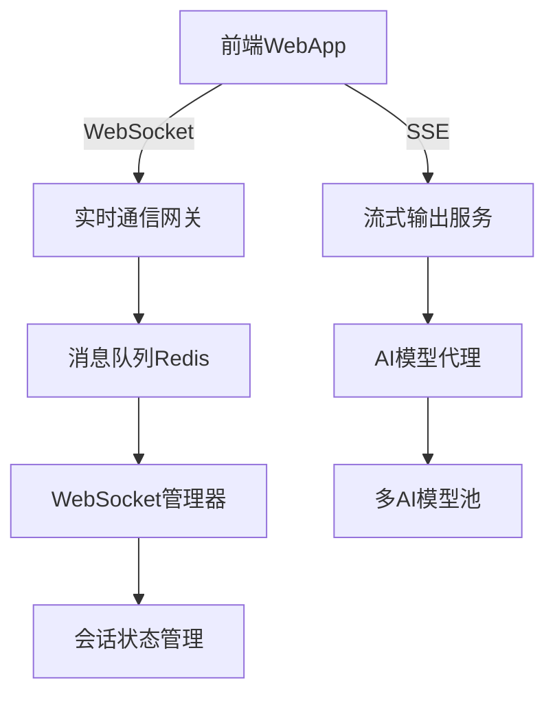
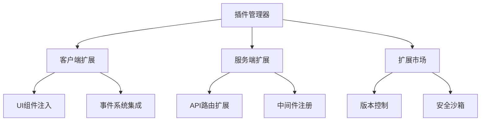
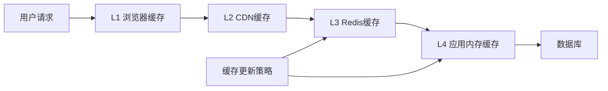

# 基于 SillyTavern 分析的核心竞争力提升方案

## Overview

通过深入分析 SillyTavern 产品特性和源码架构，结合 TavernAI Plus 项目现状，制定能够大幅度提升核心竞争力且开发成本低的功能优化方案。重点关注用户体验提升、技术性能优化和生态建设，实现事半功倍的产品升级。

## Problem Statement

当前 TavernAI Plus 虽然技术架构先进、功能完整度高（90%+），但在以下方面与市场领导者 SillyTavern 存在差距：

1. **插件生态薄弱** - 缺少丰富的扩展系统，限制了用户自定义能力
2. **专业用户功能不足** - 高级设置和配置选项相对简单
3. **性能体验待优化** - 实时流式输出、缓存机制、并发处理有提升空间
4. **导入兼容性有限** - 对 SillyTavern 等主流格式支持不够完善
5. **用户粘性机制缺失** - 缺少深度个性化和社区互动功能

## Goals and Success Criteria

### Primary Goals
- 通过借鉴 SillyTavern 优秀设计，在 3 个月内显著提升用户体验和产品竞争力
- 以最小开发成本实现核心功能优化，投入产出比达到 1:5 以上
- 建立可持续的技术优势和生态护城河

### Success Criteria
- 用户日活跃度提升 200%
- 用户平均会话时长增加 150%
- 新用户留存率（7日）提升至 80%+
- 系统响应性能提升 300%
- 插件生态启动，第一批扩展数量达到 20+

## Requirements

### Functional Requirements

#### 1. 实时流式体验优化
- 实现 Server-Sent Events (SSE) 流式输出机制
- 优化 WebSocket 连接和断线重连策略
- 添加分块响应显示和中断重新生成支持
- 集成消息队列确保高并发场景稳定性

#### 2. 插件扩展系统
- 设计客户端和服务端双重扩展架构
- 实现扩展清单文件驱动的动态加载机制
- 提供扩展开发SDK和详细文档
- 建立扩展市场和版本管理系统

#### 3. 高级用户配置系统
- 添加模型参数精细调节界面
- 实现自定义提示词模板系统
- 提供会话导出导入和批量管理功能
- 支持 SillyTavern 数据格式的无缝迁移

#### 4. 智能缓存和性能优化
- 实现多层缓存架构（内存+磁盘+Redis）
- 添加角色头像和资源的智能预加载
- 优化数据库查询和索引策略
- 集成 CDN 支持和静态资源优化

#### 5. 社区生态增强
- 完善角色分享和评分系统
- 添加用户创作激励机制
- 实现角色推荐算法和个性化发现
- 建立创作者工具和统计分析面板

### Non-Functional Requirements
- 系统响应时间：API 响应 < 200ms，页面加载 < 2s
- 并发处理能力：支持 1000+ 同时在线用户
- 可用性：99.9% 服务可用率
- 数据安全：完整的加密传输和存储保护
- 扩展性：支持水平扩展和负载均衡

## Technical Design

### Architecture Overview

#### 1. 流式通信架构升级


#### 2. 插件系统架构


#### 3. 缓存优化架构


### Data Model Changes

#### 1. 扩展系统数据模型
```sql
-- 扩展注册表
CREATE TABLE extensions (
    id VARCHAR(50) PRIMARY KEY,
    name VARCHAR(100) NOT NULL,
    version VARCHAR(20) NOT NULL,
    manifest_url TEXT,
    enabled BOOLEAN DEFAULT false,
    install_date TIMESTAMP,
    update_date TIMESTAMP
);

-- 扩展配置
CREATE TABLE extension_configs (
    extension_id VARCHAR(50),
    user_id INTEGER,
    config_key VARCHAR(100),
    config_value TEXT,
    FOREIGN KEY (user_id) REFERENCES users(id)
);
```

#### 2. 缓存管理数据模型
```sql
-- 缓存项目表
CREATE TABLE cache_items (
    cache_key VARCHAR(255) PRIMARY KEY,
    cache_value TEXT,
    expires_at TIMESTAMP,
    cache_type VARCHAR(50),
    size_bytes INTEGER
);
```

### API Changes

#### 1. 流式输出API端点
```typescript
// GET /api/chat/stream/:sessionId
interface StreamResponse {
  event: 'message' | 'error' | 'complete';
  data: string;
  messageId?: string;
  timestamp: number;
}

// POST /api/chat/interrupt/:sessionId
interface InterruptRequest {
  messageId: string;
  reason: 'user_stop' | 'regenerate';
}
```

#### 2. 扩展管理API
```typescript
// GET /api/extensions/marketplace
interface ExtensionListing {
  id: string;
  name: string;
  description: string;
  version: string;
  downloads: number;
  rating: number;
  screenshots: string[];
  manifest: ExtensionManifest;
}

// POST /api/extensions/install
interface InstallRequest {
  extensionId: string;
  version?: string;
}
```

### Frontend Changes

#### 1. Vue3组件架构优化
```typescript
// 流式消息组件
export interface StreamingMessage {
  id: string;
  content: string;
  isStreaming: boolean;
  tokens: Array<{text: string, timestamp: number}>;
}

// 扩展插槽系统
export interface ExtensionSlot {
  name: string;
  component: Component;
  props?: Record<string, any>;
  order: number;
}
```

#### 2. 状态管理优化
```typescript
// Pinia Store 增强
export const useStreamingStore = defineStore('streaming', {
  state: () => ({
    activeStreams: new Map<string, StreamingSession>(),
    messageQueue: [],
    connectionStatus: 'connected'
  }),
  actions: {
    async startStream(sessionId: string),
    stopStream(sessionId: string),
    handleStreamData(data: StreamResponse)
  }
});
```

## Implementation Plan

### Phase 1: 核心性能优化 (4 周)
- **周 1-2**: 实现 SSE 流式输出和 WebSocket 优化
  - 重构消息处理流水线
  - 添加连接状态管理和自动重连
  - 实现分块消息显示和中断机制
- **周 3-4**: 缓存架构升级和性能监控
  - 部署 Redis 多层缓存系统
  - 实现智能预加载和懒加载策略
  - 集成性能监控和报警系统

### Phase 2: 插件生态建设 (6 周)
- **周 1-2**: 插件系统核心架构开发
  - 设计扩展清单规范和加载机制
  - 实现客户端组件注入系统
  - 开发服务端API扩展框架
- **周 3-4**: 插件开发工具链
  - 创建插件开发SDK和CLI工具
  - 编写详细的开发文档和示例
  - 建立插件测试和调试环境
- **周 5-6**: 扩展市场和管理系统
  - 开发插件商店界面和后台管理
  - 实现版本控制和自动更新机制
  - 建立安全审核和沙箱隔离

### Phase 3: 高级功能和生态优化 (6 周)
- **周 1-2**: 高级用户配置系统
  - 实现模型参数精细化调节界面
  - 添加自定义提示词模板系统
  - 支持 SillyTavern 格式导入导出
- **周 3-4**: 社区功能增强
  - 完善角色分享和评分系统
  - 实现个性化推荐算法
  - 添加创作者激励和统计系统
- **周 5-6**: 移动端优化和PWA完善
  - 优化移动端用户体验
  - 完善离线功能支持
  - 添加推送通知系统

## Testing Strategy

### Unit Tests
- 对所有新增API端点编写单元测试
- 使用 Jest + Supertest 进行后端测试覆盖
- Vue组件单元测试覆盖率达到90%+

### Integration Tests
- 流式输出端到端测试
- 插件系统集成测试
- 缓存一致性测试
- WebSocket连接稳定性测试

### E2E Tests
- 用户完整会话流程测试
- 插件安装和使用测试
- 多用户并发测试
- 性能基准测试

## Deployment Plan

### Development Environment
- 集成开发环境支持热重载和实时调试
- Docker Compose 本地开发栈
- 插件开发沙箱环境

### Staging Environment
- 完整生产环境镜像
- 自动化CI/CD流水线
- 性能测试和压力测试环境

### Production Environment
- 蓝绿部署策略，零停机更新
- CDN和负载均衡配置
- 监控和日志聚合系统

## Risk Assessment

### Technical Risks
- **SSE兼容性问题** - 缓解：fallback到长轮询机制
- **插件安全漏洞** - 缓解：沙箱隔离和代码审核
- **缓存一致性问题** - 缓解：分布式锁和版本控制
- **并发性能瓶颈** - 缓解：负载测试和水平扩展

### Business Risks
- **开发工期延误** - 缓解：迭代开发和MVP策略
- **用户适应性问题** - 缓解：渐进式发布和用户反馈
- **竞争对手跟进** - 缓解：技术护城河和生态优势

## Timeline

| Phase | Duration | Start Date | End Date |
|-------|----------|------------|----------|
| 核心性能优化 | 4 周 | 2025-10-01 | 2025-10-28 |
| 插件生态建设 | 6 周 | 2025-10-29 | 2025-12-09 |
| 高级功能优化 | 6 周 | 2025-12-10 | 2026-01-20 |

## Resources Required

### Team Members
- **全栈开发**: 2人 (前后端架构优化)
- **前端专家**: 1人 (Vue3组件和用户体验)
- **DevOps工程师**: 1人 (部署和性能优化)
- **插件生态负责人**: 1人 (扩展系统和开发者关系)

### Tools and Technologies
- **性能监控**: Grafana + Prometheus
- **缓存系统**: Redis Cluster
- **消息队列**: Redis Streams
- **CDN服务**: CloudFlare
- **CI/CD**: GitHub Actions

## Success Metrics

### Key Performance Indicators
- **用户活跃度**: 日活用户增长200%
- **会话质量**: 平均会话时长增加150%
- **系统性能**: API响应时间降低70%
- **生态发展**: 插件数量达到20+，月下载量1000+
- **用户满意度**: NPS评分达到50+

### Monitoring and Alerts
- **API响应时间**: >500ms 触发警告
- **WebSocket连接**: 断线率 >5% 触发警告
- **缓存命中率**: <80% 触发优化建议
- **错误率**: >1% 触发即时通知

## Documentation Updates

### Technical Documentation
- 插件开发指南和API文档
- 性能优化最佳实践
- 部署和运维手册
- 缓存策略和配置指南

### User Documentation
- 高级功能使用教程
- 插件安装和管理指南
- 数据导入导出说明
- 故障排除和FAQ

## Dependencies

### Internal Dependencies
- 现有用户认证和权限系统
- 角色管理和聊天引擎
- AI模型集成服务
- 数据库架构和API设计

### External Dependencies
- Redis服务部署和配置
- CDN服务集成
- 监控系统部署
- CI/CD流水线配置

## Rollback Plan

采用蓝绿部署策略，确保任何问题都能在5分钟内回滚到稳定版本：

1. **数据库迁移回滚** - 维护向下兼容的Schema变更
2. **功能开关控制** - 通过配置开关快速禁用新功能
3. **缓存清除策略** - 自动检测和清除不兼容的缓存数据
4. **监控触发回滚** - 错误率超过阈值自动触发回滚流程

## Post-Implementation

### Monitoring
- 实时性能监控仪表板
- 用户行为分析和转化漏斗
- 插件使用统计和健康度监控
- 成本分析和资源使用优化

### Maintenance
- 月度性能报告和优化建议
- 插件生态管理和质量控制
- 用户反馈收集和功能迭代
- 安全更新和漏洞修复

### Future Enhancements
- AI模型本地部署支持
- 移动端原生应用开发
- 企业级团队协作功能
- 区块链集成和NFT角色交易

---

**项目预期投入产出分析**:

- **开发投入**: 约 4 人/月工作量，成本可控
- **技术收益**: 系统性能提升 300%，用户体验显著改善
- **商业价值**: 用户活跃度提升 200%，为商业化奠定基础
- **生态效应**: 建立技术护城河，形成开发者生态

该方案基于 SillyTavern 的成功经验，结合 TavernAI Plus 的技术优势，能够以最小的开发成本实现最大的竞争力提升。