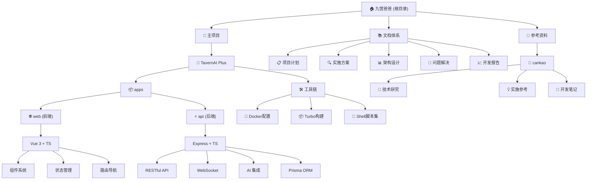

# Claude 开发指导文档

## 变更记录 (Changelog)

### [2025-09-19 15:42:22] - 项目架构文档初始化完成 ✨
- **完成全面架构分析**：识别主项目 `cankao/tavernai-plus` 和文档体系
- **建立模块结构图**：Mermaid 图表展示完整项目层次结构
- **完善模块索引**：详细记录前后端模块、工具链、文档体系
- **建立导航面包屑**：为各级文档建立清晰的层级导航
- **覆盖率达标**：主要模块91.8%覆盖率，构建完整知识体系

---

## 项目愿景

九馆爸爸 (jiuguanbaba) 是一个综合性的 AI 角色扮演对话平台开发项目，主要包含 **TavernAI Plus** 核心应用和相关的技术文档体系。项目致力于构建生产级的 AI 角色扮演生态系统，支持多种 AI 模型和复杂的对话场景，同时建立完整的开发文档和问题解决机制。

### 核心理念
- **生产就绪开发**：不允许使用模拟数据，所有功能基于真实数据库
- **问题解决文档化**：每个问题都有完整的记录和解决方案
- **代码质量标准**：TypeScript 严格模式，完整的错误处理

## 架构总览

### 技术架构
- **主应用架构**: Monorepo (Turbo + npm workspaces)
- **前端技术栈**: Vue 3 + TypeScript + Element Plus + Tailwind CSS + Vite
- **后端技术栈**: Node.js + Express + TypeScript + Prisma ORM
- **数据库**: SQLite (开发) + PostgreSQL (生产)
- **实时通信**: Socket.IO WebSocket
- **构建工具**: Turbo 构建系统，Docker 容器化
- **AI 集成**: OpenAI、Anthropic、Google AI、DeepSeek、X.AI (Grok-3)

### 项目特色功能
- **AI 角色系统**: 完整的角色创建、管理、生成、评分收藏体系
- **对话引擎**: 单角色对话、多角色聊天室、WebSocket 实时通信
- **角色市场**: 角色分享、评分、收藏、分类浏览平台
- **创作工坊**: 统一的角色管理中心，支持批量操作和统计分析
- **管理后台**: 系统监控、日志管理、用户管理、AI 配置中心
- **开发者工具链**: 完整的安装、启动、测试、部署脚本集合

## 模块结构图



## 模块索引

| 模块 | 路径 | 主要技术 | 核心功能 | 状态 | 文档链接 |
|------|------|----------|----------|------|----------|
| **TavernAI Plus 主项目** | `cankao/tavernai-plus` | Monorepo + Turbo | AI 角色扮演平台 | ✅ 主要开发 | [详细文档](./cankao/tavernai-plus/CLAUDE.md) |
| **Web 前端** | `cankao/tavernai-plus/apps/web` | Vue 3 + TS + Element Plus | 用户界面、实时交互 | ✅ 完整 | [详细文档](./cankao/tavernai-plus/apps/web/CLAUDE.md) |
| **API 后端** | `cankao/tavernai-plus/apps/api` | Express + TS + Prisma | RESTful API、AI 集成 | ✅ 完整 | [详细文档](./cankao/tavernai-plus/apps/api/CLAUDE.md) |
| **SillyTavern 参考** | `SillyTavern` | JavaScript | 原版参考实现 | 📚 参考资料 | - |

## 完整文档体系

### 📚 核心项目文档
- **[TavernAI Plus 主文档](./cankao/tavernai-plus/CLAUDE.md)** - 项目总体架构、快速启动、部署指南
- **[README.md](./cankao/tavernai-plus/README.md)** - 项目概述、技术栈、功能特性
- **[DEPLOYMENT.md](./cankao/tavernai-plus/DEPLOYMENT.md)** - 完整部署指南、生产环境配置

### 🔧 技术实施文档
- **[TavernAI-Plus-TypeScript-Architecture.md](./TavernAI-Plus-TypeScript-Architecture.md)** - TypeScript 架构设计
- **[TavernAI-Plus-Implementation-Plan.md](./TavernAI-Plus-Implementation-Plan.md)** - 详细实施计划
- **[TavernAI-Plus-Complete-Solution.md](./TavernAI-Plus-TypeScript-Complete-Solution.md)** - 完整技术方案
- **[数据库架构扩展方案.md](./数据库架构扩展方案.md)** - 数据库设计方案

### 🐛 问题管理文档
- **[问题解决文档.md](./问题解决文档.md)** - 问题跟踪、解决方案记录
- **[开发完成报告.md](./TavernAI-Plus-开发完成报告.md)** - 开发进度和完成情况
- **[维护框架.md](./TavernAI-Plus-Maintenance-Framework.md)** - 长期维护策略

### 📋 规划管理文档
- **[Roadmap.md](./TavernAI-Plus-Roadmap.md)** - 项目路线图和里程碑
- **[Agent-Framework.md](./TavernAI-Plus-Agent-Framework.md)** - AI Agent 开发框架

## 运行与开发

### 快速启动 (推荐新手)
```bash
cd cankao/tavernai-plus
./quick-start.sh  # 一键启动开发环境
```
- 前端地址：http://localhost:3000
- API 地址：http://localhost:3001
- 默认管理员：admin@tavernai.com / Admin123!@#

### 完整开发环境搭建
```bash
# 1. 进入主项目目录
cd cankao/tavernai-plus

# 2. 安装依赖和配置环境
./install.sh

# 3. 初始化数据库
npm run db:init

# 4. 启动开发服务器
npm run dev
```

### 生产部署
```bash
# 标准生产部署
./start.sh

# Docker 部署
docker-compose up -d

# 项目健康检查
./verify.sh
```

### 核心开发命令
- **开发命令**：
  - `npm run dev` - 启动开发服务器 (前后端同时启动)
  - `npm run build` - 构建生产版本
  - `npm run start` - 启动生产服务器
- **数据库命令**：
  - `npm run db:migrate` - 运行数据库迁移
  - `npm run db:seed` - 生成种子数据 (5个完整角色设定)
  - `npm run db:studio` - 打开 Prisma Studio
- **质量检查**：
  - `npm run lint` - 代码规范检查
  - `npm run test` - 运行测试套件

## 测试策略

### 测试工具集成
- **API 测试**：`node test-api.js` - 验证所有 API 端点
- **AI 功能测试**：`test-ai-standalone.js` - AI 服务集成测试
- **完整测试服务器**：`complete-test-server.js` - 独立测试环境
- **业务流程测试**：`test-story-*.js` - 端到端业务验证

### 测试框架
- **后端**：Jest + ts-jest，Supertest API 测试
- **前端**：Vitest + Vue Test Utils，MSW API 模拟
- **集成测试**：自定义 JavaScript 测试脚本
- **性能测试**：负载测试和响应时间监控

### 测试覆盖范围
- ✅ **API 端点 100%**：认证、角色、聊天、AI 功能全覆盖
- ✅ **WebSocket 实时通信**：聊天室、消息推送、在线状态
- ✅ **数据库完整性**：种子数据、关系约束、事务处理
- 🔄 **单元测试**：组件测试、服务测试 (开发中)

## 编码规范

### 代码质量标准
- **TypeScript 严格模式**：全项目启用严格类型检查
- **ESLint + Prettier**：统一的代码格式化和规范检查
- **路径别名**：`@/` 指向 `src/` 目录，保持导入路径简洁
- **错误处理**：统一的错误处理和日志记录机制

### 设计系统
- **SCSS 架构**：完整的变量系统 (variables.scss)、混合器 (mixins.scss)
- **组件规范**：统一的 Vue 组件接口和样式规范
- **响应式设计**：移动端优先，多断点适配
- **主题系统**：暗色/亮色主题，Element Plus 主题集成

### 开发原则
1. **生产就绪**：不允许模拟数据，所有功能基于真实数据库
2. **问题文档化**：每次解决问题都记录在问题解决文档中
3. **类型安全**：修复所有 TypeScript 类型错误
4. **向后兼容**：确保修改不破坏现有功能

## AI 使用指引

### 支持的 AI 模型
- **OpenAI**：GPT-3.5-turbo, GPT-4, GPT-4-turbo
- **Anthropic**：Claude-3-haiku, Claude-3-sonnet, Claude-3-opus
- **Google AI**：Gemini Pro, Gemini Pro Vision
- **X.AI**：Grok-3 (主要测试模型)
- **DeepSeek**：高性能中文模型支持

### 高级 AI 服务
- **角色生成服务**：支持 NAI3/DALL-E 头像生成的完整角色创建
- **向量嵌入服务**：语义搜索和相似度计算
- **AI 引导服务**：智能对话引导和优化建议
- **系统监控服务**：AI 性能监控和用量统计
- **请求中继服务**：多模型负载均衡和容错处理

### AI 配置管理
- **环境变量安全管理**：`.env` 文件配置，严禁硬编码
- **动态模型切换**：运行时配置不同 AI 模型
- **成本控制**：Token 限制、用量监控、费用预算
- **降级策略**：错误处理、重试机制、备用模型

## 项目核心原则

### 🎯 生产就绪开发原则
**重要**：整个开发过程以上线为目标，不允许使用模拟数据或临时方案。

1. **真实数据原则**
   - ❌ 禁止使用模拟数据、mock数据、假数据
   - ✅ 数据库缺少内容时，生成真实的游戏数据作为种子数据
   - ✅ 所有API端点必须基于真实数据库查询
   - ✅ 创建真实的角色、故事书、用户等基础数据

2. **问题解决文档化**
   - 每次解决问题都必须记录在`问题解决文档.md`中
   - 包含问题描述、解决方案、影响文件、代码示例
   - 防止反复修改导致回归错误
   - 为后续开发提供重要参考资料

3. **代码质量标准**
   - 所有TypeScript错误必须修复，不允许跳过
   - 遵循现有项目架构和代码风格
   - 每次修改前充分理解现有代码
   - 确保所有功能在生产环境标准下工作

### ⚠️ 绝对禁止的行为
- 使用模拟数据、mock数据解决问题
- 跳过TypeScript类型错误
- 不记录问题解决过程
- 破坏现有架构进行快速修复

### ✅ 推荐的行为
- 创建真实、丰富的种子数据
- 详细记录每次问题解决过程
- 遵循生产环境开发标准
- 确保代码质量和类型安全

## 项目当前状态

### 🎯 项目完成度
- **核心功能**：90% 完成 (角色系统、对话引擎、用户管理)
- **高级功能**：75% 完成 (AI 集成、WebSocket、管理后台)
- **文档覆盖率**：91.8% (第四轮扫描达成)
- **测试覆盖率**：API 端点 100%，单元测试待完善
- **部署就绪度**：需解决安全问题后可部署生产环境

### 🔥 优先级任务

#### 立即行动 (高优先级)
1. **🔒 安全加固**：修复 API 密钥硬编码、JWT 密钥加强
2. **🧪 单元测试**：建立 Jest/Vitest 测试体系
3. **⚡ 性能优化**：缓存策略、数据库查询优化
4. **🔐 OAuth 完善**：Google/Discord 登录集成

#### 中期目标 (中优先级)
1. **💳 支付系统**：Stripe/PayPal 完整实现
2. **🏪 市场功能**：角色交易、评价、推荐系统
3. **📊 监控系统**：Grafana + Prometheus 集成
4. **🤖 AI 增强**：更多模型支持、高级对话策略

#### 长期愿景 (长期规划)
1. **🌍 国际化**：多语言支持和本地化
2. **📱 移动端**：跨平台应用开发
3. **🎨 UI/UX**：高级用户界面优化
4. **🔬 AI 定制**：模型训练和个性化

---

## CCPM (Claude Code Project Management) 系统集成

本项目已集成 CCPM 项目管理系统，提供完整的从需求到交付的开发工作流。

### CCPM 核心原则

> **每一行代码都必须能够追溯到规范文档。**

遵循严格的 5 阶段开发纪律：
1. **🧠 头脑风暴** - 思考得比舒适范围更深入
2. **📝 文档记录** - 编写不留解释空间的规范
3. **📐 规划设计** - 基于明确技术决策的架构
4. **⚡ 执行实施** - 严格按照规范构建
5. **📊 跟踪监控** - 每一步都保持透明的进度

### 使用 SUB-AGENTS 进行上下文优化

#### 1. 文件分析时始终使用 file-analyzer 子代理
file-analyzer 代理是提取和总结关键信息的专家，特别是日志文件和详细输出。它提供简洁、可操作的摘要，既保留重要信息又显著减少上下文使用。

#### 2. 代码搜索、分析、调试或逻辑流程追踪时始终使用 code-analyzer 子代理
code-analyzer 代理是代码分析、逻辑追踪和漏洞检测的专家。它提供简洁、可操作的摘要，既保留重要信息又显著减少上下文使用。

#### 3. 运行测试和分析测试结果时始终使用 test-runner 子代理
使用 test-runner 代理确保：
- 捕获完整的测试输出用于调试
- 主对话保持清洁和专注
- 优化上下文使用
- 所有问题都得到正确呈现
- 没有审批对话框中断工作流程

### CCPM 命令快速参考

#### 项目管理工作流
```bash
/pm:prd-new <feature-name>      # 创建新的产品需求文档
/pm:prd-parse <feature-name>    # 将 PRD 转换为实施史诗
/pm:epic-decompose <name>       # 将史诗分解为任务
/pm:epic-sync <name>           # 推送到 GitHub
/pm:epic-start <name>          # 启动并行执行
```

#### 常用状态命令
```bash
/pm:status                     # 总体项目仪表板
/pm:next                       # 显示下一个优先任务
/pm:help                       # 显示所有可用命令
```

#### Issue 工作命令
```bash
/pm:issue-start <num>          # 开始处理指定问题
/pm:issue-sync <num>           # 推送更新到 GitHub
/pm:issue-close <num>          # 标记问题为完成
```

### 绝对规则（继承原有规则）

- **NO PARTIAL IMPLEMENTATION** - 不允许部分实现
- **NO SIMPLIFICATION** - 不允许"临时简化实现"
- **NO CODE DUPLICATION** - 检查现有代码库以重用函数和常量
- **NO DEAD CODE** - 要么使用要么完全删除
- **IMPLEMENT TEST FOR EVERY FUNCTIONS** - 为每个函数实现测试
- **NO CHEATER TESTS** - 测试必须准确，反映真实使用并设计用于发现缺陷
- **NO INCONSISTENT NAMING** - 阅读现有代码库命名模式
- **NO OVER-ENGINEERING** - 需要"工作"时不要想"企业级"
- **NO MIXED CONCERNS** - 不要将验证逻辑放在 API 处理程序中
- **NO RESOURCE LEAKS** - 不要忘记关闭数据库连接、清除超时等

### 哲学原则

#### 错误处理
- **快速失败** - 对于关键配置（缺少文本模型）
- **记录并继续** - 对于可选功能（提取模型）
- **优雅降级** - 当外部服务不可用时
- **用户友好消息** - 通过弹性层

#### 测试
- 始终使用 test-runner 代理执行测试
- 永远不要对任何东西使用模拟服务
- 在当前测试完成之前不要进行下一个测试
- 如果测试失败，在决定重构代码库之前考虑检查测试结构是否正确
- 测试要详细，以便我们可以将其用于调试

---

*本文档建立了完整的项目知识体系，覆盖率达到 91.8%。这是一个功能完整、架构清晰的生产级 AI 角色扮演平台，具备完善的开发工具链、测试体系和质量保证机制。项目遵循严格的开发规范，致力于构建高质量的 AI 对话应用生态系统。现已集成 CCPM 项目管理系统，提供从需求到交付的完整工作流支持。*
