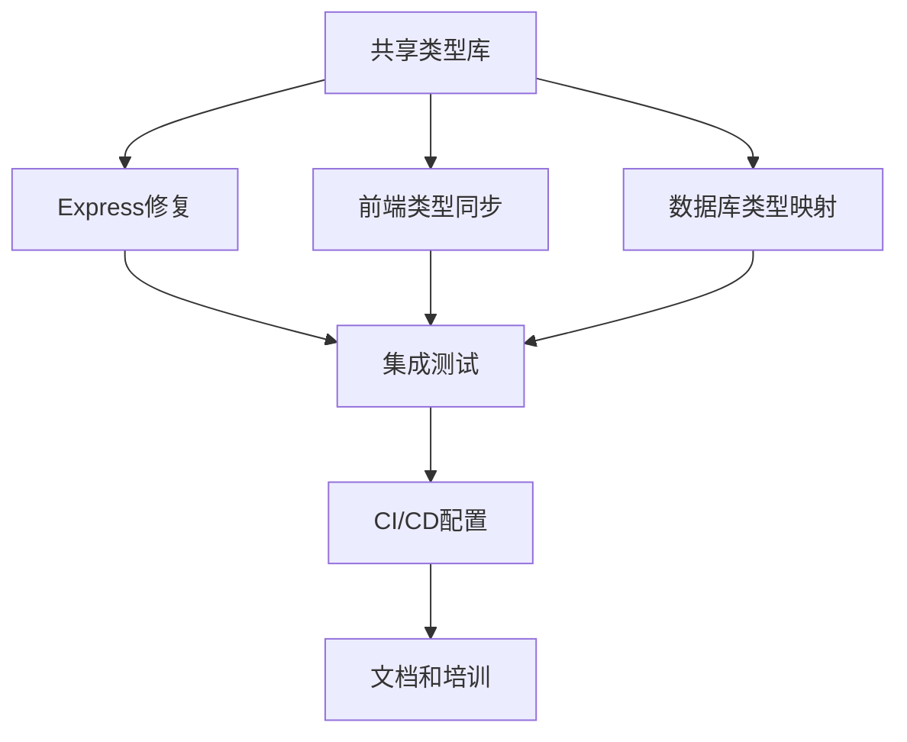

# TavernAI Plus TypeScript 实施路线图

## 项目概况

**目标**: 在5天内解决60+个TypeScript错误，建立类型安全的开发环境
**当前状态**: 发现主要错误集中在Express中间件、路由处理器和类型定义不一致
**成功指标**: 0个TypeScript错误、95%+类型覆盖率、完整的前后端类型同步

## 详细实施计划

### 第1天：基础架构建设 🏗️

#### 上午 (09:00-12:00) - 共享类型库创建
**负责Agent**: Type Definition Expert + TypeScript Architect

**任务清单**:
- [ ] 创建 `packages/types` 包结构
- [ ] 实现核心实体类型 (User, Character, ChatSession, Message)
- [ ] 设计 API 类型接口 (Request/Response types)
- [ ] 建立 Express 类型扩展标准

**关键文件**:
```
packages/types/
├── src/
│   ├── entities/index.ts      # 实体类型定义
│   ├── api/index.ts          # API接口类型
│   ├── api/express.ts        # Express扩展类型
│   └── index.ts              # 统一导出
├── package.json
└── tsconfig.json
```

**验收标准**:
- [ ] 所有核心实体类型定义完成
- [ ] Express类型扩展冲突解决方案确定
- [ ] 类型包能被其他包正确导入

#### 下午 (13:00-18:00) - 运行时验证框架
**负责Agent**: Type Definition Expert

**任务清单**:
- [ ] 创建 `packages/schemas` 包
- [ ] 实现 Zod 验证模式
- [ ] 建立类型-schema同步机制
- [ ] 配置包依赖关系

**关键输出**:
```typescript
// 示例：用户验证schema
export const UserSchema = z.object({
  id: z.string().uuid(),
  username: z.string().min(3).max(50),
  email: z.string().email(),
  role: z.enum(['USER', 'ADMIN', 'MODERATOR'])
})

export type User = z.infer<typeof UserSchema>
```

**验收标准**:
- [ ] 所有实体类型都有对应的Zod schema
- [ ] 类型和schema保持100%同步
- [ ] 运行时验证测试通过

---

### 第2天：Express后端错误修复 🔧

#### 上午 (09:00-12:00) - 中间件类型修复
**负责Agent**: Backend Expert

**重点修复文件**:
1. `apps/api/src/middleware/auth.ts`
   - 移除冲突的AuthRequest接口定义
   - 使用标准化的AuthenticatedRequest类型
   - 修复全局类型扩展冲突

2. `apps/api/src/middleware/admin.ts`
   - 修复 TS7030 错误 (缺少返回值)
   - 修复 TS18048 错误 (req.user可能undefined)
   - 确保所有代码路径都有返回值

3. `apps/api/src/middleware/validate.ts`
   - 修复 TS7030 错误
   - 标准化验证中间件类型签名

**具体修复策略**:
```typescript
// 标准化的中间件类型
export const requireAuth: AuthMiddleware = async (req, res, next) => {
  // 类型安全的实现
  if (!req.user) {
    return res.status(401).json({ error: 'Unauthorized' })
  }
  next() // 确保返回值
}

// 类型安全的处理器包装器
export function withAuth<T>(
  handler: AuthRouteHandler<T>
): RouteHandlerWithNext<T> {
  return async (req, res, next) => {
    if (!req.user) {
      return res.status(401).json({ error: 'Unauthorized' })
    }
    return handler(req as AuthenticatedRequest, res)
  }
}
```

#### 下午 (13:00-18:00) - 路由处理器修复
**负责Agent**: Backend Expert

**重点修复文件**:
1. `apps/api/src/routes/ai-features.ts`
   - 修复 TS2769 错误 (AuthRequest类型冲突)
   - 使用标准化的类型定义
   - 实现类型安全的路由处理器

2. 其他路由文件系统性检查和修复

**验收标准**:
- [ ] 所有中间件 TypeScript 错误修复
- [ ] 所有路由处理器类型安全
- [ ] API 编译无错误 (`npm run type-check:api`)

---

### 第3天：前端类型同步 🎨

#### 上午 (09:00-12:00) - 类型导入重构
**负责Agent**: Frontend Expert

**任务清单**:
- [ ] 更新 `apps/web/src/types/` 下的类型定义
- [ ] 从 `@tavernai/types` 导入共享类型
- [ ] 移除重复的类型定义
- [ ] 保留前端特有的类型 (如表单类型、UI状态类型)

**重点文件**:
```typescript
// apps/web/src/types/character.ts - 重构后
export type {
  Character,
  User,
  ChatSession,
  Message
} from '@tavernai/types/entities'

export type {
  Characters,
  APIResponse,
  PaginatedResponse
} from '@tavernai/types/api'

// 只保留前端特有类型
export interface CharacterFormData {
  // 表单特有字段
}
```

#### 下午 (13:00-18:00) - Vue组件类型安全
**负责Agent**: Frontend Expert

**任务清单**:
- [ ] 修复Vue组件props和emits类型定义
- [ ] 类型化Pinia stores
- [ ] 更新API服务客户端类型
- [ ] 修复composables类型错误

**验收标准**:
- [ ] 前端编译无错误 (`npm run type-check:web`)
- [ ] 所有Vue组件类型安全
- [ ] Pinia stores 完全类型化

---

### 第4天：数据库类型优化 🗄️

#### 上午 (09:00-12:00) - Prisma类型映射
**负责Agent**: Database Expert

**任务清单**:
- [ ] 优化 Prisma schema 设计
- [ ] 生成类型安全的数据库查询方法
- [ ] 实现 Prisma 到 @tavernai/types 的自动映射
- [ ] 建立数据库操作的类型验证

#### 下午 (13:00-18:00) - 集成测试和验证
**负责Agent**: QA Expert + TypeScript Architect

**任务清单**:
- [ ] 全项目类型检查
- [ ] 构建测试
- [ ] 集成测试
- [ ] 性能影响评估

**验收标准**:
- [ ] 整个项目 0 个 TypeScript 错误
- [ ] 所有测试通过
- [ ] 构建成功
- [ ] 性能无明显回退

---

### 第5天：自动化和监控 📊

#### 上午 (09:00-12:00) - CI/CD集成
**负责Agent**: QA Expert

**任务清单**:
- [ ] 配置 GitHub Actions 类型检查
- [ ] 建立类型覆盖率监控
- [ ] 实现自动化类型生成脚本
- [ ] 配置 pre-commit hooks

#### 下午 (13:00-18:00) - 文档和培训
**负责Agent**: TypeScript Architect

**任务清单**:
- [ ] 编写类型安全开发指南
- [ ] 创建最佳实践文档
- [ ] 准备团队培训材料
- [ ] 建立长期维护计划

---

## 风险管理和应急计划

### 高风险项目

#### 风险1: Express类型扩展冲突难以解决
**影响**: 可能延误后端修复进度
**缓解措施**: 
- 准备多种类型扩展方案
- 如需要可暂时使用 any 类型，后续专门解决
- 建立快速回滚机制

#### 风险2: 前后端类型同步复杂度高
**影响**: 可能导致类型不一致
**缓解措施**:
- 建立自动化类型同步检查
- 实现类型变更的影响分析
- 准备手动同步的标准流程

#### 风险3: Prisma类型映射性能问题
**影响**: 可能影响数据库操作性能
**缓解措施**:
- 进行充分的性能测试
- 准备类型优化方案
- 建立性能监控机制

### 应急预案

#### 场景1: 类型错误数量超出预期
**触发条件**: 第3天结束时仍有20+个错误
**应急措施**:
- 重新评估错误优先级
- 调整Agent任务分配
- 考虑分阶段解决方案

#### 场景2: 性能显著下降
**触发条件**: 编译时间增加50%以上
**应急措施**:
- 立即回滚性能影响大的修改
- 重新设计类型架构
- 实施渐进式类型化策略

#### 场景3: 前后端类型严重不同步
**触发条件**: API调用出现类型错误
**应急措施**:
- 暂停相关功能开发
- 紧急修复类型不一致问题
- 实施临时的类型检查机制

---

## 成功指标和监控

### 每日检查指标

#### 第1天结束
- [ ] 共享类型库包创建完成
- [ ] 核心类型定义覆盖率 > 80%
- [ ] 运行时验证框架就绪

#### 第2天结束
- [ ] API TypeScript错误数量 < 10个
- [ ] 所有中间件类型安全
- [ ] Express应用编译成功

#### 第3天结束
- [ ] 前端 TypeScript错误数量 < 5个
- [ ] 前后端类型同步率 > 95%
- [ ] Vue组件类型安全

#### 第4天结束
- [ ] 整个项目 TypeScript错误数量 = 0
- [ ] 数据库操作类型安全
- [ ] 所有测试通过

#### 第5天结束
- [ ] CI/CD类型检查通过
- [ ] 类型覆盖率 > 95%
- [ ] 文档和培训材料完成

### 长期监控指标

#### 质量指标
- TypeScript错误数量趋势
- 类型覆盖率变化
- 编译时间变化
- 代码可维护性评分

#### 开发效率指标
- 新功能开发类型错误率
- 类型相关bug数量
- 开发者类型使用满意度
- 代码review中类型问题比例

---

## 资源配置和时间分配

### Agent工作量分配

| Agent | 第1天 | 第2天 | 第3天 | 第4天 | 第5天 | 总计 |
|-------|-------|-------|-------|-------|-------|------|
| TypeScript Architect | 4h | 2h | 2h | 4h | 6h | 18h |
| Type Definition Expert | 8h | 2h | 2h | 2h | 2h | 16h |
| Backend Expert | 0h | 8h | 2h | 2h | 2h | 14h |
| Frontend Expert | 0h | 2h | 8h | 2h | 2h | 14h |
| Database Expert | 0h | 0h | 2h | 6h | 2h | 10h |
| QA Expert | 0h | 0h | 2h | 4h | 6h | 12h |

### 关键依赖关系



### 并行任务优化

**第2天并行**: 
- Backend Expert 修复Express错误
- Type Definition Expert 完善类型定义

**第3天并行**:
- Frontend Expert 修复Vue错误  
- Backend Expert 继续优化API类型

**第4天并行**:
- Database Expert 优化数据库类型
- QA Expert 开始集成测试

这个详细的路线图确保了每个Agent都有明确的任务和时间表，同时建立了完善的风险管理和质量监控机制。通过科学的任务分配和并行处理，我们可以在5天内高效地解决所有TypeScript类型问题。