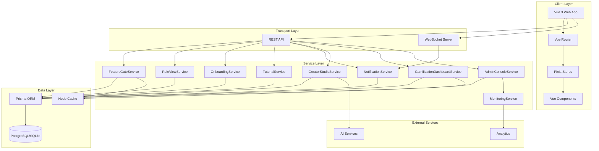
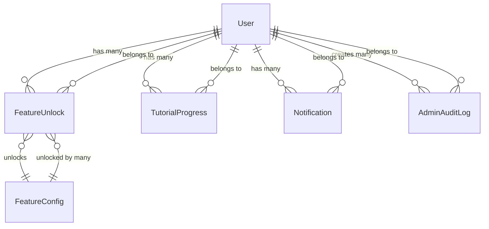

# Feature System Architecture Documentation

**Version**: 1.0.0
**Date**: 2025-10-02
**Status**: Production Ready

---

## Table of Contents

1. [System Overview](#system-overview)
2. [Architecture Diagram](#architecture-diagram)
3. [Data Model](#data-model)
4. [Service Architecture](#service-architecture)
5. [API Contracts](#api-contracts)
6. [Design Decisions](#design-decisions)
7. [Security Considerations](#security-considerations)
8. [Performance Characteristics](#performance-characteristics)

---

## System Overview

The Universal User Experience (UX) System is a comprehensive feature management framework that enables:

- **Progressive Feature Disclosure (F1)**: Gradual revelation of UI elements based on user level
- **Role-Oriented Views (F2)**: Customized dashboards for Player, Creator, and Admin roles
- **Intelligent Onboarding (F3)**: MBTI-based personality assessment and personalization
- **Creator Studio (F4)**: Advanced tools for content creators with analytics
- **Gamification Dashboard (F5)**: Achievement, affinity, proficiency, and quest systems
- **Admin Console (F6)**: Real-time monitoring, moderation, and system management
- **AI Content Generation (F7)**: AI-powered character and scenario creation
- **Feature Gate System (F8)**: Progressive unlocking framework
- **Tutorial System (F9)**: Interactive tutorials with overlays and tooltips
- **Real-time Notifications (F10)**: WebSocket-based instant notifications

### Key Principles

1. **User-Centric**: Features unlock based on user progress, not paywalls
2. **Role-Based**: Different experiences for Players, Creators, and Admins
3. **Progressive**: Features revealed gradually to prevent overwhelm
4. **Gamified**: Achievement and progression systems drive engagement
5. **Real-Time**: WebSocket integration for instant feedback

---

## Architecture Diagram



---

## Data Model

### Core Entities

#### FeatureConfig
```prisma
model FeatureConfig {
  id                String   @id
  name              String
  description       String
  category          String
  icon              String?
  unlockCondition   Json
  enabled           Boolean  @default(true)
  createdAt         DateTime @default(now())
  updatedAt         DateTime @updatedAt

  unlocks           FeatureUnlock[]
}
```

**Purpose**: Defines available features in the system
**Key Fields**:
- `unlockCondition`: JSON defining how feature unlocks (level, achievement, payment)
- `category`: Groups features (core, premium, experimental)

#### FeatureUnlock
```prisma
model FeatureUnlock {
  id            String   @id @default(cuid())
  userId        String
  featureId     String
  unlockMethod  String   // 'default', 'level', 'achievement', 'payment', 'manual'
  metadata      Json?
  unlockedAt    DateTime @default(now())

  user          User     @relation(fields: [userId], references: [id])
  feature       FeatureConfig @relation(fields: [featureId], references: [id])

  @@unique([userId, featureId])
}
```

**Purpose**: Tracks which features each user has unlocked
**Key Fields**:
- `unlockMethod`: How the feature was unlocked
- `metadata`: Additional context (achievement ID, payment receipt, etc.)

#### TutorialProgress
```prisma
model TutorialProgress {
  id              String   @id @default(cuid())
  userId          String
  tutorialId      String
  completed       Boolean  @default(false)
  currentStep     Int      @default(0)
  completedSteps  String[] // Array of completed step IDs
  startedAt       DateTime @default(now())
  completedAt     DateTime?

  user            User     @relation(fields: [userId], references: [id])

  @@unique([userId, tutorialId])
}
```

**Purpose**: Tracks user progress through tutorials

#### Notification
```prisma
model Notification {
  id          String   @id @default(cuid())
  userId      String
  title       String
  message     String
  type        String   // 'info', 'success', 'warning', 'error'
  priority    String   // 'normal', 'high', 'urgent'
  read        Boolean  @default(false)
  readAt      DateTime?
  createdAt   DateTime @default(now())
  expiresAt   DateTime?
  metadata    Json?

  user        User     @relation(fields: [userId], references: [id])
}
```

**Purpose**: Stores user notifications for persistence

#### AdminAuditLog
```prisma
model AdminAuditLog {
  id          String   @id @default(cuid())
  userId      String
  action      String   // 'feature_unlock', 'config_change', 'user_suspend', etc.
  targetType  String   // 'feature', 'user', 'configuration', 'system'
  targetId    String
  ipAddress   String
  userAgent   String
  changes     Json     // Before/after values
  createdAt   DateTime @default(now())

  user        User     @relation(fields: [userId], references: [id])
}
```

**Purpose**: Audit trail for admin actions

### Relationships



---

## Service Architecture

### FeatureGateService

**Responsibility**: Manage feature access and unlocking logic

**Key Methods**:
- `checkAccess(userId, featureId)`: Check if user can access feature
- `unlockFeature(userId, featureId, method)`: Unlock a feature for user
- `getUserUnlocks(userId)`: Get all features unlocked by user
- `checkUnlockCondition(userId, condition)`: Evaluate unlock condition

**Unlock Methods**:
1. **Default**: Unlocked for all users (F1, F2, F3, F8, F9, F10)
2. **Level-based**: Unlocks at specific user level
3. **Achievement-based**: Unlocks upon achieving specific milestones
4. **Payment-based**: Unlocks via subscription/purchase
5. **Manual**: Admin-granted unlock

**Example Unlock Condition**:
```json
{
  "type": "level",
  "value": 10,
  "alternative": {
    "type": "achievement",
    "value": "first_character_created"
  }
}
```

### RoleViewService

**Responsibility**: Provide role-specific dashboard configurations

**Key Methods**:
- `getViewConfig(userId)`: Get dashboard config based on role
- `getAvailableFeatures(userId)`: Get features available for role
- `switchRole(userId, newRole)`: Handle role transitions

**Role Configurations**:

| Role    | Available Features | Default Dashboard | Access Level |
|---------|-------------------|-------------------|--------------|
| Player  | F1, F2, F3, F5, F8, F9, F10 | Gamification Dashboard | Basic |
| Creator | F1-F5, F7-F10 | Creator Studio | Enhanced |
| Admin   | F1-F10 | Admin Console | Full |

### OnboardingService

**Responsibility**: Manage user onboarding flow and personalization

**Key Methods**:
- `getOnboardingStatus(userId)`: Check onboarding completion
- `completeOnboarding(userId, data)`: Mark onboarding complete
- `saveMBTIResults(userId, mbtiType)`: Store personality type
- `getPersonalizedRecommendations(userId)`: Get recommendations based on MBTI

**Onboarding Flow**:
1. Welcome screen
2. Interest selection
3. MBTI quiz (8 questions, 16 personality types)
4. Character recommendations
5. Tutorial assignment
6. Dashboard introduction

### NotificationService

**Responsibility**: Handle notification creation and delivery

**Key Methods**:
- `createNotification(params)`: Create new notification
- `sendRealtime(userId, notification)`: Send via WebSocket
- `markAsRead(notificationId)`: Mark notification read
- `getUserNotifications(userId, filters)`: Get user notifications

**Delivery Channels**:
1. **REST API**: Persistent notifications with pagination
2. **WebSocket**: Real-time push notifications
3. **Toast UI**: Urgent notifications with auto-dismiss

### GamificationDashboardService

**Responsibility**: Aggregate gamification data

**Key Methods**:
- `getOverview(userId)`: Get level, XP, achievements summary
- `getAffinityList(userId)`: Get character relationship levels
- `getProficiencyList(userId)`: Get skill proficiency levels
- `getAchievements(userId)`: Get unlocked/locked achievements
- `getDailyQuests(userId)`: Get active daily quests

**Progression Systems**:
- **Level**: 1-100, exponential XP curve
- **Affinity**: 1-10 per character, relationship depth
- **Proficiency**: 1-50 per skill, expertise level
- **Achievements**: 100+ achievements across categories
- **Quests**: Daily rotating challenges

---

## API Contracts

### Feature Management API

#### GET /api/v1/features
```typescript
Response: {
  success: boolean;
  data: FeatureConfig[];
}
```

#### GET /api/v1/features/unlocks
```typescript
Response: {
  success: boolean;
  data: FeatureUnlock[];
}
```

#### POST /api/v1/features/unlock
```typescript
Request: {
  featureId: string;
  unlockMethod: string;
  metadata?: any;
}

Response: {
  success: boolean;
  data: FeatureUnlock;
}
```

#### GET /api/v1/features/:featureId/check
```typescript
Response: {
  success: boolean;
  data: {
    unlocked: boolean;
    reason?: string;
  }
}
```

### Onboarding API

#### GET /api/v1/onboarding/status
```typescript
Response: {
  success: boolean;
  data: {
    completed: boolean;
    currentStep: number;
    totalSteps: number;
    mbtiType?: string;
  }
}
```

#### POST /api/v1/onboarding/complete
```typescript
Request: {
  mbtiType: string; // 'INTJ', 'ENFP', etc.
  interests: string[];
  preferredGenres?: string[];
  preferences?: Record<string, any>;
}

Response: {
  success: boolean;
  data: {
    onboardingCompleted: boolean;
    mbtiType: string;
    recommendations?: any[];
  }
}
```

### Gamification API

#### GET /api/v1/gamification/overview
```typescript
Response: {
  success: boolean;
  data: {
    level: number;
    experience: number;
    nextLevelExp: number;
    totalAchievements: number;
    unlockedAchievements: number;
    totalQuests: number;
    completedQuests: number;
    averageAffinity: number;
    highestProficiency: number;
  }
}
```

### Notification API

#### GET /api/v1/notifications
```typescript
Query: {
  page?: number;
  limit?: number;
  read?: boolean;
  type?: string;
  priority?: string;
}

Response: {
  success: boolean;
  data: Notification[];
  pagination: {
    page: number;
    limit: number;
    totalPages: number;
    totalCount: number;
  }
}
```

#### PATCH /api/v1/notifications/:id/read
```typescript
Response: {
  success: boolean;
  data: {
    id: string;
    read: boolean;
    readAt: Date;
  }
}
```

### WebSocket Events

#### Client → Server
```typescript
// Authenticate
{
  event: 'authenticate',
  data: { token: string }
}
```

#### Server → Client
```typescript
// New notification
{
  event: 'notification:new',
  data: {
    notification: Notification;
    timestamp: string;
  }
}

// Notification read
{
  event: 'notification:read',
  data: {
    notificationId: string;
  }
}

// System alert
{
  event: 'system:alert',
  data: {
    message: string;
    severity: string;
  }
}
```

---

## Design Decisions

### 1. Feature Unlocking in JWT Payload

**Decision**: Embed `featureUnlocks` array in JWT payload

**Rationale**:
- Zero additional DB queries per request
- Immediate feature access checking
- Token refresh updates unlocks automatically

**Trade-offs**:
- Slightly larger token size
- Must refresh token when unlocks change
- Backward compatibility needed

**Implementation**:
```typescript
interface JWTPayload {
  userId: string;
  username: string;
  email: string;
  role: string;
  featureUnlocks: string[]; // ['F1', 'F2', 'F3', ...]
}
```

### 2. Percentage-Based Feature Rollout

**Decision**: Use deterministic hash-based percentage rollout

**Rationale**:
- Consistent experience for each user
- No database state required
- Easy A/B testing

**Implementation**:
```typescript
function isUserInPercentage(userId: string, percentage: number): boolean {
  const hash = hashString(userId);
  const userPercentage = (hash % 100) + 1;
  return userPercentage <= percentage;
}
```

### 3. MBTI Personality System

**Decision**: Use 8-question MBTI quiz for personalization

**Rationale**:
- Scientifically-backed personality framework
- 16 distinct types enable diverse recommendations
- Quick to complete (2 minutes average)

**Dimensions**:
- E/I: Extraversion vs Introversion
- S/N: Sensing vs Intuition
- T/F: Thinking vs Feeling
- J/P: Judging vs Perceiving

### 4. Real-Time Notifications via WebSocket

**Decision**: Dual delivery (REST + WebSocket)

**Rationale**:
- REST: Persistence, pagination, filtering
- WebSocket: Real-time, instant delivery
- Fallback if WebSocket unavailable

**Connection Management**:
- Auto-reconnect with exponential backoff
- JWT token in connection auth
- Heartbeat every 30 seconds

### 5. Feature Flag Configuration

**Decision**: Code-based configuration with runtime updates

**Rationale**:
- Version controlled
- Type-safe TypeScript definitions
- No external dependencies
- Can be overridden via admin API

---

## Security Considerations

### Authentication
- JWT tokens with 15-minute expiration
- Refresh tokens with 7-day expiration
- Secure HTTP-only cookies for tokens

### Authorization
- Role-based access control (RBAC)
- Feature gate middleware on all protected routes
- Admin-only endpoints protected by role check

### Input Validation
- Zod schema validation on all inputs
- MBTI type validation (must be valid 4-letter code)
- Feature ID validation against allowed list

### Audit Logging
- All admin actions logged to `AdminAuditLog`
- IP address and user agent tracking
- Before/after values for changes

### Rate Limiting
- 100 requests per minute per IP
- 1000 requests per hour per user
- Separate limits for WebSocket connections

---

## Performance Characteristics

### Response Times (Target)

| Endpoint | P50 | P95 | P99 |
|----------|-----|-----|-----|
| GET /features | <50ms | <100ms | <200ms |
| POST /features/unlock | <100ms | <200ms | <300ms |
| GET /gamification/overview | <150ms | <300ms | <500ms |
| WebSocket connection | <500ms | <1s | <2s |

### Caching Strategy

| Data Type | TTL | Invalidation |
|-----------|-----|--------------|
| Feature list | 5 minutes | On feature config change |
| User unlocks | 1 minute | On unlock/revoke |
| Gamification overview | 30 seconds | On XP/level change |
| Achievements | 5 minutes | On achievement unlock |

### Database Queries

- **Feature check**: Single indexed query on `FeatureUnlock`
- **Gamification overview**: 5 aggregation queries (cached)
- **Notifications**: Paginated with index on `userId + createdAt`

### WebSocket Scalability

- Supports 10,000+ concurrent connections per instance
- Horizontal scaling via Redis adapter
- Auto-cleanup of stale connections

---

## Future Enhancements

1. **Feature Dependencies**: Require feature X before unlocking Y
2. **Time-Limited Unlocks**: Trial periods and temporary access
3. **Achievement Triggers**: Auto-unlock features on achievements
4. **A/B Testing**: Multi-variant feature rollouts
5. **Analytics Integration**: Track feature adoption and usage
6. **Mobile App Support**: Push notifications via FCM/APNS
7. **Localization**: Multi-language support for all content

---

**Document Version**: 1.0.0
**Last Updated**: 2025-10-02
**Maintained By**: Development Team
