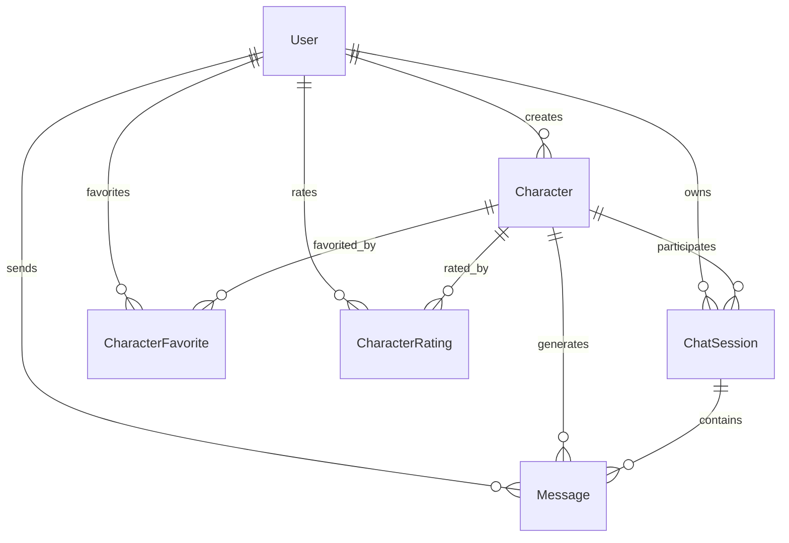

# API 后端模块

[根目录](../../CLAUDE.md) > **api**

## 变更记录 (Changelog)

### [2025-09-17 20:25:02] - 深度补捞与架构完善
- 详细扫描controllers/目录：admin控制器架构（用户、系统、日志、统计、模型管理）
- 新增middleware组件：validate（Zod验证）、requestLogger（请求日志）、rateLimiter（限流）
- 扩展utils工具集：json处理工具、errorLogger（文件日志系统）
- 发现高级AI服务：character-generator（AI角色生成服务，支持NAI3/DALL-E头像生成）
- 新增环境配置：生产、测试环境配置文件（.env.production、.env.test）
- 完善数据库策略：丰富的种子数据（5个完整角色设定，包含对话示例）

### [2025-09-17 19:54:33] - API架构文档初始化
- 完整梳理Express.js + TypeScript + Prisma架构
- 记录RESTful API端点和WebSocket服务
- 整理AI服务集成和中间件系统
- 建立开发和部署指南

---

## 模块职责

TavernAI Plus API后端是基于Express.js和TypeScript的RESTful服务，提供完整的AI角色扮演对话平台后端支持。主要职责包括：

- **用户认证与授权**: JWT认证、OAuth集成、权限管理
- **角色管理**: AI角色CRUD操作、角色生成、评分收藏系统
- **对话引擎**: 单角色对话、多角色聊天室、AI回复生成
- **实时通信**: WebSocket服务、消息推送、在线状态管理
- **AI服务集成**: 支持多种AI模型、流式响应、配置管理
- **数据持久化**: Prisma ORM、SQLite数据库、事务管理
- **系统管理**: 日志记录、性能监控、错误处理

## 入口与启动

### 主入口文件
- **`src/server.ts`**: Express应用主入口，服务器配置和中间件注册
- **`src/config/env.config.ts`**: 环境变量验证和配置管理
- **`prisma/schema.prisma`**: 数据库schema定义
- **`prisma/seed.ts`**: 数据库种子数据生成（5个完整角色+测试用户）

### 启动脚本
```bash
# 开发环境
npm run dev          # 使用nodemon + ts-node热重载开发

# 生产环境
npm run build        # 编译TypeScript到dist目录
npm run start        # 启动编译后的JavaScript

# 数据库操作
npm run migrate      # 运行数据库迁移
npm run seed         # 生成种子数据
```

### 环境变量配置
```env
# 服务器配置
NODE_ENV=development
HOST=localhost
PORT=4000

# 数据库配置
DATABASE_URL="file:./dev.db"

# AI服务配置 (Grok-3)
NEWAPI_BASE_URL=https://ttkk.inping.com/v1
NEWAPI_KEY=your_api_key
DEFAULT_MODEL=grok-3
NEWAPI_MAX_TOKENS=4000
NEWAPI_TEMPERATURE=0.7

# JWT认证
JWT_SECRET=your_jwt_secret
JWT_EXPIRES_IN=7d

# 其他配置
CORS_ORIGIN=http://localhost:3000
```

## 对外接口

### RESTful API端点

#### 认证服务 (`/api/auth`)
- `POST /login` - 用户登录
- `POST /register` - 用户注册
- `POST /logout` - 用户登出
- `GET /profile` - 获取用户资料
- `PUT /profile` - 更新用户资料

#### 角色管理 (`/api/characters`)
- `GET /` - 获取角色列表（支持分页、搜索、排序）
- `GET /popular` - 获取热门角色
- `GET /my` - 获取我的角色
- `GET /favorites` - 获取收藏的角色
- `GET /:id` - 获取角色详情
- `POST /` - 创建新角色
- `PUT /:id` - 更新角色
- `DELETE /:id` - 删除角色
- `POST /:id/favorite` - 收藏/取消收藏
- `POST /:id/rate` - 评分角色
- `POST /:id/clone` - 克隆角色
- `POST /generate` - AI生成角色设定

#### 对话服务 (`/api/chat`)
- `GET /sessions` - 获取聊天会话列表
- `POST /sessions` - 创建新会话
- `GET /sessions/:id` - 获取会话详情
- `POST /sessions/:id/messages` - 发送消息
- `GET /sessions/:id/messages` - 获取消息历史
- `DELETE /sessions/:id` - 删除会话

#### 角色市场 (`/api/marketplace`)
- `GET /characters` - 浏览市场角色
- `GET /categories` - 获取角色分类
- `GET /tags` - 获取标签列表
- `GET /featured` - 获取精选角色

#### AI功能 (`/api/ai`)
- `POST /chat` - AI对话生成
- `POST /generate/character` - AI生成角色
- `GET /models` - 获取可用模型
- `GET /status` - AI服务状态检查

#### 系统管理 (`/api/admin`)
- `GET /stats` - 系统统计数据
- `GET /users` - 用户管理
- `GET /logs` - 系统日志
- `PUT /config` - 系统配置

### WebSocket API
- **连接端点**: `ws://localhost:4000`
- **事件类型**:
  - `join_room` - 加入聊天室
  - `leave_room` - 离开聊天室
  - `send_message` - 发送消息
  - `typing_start` / `typing_stop` - 输入状态
  - `user_online` / `user_offline` - 在线状态

### 健康检查
- `GET /health` - 服务健康状态，包含数据库和AI服务状态

## 关键依赖与配置

### 核心依赖
```json
{
  "dependencies": {
    "express": "^4.18.2",
    "typescript": "^5.3.3",
    "@prisma/client": "^5.7.1",
    "prisma": "^5.7.1",
    "jsonwebtoken": "^9.0.2",
    "bcryptjs": "^2.4.3",
    "axios": "^1.12.2",
    "socket.io": "^4.6.0",
    "winston": "^3.17.0",
    "zod": "^3.22.4",
    "express-rate-limit": "^7.1.5",
    "date-fns": "^3.6.0"
  }
}
```

### 控制器架构
- **管理控制器**: `src/controllers/admin/`
  - `user.ts` - 用户管理控制器
  - `system.ts` - 系统信息控制器
  - `log.ts` - 日志管理控制器
  - `stats.ts` - 统计数据控制器
  - `model.ts` - AI模型管理控制器
  - `index.ts` - 控制器统一导出

### 中间件系统
- **认证中间件**: `src/middleware/auth.ts`
  - JWT token验证
  - 可选认证 (optionalAuth)
  - 权限检查

- **错误处理**: `src/middleware/errorHandler.ts`
  - 全局错误捕获
  - 统一错误响应格式
  - 开发/生产环境错误信息差异化

- **请求日志**: `src/middleware/requestLogger.ts`
  - HTTP请求日志记录
  - 彩色控制台输出
  - 性能监控（请求耗时）

- **速率限制**: `src/middleware/rateLimiter.ts`
  - API调用频率限制（每分钟100次）
  - 严格限制模式（认证路由15分钟5次）
  - 自定义错误响应

- **请求验证**: `src/middleware/validate.ts`
  - 输入参数验证
  - Zod schema验证
  - 详细错误信息返回

- **管理员权限**: `src/middleware/admin.ts`
  - 管理员身份验证
  - 权限检查

### AI服务集成
- **AI服务类**: `src/services/ai.ts`
  - 支持Grok-3、OpenAI、Anthropic等模型
  - 流式响应处理
  - Token计算和成本控制
  - 角色设定生成

- **角色生成服务**: `src/services/character-generator.ts`
  - AI角色完整设定生成
  - 支持多语言（中文、英文、日文）
  - 图像生成集成（NAI3/DALL-E 3）
  - 角色模板和优化功能

- **配置管理**: `src/config/env.config.ts`
  - 环境变量验证
  - AI服务健康检查
  - 动态配置切换

### 工具函数集
- **JSON处理**: `src/utils/json.ts`
  - SQLite JSON字段处理工具
  - 类型安全的JSON解析
  - 数组操作辅助函数

- **错误日志**: `src/utils/errorLogger.ts`
  - 文件日志系统（按日期轮转）
  - 多级别日志（ERROR/WARN/INFO）
  - 自动清理旧日志（7天）
  - 开发环境控制台输出

## 数据模型

### 核心实体
- **User**: 用户表，包含认证信息、订阅状态、积分等
- **Character**: AI角色表，包含角色设定、头像、评分等
- **ChatSession**: 对话会话表，单角色对话记录
- **ChatRoom**: 多角色聊天室表
- **Message**: 消息表，存储对话内容
- **CharacterFavorite**: 角色收藏关联表
- **CharacterRating**: 角色评分表

### 种子数据策略
数据库种子包含5个完整的AI角色设定：
- **司夜**: 神秘夜之女王（冷漠高贵，内心柔软）
- **艾莉亚**: 活泼精灵法师（开朗好奇，魔法学徒）
- **雷克斯**: 傲慢龙王（威严强大，重视荣誉）
- **露娜**: 温柔月之女神（慈爱智慧，治愈心灵）
- **凯尔**: 正义圣光骑士（勇敢坚定，保护弱者）

每个角色包含：
- 完整的性格设定和背景故事
- 3个示例对话展示角色特征
- 标签分类和评分数据
- 测试用户的收藏和评分关联

### 数据库关系


### 主要索引
- User: email, username (唯一)
- Character: creatorId, isPublic, rating, category
- Message: sessionId, userId, createdAt
- CharacterFavorite: userId_characterId (复合唯一)

## 测试与质量

### 测试框架
- **Jest**: 单元测试和集成测试
- **ts-jest**: TypeScript支持
- **Supertest**: HTTP接口测试

### 测试结构
```
src/__tests__/
├── routes/
│   ├── auth.test.ts
│   ├── character.test.ts
│   └── chat.test.ts
├── services/
│   └── ai.test.ts
└── middleware/
    └── auth.test.ts
```

### 代码质量工具
- **ESLint**: 代码规范检查
- **Prettier**: 代码格式化
- **TypeScript**: 类型检查

### 测试命令
```bash
npm run test              # 运行所有测试
npm run test:watch        # 监听模式测试
npm run test:coverage     # 测试覆盖率报告
npm run lint             # 代码规范检查
```

## 常见问题 (FAQ)

### Q: 如何添加新的AI模型支持？
A: 在 `src/services/ai.ts` 中的 `aiService` 类添加新的模型配置，并在环境变量中添加相应的API密钥配置。

### Q: 如何扩展角色属性？
A: 更新 `prisma/schema.prisma` 中的 `Character` 模型，运行 `npx prisma migrate dev` 生成迁移文件。

### Q: WebSocket连接断开如何处理？
A: 在 `src/websocket/index.ts` 中实现重连逻辑，前端需要监听 `disconnect` 事件并重连。

### Q: 如何优化AI响应速度？
A: 实现响应缓存、使用流式传输、选择更快的AI模型、优化prompt长度。

### Q: 数据库性能如何优化？
A: 添加适当索引、使用连接池、实现查询缓存、定期清理过期数据。

### Q: 如何使用角色生成服务？
A: 调用 `/api/ai/generate/character` 端点，提供角色描述和可选参数（风格、性格、背景），系统将返回完整的角色设定。

### Q: 日志系统如何配置？
A: 日志自动按日期分文件存储在 `logs/` 目录，可通过 `errorLogger` 工具记录不同级别的日志。

## 相关文件清单

### 核心文件
- `src/server.ts` - 服务器主入口
- `prisma/schema.prisma` - 数据库schema
- `prisma/seed.ts` - 种子数据生成
- `src/config/env.config.ts` - 环境配置
- `package.json` - 依赖和脚本配置

### 控制器文件
- `src/controllers/admin/index.ts` - 管理控制器入口
- `src/controllers/admin/user.ts` - 用户管理
- `src/controllers/admin/system.ts` - 系统信息
- `src/controllers/admin/log.ts` - 日志管理
- `src/controllers/admin/stats.ts` - 统计数据
- `src/controllers/admin/model.ts` - 模型管理

### 路由文件
- `src/routes/auth.ts` - 认证路由
- `src/routes/character.ts` - 角色管理路由
- `src/routes/chat.ts` - 对话路由
- `src/routes/marketplace.ts` - 市场路由
- `src/routes/ai-features.ts` - AI功能路由
- `src/routes/admin.ts` - 管理后台路由

### 服务文件
- `src/services/ai.ts` - AI服务集成
- `src/services/character-generator.ts` - AI角色生成服务
- `src/services/email.ts` - 邮件服务
- `src/services/payment.ts` - 支付服务

### 中间件文件
- `src/middleware/auth.ts` - 认证中间件
- `src/middleware/errorHandler.ts` - 错误处理
- `src/middleware/rateLimiter.ts` - 速率限制
- `src/middleware/validate.ts` - 请求验证
- `src/middleware/requestLogger.ts` - 请求日志
- `src/middleware/admin.ts` - 管理员权限

### WebSocket
- `src/websocket/index.ts` - WebSocket服务器

### 工具文件
- `src/utils/json.ts` - JSON处理工具
- `src/utils/errorLogger.ts` - 错误日志工具

### 环境配置
- `.env` - 开发环境配置
- `.env.production` - 生产环境配置
- `.env.test` - 测试环境配置

---

*本文档涵盖API后端的核心架构和开发指导。如需了解前端模块，请查看 [Web前端文档](../web/CLAUDE.md)。*