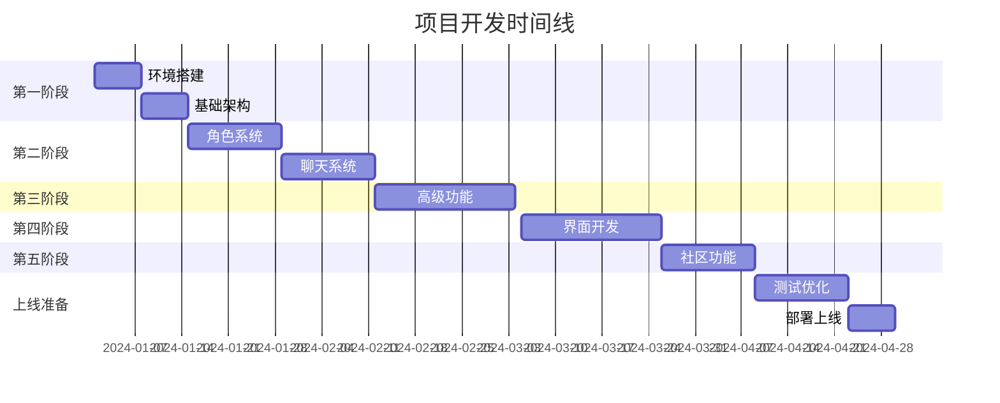

# QuackAI 克隆项目完整实施方案

## 项目概述

### 项目名称
**TavernAI Plus** - 基于 SillyTavern 的下一代 AI 角色扮演平台

### 项目目标
基于 SillyTavern 的强大底层，打造一个功能完善、体验优秀的 AI 角色扮演平台，实现并超越 quack.im 的所有核心功能。

### 核心价值主张
- 🎭 **沉浸式角色扮演** - 多角色互动、丰富的故事创作
- 🤖 **多模型支持** - 集成主流 AI 模型（DeepSeek、Claude、GPT、Gemini 等）
- 🎨 **智能创作工具** - AI 辅助角色生成、自动构建属性和开场白
- 🌍 **世界观构建** - 知识库系统、故事书功能
- 📱 **全平台覆盖** - Web、iOS、Android 多端同步

## 一、功能需求分析

### 1.1 核心功能模块

#### A. 用户系统
- **注册/登录**
  - 邮箱注册
  - 手机号注册
  - 第三方登录（Google、Discord）
  - 游客试用模式
- **用户中心**
  - 个人资料管理
  - 虚拟货币系统（虾米）
  - 会员订阅管理
  - 使用记录和统计

#### B. 角色系统
- **角色创建**
  - AI 自动生成角色属性
  - NAI3 图像生成
  - 角色标签系统
  - 角色卡导入（V2/V3 格式）
- **角色管理**
  - 公开/私有角色
  - 角色分享市场
  - 角色收藏
  - 角色评分系统

#### C. 聊天系统
- **对话功能**
  - 单角色对话
  - 多角色群聊
  - 召唤角色功能
  - 指导回复
- **高级功能**
  - 世界观/知识库
  - 故事书系统
  - 预设模型切换
  - 聊天设定自定义

#### D. AI 模型集成
- **支持模型**
  - DeepSeek V3
  - Claude 3
  - GPT-4
  - Gemini
  - Cohere
  - Grok
  - 自定义 API
- **模型配置**
  - 温度参数调节
  - 上下文长度设置
  - 回复长度控制
  - 流式输出

#### E. 创作工具
- **智能创作**
  - AI 角色生成器
  - 开场白生成
  - 剧情编织工具
  - 世界观构建器
- **内容管理**
  - 故事管理
  - 人设管理
  - 预设管理

### 1.2 特色功能

#### 增强体验功能
1. **指导回复** - 控制 AI 回复方向
2. **召唤角色** - 动态加入新角色
3. **模型微调** - 自定义文风和格式
4. **知识库** - 构建世界观设定

#### 社区功能
1. **角色市场** - 分享和发现角色
2. **评论系统** - 角色评价和讨论
3. **Discord 社区** - 用户交流平台
4. **公告系统** - 更新通知

## 二、技术架构设计

### 2.1 整体架构

```
┌─────────────────────────────────────────────────────┐
│                    前端应用层                        │
├─────────────────────────────────────────────────────┤
│  Web App │ iOS App │ Android App │ Desktop App     │
├─────────────────────────────────────────────────────┤
│                    API 网关层                        │
├─────────────────────────────────────────────────────┤
│              业务服务层 (基于 SillyTavern)           │
├─────────────────────────────────────────────────────┤
│   用户服务 │ 角色服务 │ 聊天服务 │ AI服务 │ 存储服务│
├─────────────────────────────────────────────────────┤
│                    数据持久层                        │
├─────────────────────────────────────────────────────┤
│  PostgreSQL │ Redis │ MongoDB │ MinIO │ CDN        │
└─────────────────────────────────────────────────────┘
```

### 2.2 技术选型

#### 前端技术栈
- **Web 前端**
  - Vue 3 + TypeScript
  - Vite 构建工具
  - Element Plus UI 框架
  - Tailwind CSS
  - Socket.io 实时通信
  
- **移动端**
  - React Native / Flutter
  - 原生 iOS (Swift)
  - 原生 Android (Kotlin)

#### 后端技术栈（基于 SillyTavern 扩展）
- **核心框架**
  - Node.js + Express (继承自 SillyTavern)
  - TypeScript
  - Socket.io
  
- **数据库**
  - PostgreSQL (主数据库)
  - Redis (缓存 + 会话)
  - MongoDB (聊天记录)
  - MinIO (对象存储)

- **AI 服务**
  - 继承 SillyTavern 的 AI 提供商集成
  - 新增 DeepSeek API
  - 新增 Gemini API
  - NAI3 图像生成 API

### 2.3 核心模块改造

#### A. SillyTavern 改造计划

```javascript
// 1. 用户系统集成
src/
├── auth/
│   ├── passport.js      // 认证策略
│   ├── jwt.js          // JWT 处理
│   └── permissions.js   // 权限管理
├── user/
│   ├── profile.js      // 用户资料
│   ├── subscription.js  // 订阅管理
│   └── credits.js      // 虚拟货币

// 2. 数据库层改造
src/database/
├── models/
│   ├── User.js
│   ├── Character.js
│   ├── Chat.js
│   └── Subscription.js
├── migrations/
└── seeders/

// 3. API 端点扩展
src/endpoints/
├── auth.js            // 认证接口
├── marketplace.js     // 角色市场
├── subscription.js    // 订阅接口
└── analytics.js       // 数据分析
```

#### B. 前端界面重构

```vue
<!-- 主要页面结构 -->
src/pages/
├── Home.vue           // 首页
├── Discovery.vue      // 发现页
├── Chat.vue          // 聊天界面
├── Studio.vue        // 创作工作室
├── Profile.vue       // 个人中心
└── Marketplace.vue   // 角色市场
```

## 三、详细功能开发计划

### 3.1 第一阶段：基础设施（2周）

#### Week 1: 环境搭建与基础改造
- [ ] Fork SillyTavern 项目并初始化
- [ ] 搭建开发环境和 CI/CD
- [ ] 数据库设计和初始化
- [ ] 用户认证系统实现
- [ ] 基础 API 框架搭建

#### Week 2: 核心服务实现
- [ ] 用户服务实现
- [ ] 角色管理服务
- [ ] 文件存储服务
- [ ] 缓存系统配置
- [ ] 日志和监控系统

### 3.2 第二阶段：核心功能（4周）

#### Week 3-4: 角色系统
```javascript
// 角色创建 API
POST /api/characters/create
{
  name: string,
  description: string,
  personality: string,
  first_message: string,
  avatar: file,
  tags: string[],
  is_public: boolean,
  ai_generated: {
    enabled: boolean,
    model: string,
    prompt: string
  }
}

// AI 生成角色
POST /api/characters/generate
{
  prompt: string,
  model: 'deepseek-v3',
  include_image: boolean,
  image_model: 'nai3'
}
```

#### Week 5-6: 聊天系统
```javascript
// 聊天会话管理
class ChatSession {
  constructor(userId, characterIds) {
    this.sessionId = uuid();
    this.userId = userId;
    this.characters = characterIds;
    this.messages = [];
    this.worldInfo = {};
    this.storybook = null;
  }
  
  async sendMessage(message, options) {
    // 处理消息发送
    // 应用世界观和故事书
    // 调用 AI 模型
    // 返回响应
  }
  
  async summonCharacter(characterId) {
    // 动态添加角色
  }
  
  async applyGuidance(guidance) {
    // 应用指导回复
  }
}
```

### 3.3 第三阶段：高级功能（3周）

#### Week 7: 世界观和知识库
```javascript
// 知识库数据结构
{
  world_id: uuid,
  name: string,
  description: string,
  entries: [
    {
      trigger: string[],     // 触发词
      content: string,       // 内容
      priority: number,      // 优先级
      context: string        // 上下文类型
    }
  ],
  activation: {
    auto: boolean,
    manual: boolean,
    threshold: number
  }
}
```

#### Week 8: AI 模型集成
- [ ] DeepSeek V3 集成
- [ ] Gemini 集成
- [ ] Claude 3 集成
- [ ] 模型切换和预设系统
- [ ] 流式输出优化

#### Week 9: 创作工具
- [ ] AI 角色生成器
- [ ] 开场白生成器
- [ ] 剧情编织工具
- [ ] NAI3 图像生成集成

### 3.4 第四阶段：用户界面（3周）

#### Week 10-11: Web 前端开发
```vue
<template>
  <!-- 聊天界面组件 -->
  <div class="chat-container">
    <ChatSidebar 
      :characters="characters"
      @select="selectCharacter"
      @summon="summonCharacter"
    />
    
    <ChatMain
      :messages="messages"
      :current-character="currentCharacter"
      @send="sendMessage"
      @guidance="setGuidance"
    />
    
    <ChatSettings
      :model="selectedModel"
      :presets="presets"
      :world-info="worldInfo"
      @update="updateSettings"
    />
  </div>
</template>
```

#### Week 12: 移动端适配
- [ ] 响应式设计实现
- [ ] PWA 配置
- [ ] 移动端手势支持
- [ ] 离线功能

### 3.5 第五阶段：社区功能（2周）

#### Week 13: 角色市场
- [ ] 角色上传和审核
- [ ] 角色浏览和搜索
- [ ] 评分和评论系统
- [ ] 收藏和分享功能

#### Week 14: 社区集成
- [ ] Discord 集成
- [ ] 公告系统
- [ ] 用户反馈系统
- [ ] 数据统计面板

## 四、部署和运维方案

### 4.1 部署架构

```yaml
# docker-compose.yml
version: '3.8'
services:
  # 应用服务
  web:
    build: ./web
    ports:
      - "3000:3000"
    environment:
      - NODE_ENV=production
    depends_on:
      - api
      - redis
      
  api:
    build: ./api
    ports:
      - "5000:5000"
    environment:
      - DATABASE_URL=postgresql://...
      - REDIS_URL=redis://...
    depends_on:
      - postgres
      - redis
      - mongodb
      
  # 数据服务
  postgres:
    image: postgres:15
    volumes:
      - postgres_data:/var/lib/postgresql/data
      
  redis:
    image: redis:7-alpine
    
  mongodb:
    image: mongo:6
    volumes:
      - mongo_data:/data/db
      
  # 反向代理
  nginx:
    image: nginx:alpine
    ports:
      - "80:80"
      - "443:443"
    volumes:
      - ./nginx.conf:/etc/nginx/nginx.conf
      - ./ssl:/etc/nginx/ssl
```

### 4.2 云服务部署

#### A. 推荐云平台
1. **AWS 方案**
   - EC2 / ECS (应用部署)
   - RDS (PostgreSQL)
   - ElastiCache (Redis)
   - S3 (对象存储)
   - CloudFront (CDN)

2. **阿里云方案**
   - ECS (云服务器)
   - RDS (数据库)
   - Redis (缓存)
   - OSS (对象存储)
   - CDN (内容分发)

#### B. 自动化部署
```yaml
# .github/workflows/deploy.yml
name: Deploy to Production

on:
  push:
    branches: [main]

jobs:
  deploy:
    runs-on: ubuntu-latest
    steps:
      - uses: actions/checkout@v2
      
      - name: Build Docker images
        run: |
          docker build -t tavernai-web ./web
          docker build -t tavernai-api ./api
          
      - name: Push to Registry
        run: |
          docker push tavernai-web
          docker push tavernai-api
          
      - name: Deploy to Server
        run: |
          ssh deploy@server 'docker-compose pull && docker-compose up -d'
```

### 4.3 监控和维护

#### A. 监控方案
```javascript
// 性能监控
const monitoring = {
  // APM 监控
  apm: 'New Relic / DataDog',
  
  // 日志收集
  logging: {
    service: 'ELK Stack',
    levels: ['error', 'warn', 'info', 'debug']
  },
  
  // 指标监控
  metrics: {
    response_time: '< 200ms',
    uptime: '> 99.9%',
    error_rate: '< 0.1%'
  },
  
  // 告警规则
  alerts: [
    'API 响应时间 > 500ms',
    '错误率 > 1%',
    'CPU 使用率 > 80%',
    '内存使用率 > 90%'
  ]
};
```

#### B. 备份策略
- 数据库每日自动备份
- 用户数据实时同步
- 文件存储多地备份
- 配置文件版本控制

## 五、性能优化方案

### 5.1 前端优化
```javascript
// 性能优化配置
const optimization = {
  // 代码分割
  splitChunks: {
    chunks: 'all',
    cacheGroups: {
      vendor: {
        test: /[\\/]node_modules[\\/]/,
        priority: 10
      }
    }
  },
  
  // 懒加载
  lazyLoading: {
    routes: true,
    components: true,
    images: true
  },
  
  // 缓存策略
  cache: {
    strategy: 'CacheFirst',
    maxAge: 86400,
    resources: ['js', 'css', 'images']
  },
  
  // 压缩
  compression: {
    gzip: true,
    brotli: true,
    minify: true
  }
};
```

### 5.2 后端优化
```javascript
// API 优化
class APIOptimization {
  // 数据库查询优化
  async optimizedQuery() {
    return await db.query(`
      SELECT c.*, u.username, COUNT(r.id) as rating_count
      FROM characters c
      LEFT JOIN users u ON c.user_id = u.id
      LEFT JOIN ratings r ON c.id = r.character_id
      WHERE c.is_public = true
      GROUP BY c.id, u.username
      ORDER BY c.created_at DESC
      LIMIT 20
    `);
  }
  
  // Redis 缓存
  async getCached(key, generator) {
    const cached = await redis.get(key);
    if (cached) return JSON.parse(cached);
    
    const data = await generator();
    await redis.setex(key, 3600, JSON.stringify(data));
    return data;
  }
  
  // 并发控制
  async batchProcess(items, processor, concurrency = 5) {
    const results = [];
    for (let i = 0; i < items.length; i += concurrency) {
      const batch = items.slice(i, i + concurrency);
      const batchResults = await Promise.all(
        batch.map(processor)
      );
      results.push(...batchResults);
    }
    return results;
  }
}
```

### 5.3 AI 响应优化
```javascript
// 流式输出实现
class StreamingAI {
  async *generateStream(prompt, model) {
    const response = await fetch(`${API_URL}/v1/chat/completions`, {
      method: 'POST',
      headers: {
        'Content-Type': 'application/json',
        'Authorization': `Bearer ${API_KEY}`
      },
      body: JSON.stringify({
        model,
        messages: [{ role: 'user', content: prompt }],
        stream: true
      })
    });
    
    const reader = response.body.getReader();
    const decoder = new TextDecoder();
    
    while (true) {
      const { done, value } = await reader.read();
      if (done) break;
      
      const chunk = decoder.decode(value);
      const lines = chunk.split('\n');
      
      for (const line of lines) {
        if (line.startsWith('data: ')) {
          const data = JSON.parse(line.slice(6));
          if (data.choices[0].delta.content) {
            yield data.choices[0].delta.content;
          }
        }
      }
    }
  }
}
```

## 六、安全策略

### 6.1 安全措施
```javascript
// 安全配置
const security = {
  // 认证和授权
  auth: {
    jwt_secret: process.env.JWT_SECRET,
    session_timeout: '24h',
    refresh_token: '7d',
    mfa: true
  },
  
  // 数据加密
  encryption: {
    algorithm: 'AES-256-GCM',
    sensitive_fields: ['password', 'api_key', 'payment_info']
  },
  
  // 速率限制
  rate_limit: {
    api: '100/hour',
    chat: '1000/hour',
    generation: '50/hour'
  },
  
  // 内容审核
  moderation: {
    text: 'OpenAI Moderation API',
    image: 'Azure Content Moderator',
    auto_block: true
  },
  
  // XSS/CSRF 防护
  protection: {
    helmet: true,
    cors: {
      origin: ['https://tavernai.com'],
      credentials: true
    },
    csrf: true
  }
};
```

### 6.2 数据保护
- GDPR 合规
- 用户数据加密
- 定期安全审计
- 漏洞扫描和修复

## 七、成本预算

### 7.1 开发成本
| 项目 | 人员 | 时间 | 预算 |
|-----|------|------|------|
| 后端开发 | 2人 | 3个月 | ¥120,000 |
| 前端开发 | 2人 | 3个月 | ¥120,000 |
| UI/UX 设计 | 1人 | 2个月 | ¥40,000 |
| 测试工程师 | 1人 | 2个月 | ¥30,000 |
| 项目管理 | 1人 | 3个月 | ¥45,000 |
| **总计** | **7人** | **3个月** | **¥355,000** |

### 7.2 运营成本（月度）
| 项目 | 规格 | 费用 |
|-----|------|------|
| 云服务器 | 4核8G×3 | ¥2,000 |
| 数据库 | RDS 高可用 | ¥1,500 |
| CDN | 1TB 流量 | ¥500 |
| 对象存储 | 500GB | ¥200 |
| AI API | 100万 tokens | ¥3,000 |
| SSL 证书 | 通配符证书 | ¥100 |
| **月度总计** | - | **¥7,300** |

## 八、时间规划

### 8.1 项目里程碑


### 8.2 版本发布计划
- **v0.1.0 Alpha** - 基础功能完成（第6周）
- **v0.5.0 Beta** - 核心功能完成（第10周）
- **v0.9.0 RC** - 功能冻结，修复 bug（第13周）
- **v1.0.0 正式版** - 正式上线（第14周）

## 九、风险评估与应对

### 9.1 技术风险
| 风险 | 概率 | 影响 | 应对措施 |
|-----|------|------|----------|
| AI API 限流 | 高 | 高 | 多供应商备份、本地模型部署 |
| 数据库性能瓶颈 | 中 | 高 | 读写分离、分库分表 |
| 安全漏洞 | 中 | 高 | 定期安全审计、漏洞赏金计划 |
| 扩展性问题 | 低 | 中 | 微服务架构、容器化部署 |

### 9.2 运营风险
| 风险 | 概率 | 影响 | 应对措施 |
|-----|------|------|----------|
| 内容合规 | 高 | 高 | 自动审核系统、人工复审 |
| 版权问题 | 中 | 高 | DMCA 流程、用户协议 |
| 竞争对手 | 高 | 中 | 差异化功能、快速迭代 |
| 资金链断裂 | 低 | 高 | 分阶段融资、订阅收费 |

## 十、成功指标

### 10.1 技术指标
- 系统可用性 > 99.9%
- API 响应时间 < 200ms
- 并发用户数 > 10,000
- 日活跃用户 > 5,000

### 10.2 业务指标
- 注册用户数 > 100,000（6个月）
- 付费转化率 > 5%
- 月收入 > ¥50,000（6个月）
- 用户留存率 > 40%（30天）

### 10.3 用户体验指标
- 用户满意度 > 4.5/5
- 应用商店评分 > 4.5
- NPS 分数 > 50
- 客服响应时间 < 1小时

## 十一、团队组建

### 11.1 核心团队
- **项目负责人** - 整体规划和协调
- **技术负责人** - 架构设计和技术决策
- **产品经理** - 需求分析和产品设计
- **全栈工程师×2** - 前后端开发
- **AI 工程师** - 模型集成和优化
- **UI/UX 设计师** - 界面和交互设计
- **测试工程师** - 质量保证

### 11.2 外部资源
- AI 模型供应商合作
- 云服务技术支持
- 安全顾问
- 法务顾问

## 总结

本实施方案基于 SillyTavern 的强大底层，通过系统化的改造和扩展，打造一个功能完善、体验优秀的 AI 角色扮演平台。项目预计在 3-4 个月内完成开发并上线，初期投入约 40 万元，月度运营成本约 7300 元。

通过分阶段开发、持续迭代的方式，我们有信心在保证质量的前提下，按时交付一个超越 quack.im 的优秀产品。

---

*文档版本: v1.0*  
*更新日期: 2024-01-01*  
*负责人: TavernAI Plus 项目组*