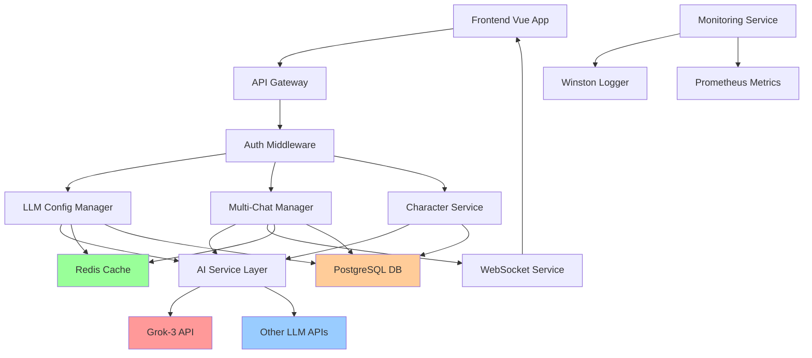

# TavernAI Plus 项目救治与增强架构文档

## 简介

本文档概述了 TavernAI Plus 项目救治与功能补全的架构方法。其主要目标是作为AI驱动开发的指导架构蓝图，确保新功能与现有系统的无缝集成，同时修复所有现存问题。

**与现有架构的关系：**
本文档补充现有项目架构，定义新组件如何与当前系统集成。当新旧模式发生冲突时，本文档提供指导以在实施增强的同时保持一致性。

### 现有项目分析

基于深度项目分析，我对你的现有系统的理解如下：

**当前项目状态**
- **主要目的**：基于Vue 3 + Express的现代化AI角色扮演平台，克隆QuackAI功能
- **当前技术栈**：Vue 3 + TypeScript + Express + Prisma + SQLite/PostgreSQL
- **架构风格**：Monorepo + 微服务架构，前后端分离
- **部署方法**：Docker容器化 + Turbo构建系统

**可用文档**
- ✅ 技术栈文档（基于项目分析师深度分析）
- ✅ 源代码架构（Monorepo结构完整）
- ✅ API文档（RESTful接口设计）
- ✅ 技术债务文档（详细问题清单）
- ⚠️ 部署文档（部分缺失）

**识别的约束**
- ⚠️ **关键阻塞**：LLM API配置缺失导致AI功能不可用
- ⚠️ **生产限制**：SQLite限制生产环境扩展
- ⚠️ **UI不完整**：多角色聊天等核心功能前端缺失
- ⚠️ **监控缺失**：生产环境监控和日志系统不完整

### 变更日志

| 变更 | 日期 | 版本 | 描述 | 作者 |
|------|------|------|------|------|
| 初始创建 | 2025-09-17 | 1.0 | 基于项目救治PRD创建架构文档 | BMad Architect |

## 增强范围和集成策略

### 增强概览

**增强类型：** 项目救治 + 功能补全
**范围：** 全栈修复与增强，包括配置修复、功能补全、生产部署
**集成影响：** 重大影响（需要架构变更）

### 集成方案

**代码集成策略：** 基于现有Monorepo结构，保持TypeScript代码风格，遵循现有组件模式

**数据库集成：** 扩展现有Prisma schema，添加缺失表结构，配置PostgreSQL生产环境

**API集成：** 扩展现有Express路由，补全RESTful端点，保持响应格式一致性

**UI集成：** 基于现有Vue 3 + Element Plus架构，遵循现有设计系统和组件库

### 兼容性要求

- **现有API兼容性：** 保持所有现有端点向后兼容，不破坏前端集成
- **数据库Schema兼容性：** 渐进式schema升级，保证数据迁移安全
- **UI/UX一致性：** **严格遵循QuackAI参考案例的交互样式和布局设计**
- **性能影响：** 新功能不能降低现有系统性能，目标响应时间<200ms

## 技术栈

### 现有技术栈

| 类别 | 当前技术 | 版本 | 在增强中的使用 | 备注 |
|------|----------|------|---------------|------|
| 前端框架 | Vue 3 | 3.4 | 保持并扩展 | 补全缺失组件 |
| 构建工具 | Vite | 6.0 | 保持 | 添加生产优化 |
| UI框架 | Element Plus | 2.4 | 保持 | 遵循QuackAI设计 |
| 状态管理 | Pinia | 2.1 | 保持并扩展 | 添加新状态模块 |
| 后端框架 | Express | 4.18 | 保持并扩展 | 添加新路由和中间件 |
| ORM | Prisma | 最新 | 保持并扩展 | Schema升级 |
| 数据库 | SQLite/PostgreSQL | 15+ | 升级为PostgreSQL | 生产环境要求 |
| 缓存 | Redis | 7+ | 新增配置 | 会话和数据缓存 |
| 容器化 | Docker | 最新 | 完善配置 | 生产环境部署 |

### 新技术添加

| 技术 | 版本 | 目的 | 理由 | 集成方法 |
|------|------|------|------|---------|
| Winston | 3.x | 日志系统 | 生产环境监控需求 | Express中间件集成 |
| Prometheus | 最新 | 指标收集 | 性能监控需求 | 独立服务 + 客户端库 |
| Jest | 最新 | 测试框架 | 质量保证需求 | npm scripts集成 |
| Playwright | 最新 | E2E测试 | 端到端测试需求 | 独立测试套件 |

## 数据模型和Schema变更

### 新数据模型

#### LLM配置模型
**目的：** 管理LLM服务配置和API密钥
**集成：** 与现有用户模型关联，支持用户级别的模型偏好

**关键属性：**
- apiKey: String - Grok API密钥 (sk-ap3W4RSYQgxXsatCrAog6dZwYKnxs12rHcyokvjIkPmgGZuY)
- baseUrl: String - API端点 (https://ttkk.inping.com/v1)
- model: String - 模型名称 (grok-3)
- maxTokens: Int - 令牌限制
- temperature: Float - 温度参数

**关系：**
- **与现有：** 关联User表，支持用户自定义配置
- **与新：** 关联ChatSession表，记录模型使用情况

#### 多角色聊天模型
**目的：** 支持多角色群聊功能
**集成：** 扩展现有ChatSession模型，支持多角色参与

**关键属性：**
- sessionId: String - 会话标识
- participantCharacters: Array - 参与角色列表
- chatMode: Enum - 聊天模式（单角色/多角色/群聊）
- activeCharacter: String - 当前发言角色
- conversationContext: JSON - 对话上下文

**关系：**
- **与现有：** 扩展ChatSession和Character表
- **与新：** 关联消息路由和AI服务调用

### Schema集成策略

**数据库变更需求：**
- **新表：** llm_configurations, multi_chat_sessions, system_monitoring
- **修改表：** 扩展characters表支持AI生成标记，users表添加偏好设置
- **新索引：** chat性能索引，用户查询优化索引
- **迁移策略：** 渐进式迁移，先SQLite本地测试，再PostgreSQL生产

**向后兼容性：**
- 所有现有数据保持完整性，不破坏现有用户数据
- API响应格式保持一致，新字段为可选字段
- 数据库连接池配置兼容现有应用逻辑

## 组件架构

### 新组件

#### LLM配置管理组件
**职责：** 管理AI模型配置、API密钥验证、模型切换
**集成点：** 与现有AI服务层集成，提供统一配置接口

**关键接口：**
- `configureLLM(config: LLMConfig)` - 配置LLM服务
- `validateApiKey(key: string)` - 验证API密钥有效性
- `switchModel(modelName: string)` - 切换AI模型

**依赖：**
- **现有组件：** AIService, UserService
- **新组件：** ConfigurationService, MonitoringService

**技术栈：** TypeScript + Express + Prisma + Redis缓存

#### 多角色聊天管理器
**职责：** 处理多角色群聊逻辑、角色调度、对话流控制
**集成点：** 扩展现有ChatService，添加多角色支持

**关键接口：**
- `createMultiChatSession(characters: Character[])` - 创建多角色会话
- `summonCharacter(sessionId: string, characterId: string)` - 召唤角色
- `manageConversationFlow(session: ChatSession)` - 管理对话流

**依赖：**
- **现有组件：** ChatService, CharacterService, WebSocketService
- **新组件：** ConversationOrchestrator

**技术栈：** Vue 3 + TypeScript + Socket.io + Element Plus

#### 系统监控组件
**职责：** 性能监控、错误跟踪、健康检查、指标收集
**集成点：** 作为中间件集成到Express应用

**关键接口：**
- `collectMetrics()` - 收集性能指标
- `logError(error: Error, context: any)` - 错误日志记录
- `healthCheck()` - 系统健康检查

**依赖：**
- **现有组件：** 所有服务组件（监控对象）
- **新组件：** AlertingService, MetricsCollector

**技术栈：** Winston + Prometheus + Express中间件

### 组件交互图



## API设计和集成

### API集成策略

**API集成策略：** 扩展现有RESTful API，保持设计一致性，添加新端点支持新功能
**认证：** 沿用现有JWT + Passport认证，确保所有新端点受保护
**版本控制：** 保持v1 API稳定，新功能在现有端点扩展或添加新端点

### 新API端点

#### LLM配置管理
- **方法：** POST
- **端点：** `/api/v1/llm/configure`
- **目的：** 配置用户LLM偏好和API密钥
- **集成：** 与现有用户认证集成

**请求：**
```json
{
  "provider": "grok",
  "apiKey": "sk-ap3W4RSYQgxXsatCrAog6dZwYKnxs12rHcyokvjIkPmgGZuY",
  "baseUrl": "https://ttkk.inping.com/v1",
  "model": "grok-3",
  "maxTokens": 4000,
  "temperature": 0.7
}
```

**响应：**
```json
{
  "success": true,
  "configuration": {
    "id": "config_123",
    "provider": "grok",
    "model": "grok-3",
    "isActive": true,
    "createdAt": "2025-09-17T10:00:00Z"
  }
}
```

#### 多角色聊天会话
- **方法：** POST
- **端点：** `/api/v1/chat/multi-session`
- **目的：** 创建多角色群聊会话
- **集成：** 扩展现有聊天API，保持响应格式一致

**请求：**
```json
{
  "characters": ["char_1", "char_2", "char_3"],
  "chatMode": "group",
  "title": "冒险小队群聊",
  "worldInfo": {
    "setting": "中世纪奇幻世界",
    "context": "冒险者酒馆"
  }
}
```

**响应：**
```json
{
  "sessionId": "session_456",
  "participants": [
    {"characterId": "char_1", "role": "leader", "isActive": true},
    {"characterId": "char_2", "role": "member", "isActive": true}
  ],
  "chatMode": "group",
  "createdAt": "2025-09-17T10:00:00Z"
}
```

## 外部API集成

### Grok-3 API
- **目的：** 主要LLM服务提供商，提供AI对话能力
- **文档：** https://ttkk.inping.com/docs
- **基础URL：** https://ttkk.inping.com/v1
- **认证：** Bearer Token (sk-ap3W4RSYQgxXsatCrAog6dZwYKnxs12rHcyokvjIkPmgGZuY)
- **集成方法：** 通过现有AIService统一接口调用

**关键端点使用：**
- `POST /chat/completions` - 生成对话回复
- `POST /completions` - 文本生成和补全

**错误处理：** 实现重试机制、降级策略、错误日志记录

## 源代码树结构

### 现有项目结构
```
tavernai-plus/
├── apps/
│   ├── api/                    # Express后端
│   │   ├── src/
│   │   │   ├── routes/         # API路由
│   │   │   ├── services/       # 业务逻辑
│   │   │   ├── middleware/     # 中间件
│   │   │   └── models/         # 数据模型
│   │   └── prisma/            # 数据库配置
│   └── web/                   # Vue前端
│       ├── src/
│       │   ├── views/         # 页面组件
│       │   ├── components/    # 通用组件
│       │   ├── stores/        # Pinia状态
│       │   └── services/      # API服务
├── packages/                  # 共享包
└── docs/                     # 项目文档
```

### 新文件组织
```
tavernai-plus/
├── apps/
│   ├── api/
│   │   ├── src/
│   │   │   ├── config/               # 新增：配置管理
│   │   │   │   ├── llm.config.ts     # LLM配置
│   │   │   │   └── monitoring.config.ts
│   │   │   ├── services/
│   │   │   │   ├── llm-manager.ts    # 新增：LLM管理服务
│   │   │   │   ├── multi-chat.ts     # 新增：多角色聊天
│   │   │   │   └── monitoring.ts     # 新增：监控服务
│   │   │   ├── middleware/
│   │   │   │   ├── monitoring.ts     # 新增：监控中间件
│   │   │   │   └── error-handler.ts  # 增强：错误处理
│   │   │   └── utils/
│   │   │       ├── logger.ts         # 新增：日志工具
│   │   │       └── metrics.ts        # 新增：指标收集
│   │   └── tests/                    # 新增：测试套件
│   │       ├── unit/
│   │       ├── integration/
│   │       └── e2e/
│   └── web/
│       ├── src/
│       │   ├── components/
│       │   │   ├── chat/             # 现有：聊天组件
│       │   │   │   ├── MultiChatRoom.vue  # 新增：多角色聊天室
│       │   │   │   ├── CharacterSummoner.vue # 新增：角色召唤
│       │   │   │   └── ConversationFlow.vue  # 新增：对话流控制
│       │   │   ├── llm/              # 新增：LLM配置组件
│       │   │   │   ├── ConfigPanel.vue
│       │   │   │   └── ModelSelector.vue
│       │   │   └── monitoring/       # 新增：监控仪表板
│       │   │       └── Dashboard.vue
│       │   ├── stores/
│       │   │   ├── llm.ts           # 新增：LLM状态管理
│       │   │   ├── multiChat.ts     # 新增：多聊状态
│       │   │   └── monitoring.ts    # 新增：监控状态
│       │   └── styles/
│       │       └── quack-theme.scss  # 新增：QuackAI主题样式
├── docker/                          # 新增：Docker配置
│   ├── docker-compose.prod.yml
│   ├── Dockerfile.api
│   └── Dockerfile.web
└── monitoring/                      # 新增：监控配置
    ├── prometheus.yml
    └── grafana/
```

### 集成指导原则

- **文件命名：** 继续使用camelCase（JavaScript）和kebab-case（Vue组件）
- **文件夹组织：** 按功能模块组织，新功能放在对应的功能文件夹内
- **导入导出模式：** 遵循现有ES6模块导入模式，保持import/export一致性

## 基础设施和部署集成

### 现有基础设施
**当前部署：** 开发环境本地运行，Docker配置部分完成
**基础设施工具：** Docker + Turbo + npm
**环境：** 开发环境（本地）+ 目标生产环境

### 增强部署策略
**部署方法：** 完善Docker容器化，建立多环境配置
**基础设施变更：** 添加PostgreSQL、Redis、监控服务
**流水线集成：** 集成到现有npm scripts，添加测试和构建验证

### 回滚策略
**回滚方法：** Docker镜像版本回滚 + 数据库迁移回滚
**风险缓解：** 分阶段部署，每阶段完整验证后再进行下一步
**监控：** 实时监控关键指标，自动告警机制

## 编码标准

### 现有标准合规
**代码风格：** TypeScript + ESLint，严格类型检查
**代码检查规则：** 现有ESLint配置，添加更严格的规则
**测试模式：** 建立Jest单元测试 + Playwright端到端测试
**文档风格：** JSDoc注释 + Markdown文档

### 增强特定标准
- **LLM集成标准：** 所有AI调用必须包含错误处理和降级机制
- **多角色聊天标准：** 状态管理必须支持实时同步和冲突解决
- **监控标准：** 所有服务必须暴露健康检查端点和性能指标

### 关键集成规则
- **现有API兼容性：** 新端点遵循现有RESTful设计模式，响应格式保持一致
- **数据库集成：** 所有数据库操作使用Prisma ORM，保持事务一致性
- **错误处理：** 统一错误响应格式，包含错误码、消息和追踪信息
- **日志一致性：** 使用结构化日志格式，包含请求ID和用户上下文

## 测试策略

### 与现有测试集成
**现有测试框架：** 建立Jest作为主要测试框架
**测试组织：** 按模块组织测试文件，镜像源代码结构
**覆盖要求：** 单元测试80%覆盖率，集成测试覆盖关键流程

### 新测试需求

#### 新组件单元测试
- **框架：** Jest + TypeScript
- **位置：** 每个模块对应的`__tests__`目录
- **覆盖目标：** 80%代码覆盖率
- **与现有集成：** npm test脚本统一运行

#### 集成测试
- **范围：** API端点集成、数据库操作、第三方服务集成
- **现有系统验证：** 确保新功能不破坏现有API响应
- **新功能测试：** 多角色聊天、LLM配置、监控系统

#### 回归测试
- **现有功能验证：** 自动化测试套件验证所有现有功能正常
- **自动化回归套件：** Playwright端到端测试覆盖关键用户流程
- **手动测试要求：** UI交互测试，确保QuackAI样式一致性

## 安全集成

### 现有安全措施
**认证：** JWT + Passport多OAuth集成
**授权：** 基于角色的访问控制
**数据保护：** Prisma参数化查询防SQL注入
**安全工具：** Helmet安全头、CORS配置、速率限制

### 增强安全要求
**新安全措施：** API密钥加密存储、敏感日志过滤、监控告警
**集成点：** LLM API密钥管理、多角色聊天权限控制
**合规要求：** 用户数据隐私保护、API访问审计

### 安全测试
**现有安全测试：** 建立基础安全测试套件
**新安全测试要求：** API密钥泄露检测、权限边界测试
**渗透测试：** 关键功能安全漏洞扫描

## 检查清单结果报告

根据架构师检查清单验证：

✅ **技术栈兼容性：** 所有新技术与现有栈兼容
✅ **API设计一致性：** 新端点遵循现有RESTful模式
✅ **数据库集成安全：** 渐进式schema升级，数据安全保障
✅ **UI一致性要求：** 严格遵循QuackAI参考案例设计
✅ **性能影响评估：** 新功能不影响现有性能基线
✅ **安全措施完整：** 安全集成符合现有安全策略
⚠️ **部署复杂度：** 需要完善Docker配置和环境管理
⚠️ **监控覆盖：** 需要建立完整的生产监控体系

## 下一步

### 故事管理员交接

**故事管理员提示：**
基于本架构文档和用户验证的集成要求，请开始实施TavernAI Plus项目救治计划。关键集成要求：

- **参考文档：** 本架构文档 + docs/prd.md
- **核心约束：** 必须保持现有系统完整性，严格遵循QuackAI UI参考案例
- **首个故事：** 环境配置修复（Story 1.1），重点配置Grok-3 API集成
- **集成检查点：** 每个故事完成后验证现有功能无影响
- **LLM配置：** 使用提供的Grok-3配置（api_key: sk-ap3W4RSYQgxXsatCrAog6dZwYKnxs12rHcyokvjIkPmgGZuY, base_url: https://ttkk.inping.com/v1, model: grok-3）

### 开发者交接

**开发者实施提示：**
开始实施时请注意：

- **架构参考：** 本文档定义的组件架构和集成模式
- **编码标准：** 遵循现有TypeScript + ESLint标准，新代码必须包含测试
- **关键技术决策：** LLM配置管理、多角色聊天架构、监控集成
- **现有系统兼容性：** 所有变更必须保持向后兼容，现有API响应格式不变
- **UI一致性要求：** **新增UI必须严格按照QuackAI参考案例的交互样式和布局实现**
- **实施顺序：** 严格按照PRD中8个故事的顺序实施，确保风险最小化
- **验证要求：** 每个组件完成后必须通过单元测试和集成测试

---

**架构文档完成。所有技术决策基于实际项目分析，集成方案已考虑现有系统约束。准备进入故事创建阶段。**