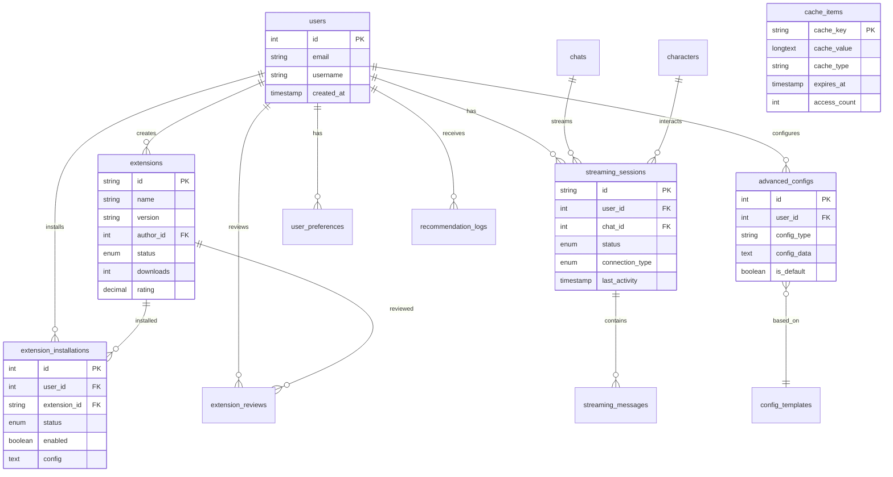

# 核心竞争力提升方案 - 数据模型设计

## 数据模型概览

基于功能需求分析，新增以下核心数据实体来支持竞争力提升功能：

## 1. 扩展系统数据模型

### Extension (扩展注册表)
```sql
CREATE TABLE extensions (
    id VARCHAR(50) PRIMARY KEY,              -- 扩展唯一标识
    name VARCHAR(100) NOT NULL,              -- 扩展显示名称
    version VARCHAR(20) NOT NULL,            -- 版本号 (semver格式)
    author_id INTEGER,                       -- 作者用户ID
    description TEXT,                        -- 扩展描述
    category VARCHAR(50),                    -- 扩展分类: ui, api, tool, theme
    manifest_url TEXT,                       -- 清单文件URL
    package_url TEXT,                        -- 安装包URL
    icon_url TEXT,                          -- 图标URL
    screenshots TEXT,                        -- 截图URLs (JSON数组)

    -- 状态和统计
    status ENUM('pending', 'approved', 'rejected', 'suspended') DEFAULT 'pending',
    downloads INTEGER DEFAULT 0,            -- 下载次数
    rating DECIMAL(3,2) DEFAULT 0.00,       -- 平均评分
    rating_count INTEGER DEFAULT 0,         -- 评分人数

    -- 权限和安全
    permissions TEXT,                        -- 权限列表 (JSON数组)
    sandbox_level ENUM('none', 'basic', 'strict') DEFAULT 'basic',
    security_review BOOLEAN DEFAULT FALSE,   -- 安全审核状态

    -- 时间戳
    created_at TIMESTAMP DEFAULT CURRENT_TIMESTAMP,
    updated_at TIMESTAMP DEFAULT CURRENT_TIMESTAMP ON UPDATE CURRENT_TIMESTAMP,
    published_at TIMESTAMP NULL,

    FOREIGN KEY (author_id) REFERENCES users(id) ON DELETE SET NULL,
    INDEX idx_extensions_category (category),
    INDEX idx_extensions_status (status),
    INDEX idx_extensions_rating (rating DESC)
);
```

### ExtensionInstallation (用户扩展安装记录)
```sql
CREATE TABLE extension_installations (
    id INTEGER PRIMARY KEY AUTO_INCREMENT,
    user_id INTEGER NOT NULL,               -- 安装用户
    extension_id VARCHAR(50) NOT NULL,      -- 扩展ID
    version VARCHAR(20) NOT NULL,           -- 安装版本

    -- 安装状态
    status ENUM('installing', 'active', 'disabled', 'error') DEFAULT 'installing',
    enabled BOOLEAN DEFAULT TRUE,           -- 是否启用
    auto_update BOOLEAN DEFAULT TRUE,       -- 自动更新开关

    -- 配置数据
    config TEXT,                           -- 扩展配置 (JSON)
    user_data TEXT,                        -- 扩展用户数据 (JSON)

    -- 时间戳
    installed_at TIMESTAMP DEFAULT CURRENT_TIMESTAMP,
    last_updated TIMESTAMP DEFAULT CURRENT_TIMESTAMP ON UPDATE CURRENT_TIMESTAMP,
    last_used TIMESTAMP NULL,

    FOREIGN KEY (user_id) REFERENCES users(id) ON DELETE CASCADE,
    FOREIGN KEY (extension_id) REFERENCES extensions(id) ON DELETE CASCADE,
    UNIQUE KEY unique_user_extension (user_id, extension_id),
    INDEX idx_installations_user (user_id),
    INDEX idx_installations_status (status)
);
```

### ExtensionReview (扩展评价)
```sql
CREATE TABLE extension_reviews (
    id INTEGER PRIMARY KEY AUTO_INCREMENT,
    extension_id VARCHAR(50) NOT NULL,      -- 扩展ID
    user_id INTEGER NOT NULL,               -- 评价用户
    rating INTEGER NOT NULL CHECK (rating >= 1 AND rating <= 5),
    review TEXT,                           -- 评价内容
    version VARCHAR(20) NOT NULL,          -- 评价的扩展版本

    -- 评价状态
    status ENUM('active', 'hidden', 'reported') DEFAULT 'active',
    helpful_count INTEGER DEFAULT 0,       -- 有用投票数

    -- 时间戳
    created_at TIMESTAMP DEFAULT CURRENT_TIMESTAMP,
    updated_at TIMESTAMP DEFAULT CURRENT_TIMESTAMP ON UPDATE CURRENT_TIMESTAMP,

    FOREIGN KEY (extension_id) REFERENCES extensions(id) ON DELETE CASCADE,
    FOREIGN KEY (user_id) REFERENCES users(id) ON DELETE CASCADE,
    UNIQUE KEY unique_user_extension_review (user_id, extension_id),
    INDEX idx_reviews_extension (extension_id),
    INDEX idx_reviews_rating (rating)
);
```

## 2. 流式输出系统数据模型

### StreamingSession (流式会话)
```sql
CREATE TABLE streaming_sessions (
    id VARCHAR(36) PRIMARY KEY,             -- UUID会话ID
    user_id INTEGER NOT NULL,               -- 用户ID
    chat_id INTEGER,                        -- 关联聊天ID
    character_id INTEGER,                   -- 关联角色ID

    -- 会话状态
    status ENUM('active', 'paused', 'completed', 'error') DEFAULT 'active',
    connection_type ENUM('sse', 'websocket', 'polling') DEFAULT 'sse',

    -- 流式配置
    chunk_size INTEGER DEFAULT 1024,       -- 数据块大小
    heartbeat_interval INTEGER DEFAULT 30, -- 心跳间隔(秒)
    max_duration INTEGER DEFAULT 300,      -- 最大持续时间(秒)

    -- 统计信息
    messages_sent INTEGER DEFAULT 0,       -- 已发送消息数
    bytes_transferred BIGINT DEFAULT 0,    -- 传输字节数
    connection_drops INTEGER DEFAULT 0,     -- 连接中断次数

    -- 时间戳
    created_at TIMESTAMP DEFAULT CURRENT_TIMESTAMP,
    last_activity TIMESTAMP DEFAULT CURRENT_TIMESTAMP,
    completed_at TIMESTAMP NULL,

    FOREIGN KEY (user_id) REFERENCES users(id) ON DELETE CASCADE,
    FOREIGN KEY (chat_id) REFERENCES chats(id) ON DELETE SET NULL,
    FOREIGN KEY (character_id) REFERENCES characters(id) ON DELETE SET NULL,
    INDEX idx_streaming_user (user_id),
    INDEX idx_streaming_status (status),
    INDEX idx_streaming_activity (last_activity)
);
```

### StreamingMessage (流式消息)
```sql
CREATE TABLE streaming_messages (
    id INTEGER PRIMARY KEY AUTO_INCREMENT,
    session_id VARCHAR(36) NOT NULL,       -- 流式会话ID
    message_id INTEGER,                     -- 关联消息ID

    -- 消息内容
    event_type ENUM('message', 'error', 'complete', 'heartbeat') DEFAULT 'message',
    content TEXT,                          -- 消息内容
    metadata TEXT,                         -- 消息元数据 (JSON)

    -- 传输状态
    status ENUM('queued', 'sending', 'sent', 'error') DEFAULT 'queued',
    sequence_number INTEGER NOT NULL,      -- 序列号
    chunk_index INTEGER DEFAULT 0,        -- 块索引
    is_complete BOOLEAN DEFAULT FALSE,     -- 是否完整消息

    -- 时间戳
    created_at TIMESTAMP DEFAULT CURRENT_TIMESTAMP,
    sent_at TIMESTAMP NULL,

    FOREIGN KEY (session_id) REFERENCES streaming_sessions(id) ON DELETE CASCADE,
    FOREIGN KEY (message_id) REFERENCES messages(id) ON DELETE SET NULL,
    INDEX idx_streaming_messages_session (session_id),
    INDEX idx_streaming_messages_sequence (session_id, sequence_number),
    INDEX idx_streaming_messages_status (status)
);
```

## 3. 缓存管理数据模型

### CacheItem (缓存项目)
```sql
CREATE TABLE cache_items (
    cache_key VARCHAR(255) PRIMARY KEY,     -- 缓存键
    cache_value LONGTEXT,                   -- 缓存值
    cache_type VARCHAR(50) NOT NULL,       -- 缓存类型: user, character, chat, ai_response

    -- 缓存元数据
    size_bytes INTEGER,                    -- 数据大小(字节)
    version INTEGER DEFAULT 1,            -- 版本号
    access_count INTEGER DEFAULT 0,       -- 访问次数

    -- 过期管理
    expires_at TIMESTAMP,                  -- 过期时间
    created_at TIMESTAMP DEFAULT CURRENT_TIMESTAMP,
    last_accessed TIMESTAMP DEFAULT CURRENT_TIMESTAMP,

    -- 关联引用
    entity_type VARCHAR(50),               -- 实体类型
    entity_id INTEGER,                     -- 实体ID

    INDEX idx_cache_type (cache_type),
    INDEX idx_cache_expires (expires_at),
    INDEX idx_cache_entity (entity_type, entity_id),
    INDEX idx_cache_access (last_accessed)
);
```

### CacheStatistics (缓存统计)
```sql
CREATE TABLE cache_statistics (
    id INTEGER PRIMARY KEY AUTO_INCREMENT,
    date DATE NOT NULL,                    -- 统计日期
    cache_type VARCHAR(50) NOT NULL,      -- 缓存类型

    -- 性能指标
    hit_count INTEGER DEFAULT 0,          -- 命中次数
    miss_count INTEGER DEFAULT 0,         -- 未命中次数
    eviction_count INTEGER DEFAULT 0,     -- 淘汰次数

    -- 容量指标
    total_size BIGINT DEFAULT 0,          -- 总缓存大小
    item_count INTEGER DEFAULT 0,         -- 缓存项数量
    avg_access_time DECIMAL(10,2),        -- 平均访问时间(ms)

    created_at TIMESTAMP DEFAULT CURRENT_TIMESTAMP,

    UNIQUE KEY unique_date_type (date, cache_type),
    INDEX idx_cache_stats_date (date),
    INDEX idx_cache_stats_type (cache_type)
);
```

## 4. 高级配置数据模型

### AdvancedConfig (高级配置)
```sql
CREATE TABLE advanced_configs (
    id INTEGER PRIMARY KEY AUTO_INCREMENT,
    user_id INTEGER NOT NULL,              -- 用户ID
    config_name VARCHAR(100) NOT NULL,     -- 配置名称
    config_type ENUM('model', 'prompt', 'session', 'ui') NOT NULL,

    -- 配置内容
    config_data TEXT NOT NULL,             -- 配置数据 (JSON)
    is_default BOOLEAN DEFAULT FALSE,      -- 是否默认配置
    is_public BOOLEAN DEFAULT FALSE,       -- 是否公开分享

    -- 兼容性
    sillytavern_compatible BOOLEAN DEFAULT FALSE, -- SillyTavern兼容标记
    import_source VARCHAR(50),             -- 导入来源

    -- 使用统计
    usage_count INTEGER DEFAULT 0,        -- 使用次数
    last_used TIMESTAMP NULL,

    -- 时间戳
    created_at TIMESTAMP DEFAULT CURRENT_TIMESTAMP,
    updated_at TIMESTAMP DEFAULT CURRENT_TIMESTAMP ON UPDATE CURRENT_TIMESTAMP,

    FOREIGN KEY (user_id) REFERENCES users(id) ON DELETE CASCADE,
    INDEX idx_advanced_config_user (user_id),
    INDEX idx_advanced_config_type (config_type),
    INDEX idx_advanced_config_public (is_public)
);
```

### ConfigTemplate (配置模板)
```sql
CREATE TABLE config_templates (
    id INTEGER PRIMARY KEY AUTO_INCREMENT,
    name VARCHAR(100) NOT NULL,            -- 模板名称
    description TEXT,                      -- 模板描述
    config_type ENUM('model', 'prompt', 'session', 'ui') NOT NULL,
    author_id INTEGER,                     -- 作者ID

    -- 模板内容
    template_data TEXT NOT NULL,           -- 模板数据 (JSON)
    variables TEXT,                        -- 变量定义 (JSON)

    -- 分享和统计
    is_official BOOLEAN DEFAULT FALSE,     -- 官方模板
    downloads INTEGER DEFAULT 0,          -- 下载次数
    rating DECIMAL(3,2) DEFAULT 0.00,     -- 评分

    -- 时间戳
    created_at TIMESTAMP DEFAULT CURRENT_TIMESTAMP,
    updated_at TIMESTAMP DEFAULT CURRENT_TIMESTAMP ON UPDATE CURRENT_TIMESTAMP,

    FOREIGN KEY (author_id) REFERENCES users(id) ON DELETE SET NULL,
    INDEX idx_config_templates_type (config_type),
    INDEX idx_config_templates_official (is_official)
);
```

## 5. 社区增强数据模型

### UserPreference (用户偏好)
```sql
CREATE TABLE user_preferences (
    id INTEGER PRIMARY KEY AUTO_INCREMENT,
    user_id INTEGER NOT NULL,              -- 用户ID

    -- 内容偏好
    preferred_genres TEXT,                 -- 偏好类型 (JSON数组)
    preferred_characters TEXT,             -- 偏好角色 (JSON数组)
    language_preference VARCHAR(10) DEFAULT 'zh-CN',

    -- 交互偏好
    notification_settings TEXT,           -- 通知设置 (JSON)
    privacy_settings TEXT,                -- 隐私设置 (JSON)
    ui_preferences TEXT,                   -- 界面偏好 (JSON)

    -- 算法参数
    recommendation_weight TEXT,           -- 推荐权重配置 (JSON)
    content_filter_level ENUM('none', 'mild', 'moderate', 'strict') DEFAULT 'mild',

    -- 时间戳
    created_at TIMESTAMP DEFAULT CURRENT_TIMESTAMP,
    updated_at TIMESTAMP DEFAULT CURRENT_TIMESTAMP ON UPDATE CURRENT_TIMESTAMP,

    FOREIGN KEY (user_id) REFERENCES users(id) ON DELETE CASCADE,
    UNIQUE KEY unique_user_preference (user_id)
);
```

### RecommendationLog (推荐日志)
```sql
CREATE TABLE recommendation_logs (
    id INTEGER PRIMARY KEY AUTO_INCREMENT,
    user_id INTEGER NOT NULL,              -- 用户ID
    item_type ENUM('character', 'scenario', 'user') NOT NULL,
    item_id INTEGER NOT NULL,              -- 推荐项目ID

    -- 推荐信息
    algorithm_type VARCHAR(50) NOT NULL,   -- 算法类型
    confidence_score DECIMAL(5,4),         -- 置信度分数
    recommendation_reason TEXT,           -- 推荐理由

    -- 用户反馈
    user_action ENUM('view', 'like', 'share', 'ignore', 'dislike') NULL,
    feedback_time TIMESTAMP NULL,

    -- 时间戳
    created_at TIMESTAMP DEFAULT CURRENT_TIMESTAMP,

    FOREIGN KEY (user_id) REFERENCES users(id) ON DELETE CASCADE,
    INDEX idx_recommendation_user (user_id),
    INDEX idx_recommendation_type (item_type),
    INDEX idx_recommendation_algorithm (algorithm_type)
);
```

## 数据关系图



## 数据模型验证规则

### 1. 扩展系统验证
```typescript
// 扩展ID格式验证
const extensionIdSchema = z.string()
  .regex(/^[a-z0-9_-]+$/)
  .min(3)
  .max(50);

// 版本号验证
const versionSchema = z.string()
  .regex(/^\d+\.\d+\.\d+(-[a-z0-9-]+)?$/);

// 权限列表验证
const permissionsSchema = z.array(
  z.enum(['ui', 'api', 'storage', 'network', 'system'])
);
```

### 2. 流式会话验证
```typescript
// 会话ID验证
const sessionIdSchema = z.string().uuid();

// 块大小限制
const chunkSizeSchema = z.number()
  .min(256)
  .max(65536);

// 心跳间隔验证
const heartbeatSchema = z.number()
  .min(10)
  .max(300);
```

### 3. 配置数据验证
```typescript
// 模型参数验证
const modelParamsSchema = z.object({
  temperature: z.number().min(0).max(2),
  topP: z.number().min(0).max(1),
  maxTokens: z.number().min(1).max(32768),
  presencePenalty: z.number().min(-2).max(2),
  frequencyPenalty: z.number().min(-2).max(2)
});
```

## 数据迁移策略

### 1. 现有数据兼容性
```sql
-- 为现有表添加扩展支持
ALTER TABLE users ADD COLUMN extension_preferences TEXT DEFAULT '{}';
ALTER TABLE messages ADD COLUMN streaming_session_id VARCHAR(36) NULL;

-- 创建索引提升性能
CREATE INDEX idx_messages_streaming ON messages(streaming_session_id);
```

### 2. 数据清理策略
```sql
-- 清理过期缓存数据
DELETE FROM cache_items WHERE expires_at < NOW();

-- 清理无效流式会话
DELETE FROM streaming_sessions
WHERE status = 'completed' AND completed_at < DATE_SUB(NOW(), INTERVAL 30 DAY);

-- 清理统计数据
DELETE FROM cache_statistics WHERE date < DATE_SUB(NOW(), INTERVAL 90 DAY);
```

## 性能优化索引

### 关键查询路径索引
```sql
-- 扩展搜索优化
CREATE INDEX idx_extensions_search ON extensions(category, status, rating DESC);

-- 缓存查询优化
CREATE INDEX idx_cache_lookup ON cache_items(cache_type, expires_at, last_accessed);

-- 推荐查询优化
CREATE INDEX idx_recommendation_active ON recommendation_logs(user_id, created_at DESC);

-- 流式会话查询优化
CREATE INDEX idx_streaming_active ON streaming_sessions(user_id, status, last_activity);
```

### 分区表设计
```sql
-- 流式消息按月分区
ALTER TABLE streaming_messages
PARTITION BY RANGE (YEAR(created_at) * 100 + MONTH(created_at)) (
    PARTITION p202410 VALUES LESS THAN (202411),
    PARTITION p202411 VALUES LESS THAN (202412),
    -- ... 其他分区
    PARTITION pmax VALUES LESS THAN MAXVALUE
);

-- 推荐日志按季度分区
ALTER TABLE recommendation_logs
PARTITION BY RANGE (YEAR(created_at) * 10 + QUARTER(created_at)) (
    PARTITION p20244 VALUES LESS THAN (20251),
    PARTITION p20251 VALUES LESS THAN (20252),
    -- ... 其他分区
    PARTITION pmax VALUES LESS THAN MAXVALUE
);
```

---

**数据模型设计完成**：该数据模型设计支持所有核心竞争力提升功能，保持与现有架构的兼容性，包含完整的性能优化和数据治理策略。